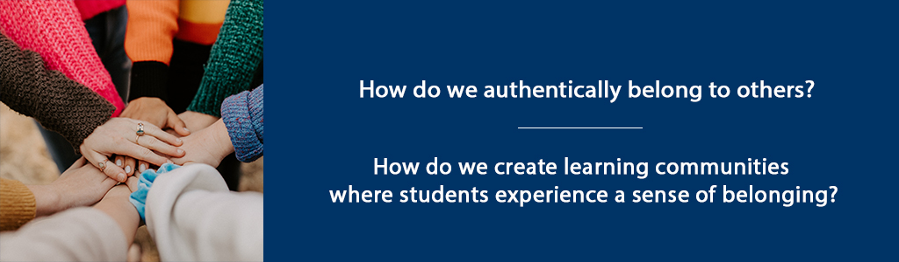

# Belonging to Others



## Overview {-}

Building on our discussion of “belonging to ourselves” in the previous
unit, in this unit we will explore the concept of “belonging to others.”
This key concept is foundational to the creation of authentic learning
communities – spaces where students experience genuine connection with
other learners, with the facilitator, and with the discipline they are
studying.

**Unit 3 focuses on two guiding questions:**

- How do we authentically belong to others?  
- How do we create learning communities where students experience a sense of belonging?  

### Topics{-}

1. Belonging to Others
2. Creating Learning Spaces Where Students Belong

### Learning Outcomes{-}

When you have completed this unit you should be able to:

- Discuss how we can authentically belong to others.  
- Describe elements of a learning community that create a sense of belonging.  
- Identify problems that affect learning communities.  
- Plan a learning activity that builds community.  

### Activity Checklist {-}

These learning activities will engage you in considering the guiding questions for this unit. As you plan your week, be sure to include time for these important learning activities. *Note that not all activities are required. Your instructor will provide guidance on key activities to complete.*  

```{block2, type='reflect'}

<span class="blockhead">Learning Activities</span>

- Reflect on Rilke, R.M. [*Ah, Not to be Cut Off*](https://gladdestthing.com/poems/ah-not-to-be-cut-off){target="_blank"}.  
- Select from the three reading options (Brown, Palmer, Westheimer) to help you reflect on inclusive learning communities.  
- Listen and respond to Taylor Swift's *A Place in this World*.  

```

```{block2, type='assessment'}

<span class="blockhead">Assessment</span>

- Unit 3 Discussion: Write a post in response to your readings, including the BRAVING checklist (Brown, 2017, p. 114). Then, create a learning activity you would use in a course that incorporates elements of belonging.  
- Assignment 1: Identity as a Teacher Paper (20%)**: Write a 3-4 page paper in which you describe your identity as a teacher/facilitator.  

```

## Belonging to Others

In *Braving the Wilderness: The Quest for True Belonging and the Courage to Stand Alone,* Brene Brown (2017) discusses the universal human need for belonging -- and the importance of belonging authentically. She contrasts a true sense of "belonging" to "fitting in" which she describes as a sense of being accepted, but not as one's true self.

> We want to be part of something, but we need it to be real -- not conditional or fake or constantly up for negotiation. We need true belonging. -- Brene Brown (2017, p. 31)

According to Brown (2017), belonging involves a certain level of vulnerability, because it means we are must show up as our true selves – and those selves often include some level of doubt or weakness or insecurity.

She defines “belonging” this way:

> Belonging is the innate human desire to be part of something larger than us. Because this yearning is so primal, we often try to acquire it by fitting in and by seeking approval, which are not only hollow substitutes for belonging, but often barriers to it. Because **true belonging** only happens when we present our authentic, imperfect selves to the world, our sense of belonging can never be greater than our level of self-acceptance -- (Brown, 2017, p. 32).

Part of our role as teachers and facilitates or to foster learning communities where students can truly belong.

## Creating Learning Spaces Where Students Belong

Learning, by its nature, requires us to wrestle with ideas and facts and theoretical perspectives that are new or contradict our current knowledge or beliefs. Therefore, learning spaces must serve as spaces where we can be challenged by new ideas and challenge our current thinking, while at the same time feel confident that our thoughts and perspective are valued. These learning spaces must simultaneously allow us to be our authentic selves – and allow others to be authentic as well.

Brene Brown (2017) discusses key concepts of creating spaces that facilitate a sense of belonging – including civility, inclusive language, truth, and respect. Often, the balance between truth and civility can be challenging – as we seek to authentically discuss new ideas – but in a manner that is both civil and respectful of others.

Trust is at the heart of authentic learning communities. Brown (2017) uses the acronym “BRAVING” to describe key elements of trust. These elements include Boundaries, Reliability, Accountability, Vault, Integrity, Non-Judgement, and Generosity (p. 114).

Palmer (2017) also argues that spaces free of fear are necessary for authentic learning. He describes a “shutdown” that occurs as we seek to protect ourselves – both teachers and students – and as we think about learning and knowing in from an either-or perspective, failing to acknowledge the great vastness of truth. Learning communities, then, must be places of trust, with a focus on learning that incorporates both “profound truth” and “paradox” (Palmer, 2017, p. 65).

Brower and Dettinger (1998) contend that diversity of thought and perspective is an essential element of a learning community. “When we define a community as a group of individuals committed to shared values and goals, who purposefully come together and work together to reach these goals, then diversity is encouraged not just for ideological reasons but also because different perspectives, experiences, and backgrounds contribute to the collaborative efforts to achieve the community’s goals” (Brower & Dettinger, 1998, p. 16).

### Activity: Reflection {-}

```{block2, type='reflect'}

Find a quiet space in your home or outdoors. Make your favourite beverage. With your iced coffee or hot tea with honey next to you, settle into a comfortable position. 

Read the poem by Rainer Maria Rilke [“Ah, not to be cut off”](https://gladdestthing.com/poems/ah-not-to-be-cut-off){target="_blank"}. Sit for a moment with this poem. Re-read it. Consider the words and ideas expressed by Rilke.

In your Reflective Journal, jot down your thoughts. Consider how you have, in your own learning experiences, experienced “the winds of homecoming” or the desire “not to be cut off.”


*Image by <a href="https://pixabay.com/users/engin_akyurt-3656355/?utm_source=link-attribution&amp;utm_medium=referral&amp;utm_campaign=image&amp;utm_content=2242212">Engin Akyurt</a> from <a href="https://pixabay.com/?utm_source=link-attribution&amp;utm_medium=referral&amp;utm_campaign=image&amp;utm_content=2242212">Pixabay</a>*

```

### Activity: Read and Reflect {-}

```{block2, type='reflect'}

**There are three reading options to help you reflect on inclusive learning communities.**  

1. Read: Brown (2017). Chapters 3-6.  
  - In preparation for the discussion in this unit, reflect on the BRAVING checklist (p. 114).  
  - How would you apply this concept in a course to create an inclusive, authentic learning community?  
2. Read Palmer (2017) Chapter 2. As you read, consider these questions:  
  - How am I “at home in a universe that embraces both the smallness of ‘I’ and the vastness of all that is ‘not I,’”? (Palmer, 2017, p. 59).  
  - What fears do I need to overcome as a teacher so I can create space for students to express their fears?  
3. Read Westheimer et. al (2004) [Education Leading to Good Citizens](assets/unit3/Westheimer.pdf).  
  - How would you apply what the authors are saying in a course to create an inclusive, authentic learning community?  

```

### Activity: Listen and Reflect {-}

```{block2, type='reflect'}

Listen to [*A Place in this World*](https://music.youtube.com/watch?v=_FNQ5qLuLjA&list=RDAMVM_FNQ5qLuLjA){target="_blank"}, sung by Taylor Swift.

<span class="blockhead">Consider the following scenario:</span> 

Imagine a student in a course you are facilitating. A young student submits a poorly written assignment and then does not complete the next week’s assignment. When you ask the student to meet with you, she shares this song with you and shares that she feels all alone, she doesn’t feel confident writing at an academic level, and she didn’t do this week’s assignment because she’s afraid she will fail. She thinks she probably shouldn’t have been admitted to this program.

In your Reflective Journal, compose an email or talking points for a conversation with the student, specifically describing why she belongs in this course.

```

## Unit 3 Summary {-}

In this unit, you have had the opportunity to consider concepts related to our own sense of “belonging to others” and what it means to create safe learning spaces, built on trust and an awareness that learning is both vast and paradoxical. Bringing our selves to the educational experience – both as teachers/facilitators and as students/learners, we must seek to authentically engage in the learning experience – and to form connections with other learners. In the next unit, we will move from the philosophical and self-reflective to explore practical strategies for creating authentic learning communities.

## Assessment{-}

```{block2, type='assessment'}

<span class="blockhead">Unit 3 Discussion</span>

**Part A: Braving**

Using the readings from this unit, including the BRAVING checklist (Brown, 2017, p. 114), write a 250-word discussion post that includes a description of each element of the checklist, as well as a 2-3 sentence description of how you would apply this concept in a course to create an inclusive, authentic learning community.


**Part B: Belonging Learning Activity**

Based on the learning activities in this unit, create a learning activity you would use in a course that incorporates elements of belonging, discussed in the course readings and your blog posts. Include the learning outcome for the activity, the learning activity, and a discussion of how the different elements of the learning activity would serve to support a sense of belonging for students.

```

```{block2, type='assessment'}

<span class="blockhead">Assignment 1: Identity as a Teacher Paper (20%)</span>

Building on your learning in the first three weeks of class, write a 3-4 page paper in which you describe your identity as a teacher/facilitator. Incorporate references to the Brown (2017) and Palmer (2017) texts, as well as other resources from your graduate coursework. The paper should include an introduction, a statement of your identity as a teacher/facilitator, and a discussion of three important aspects of that identity. Your conclusion should include a discussion of how you will use your identity to create authentic spaces for learning in the courses you facilitate/teach.

```

```{block2, type='caution'}

*Please submit your assignments in the appropriate dropbox in Moodle. See the Assessment section for the Grading Criteria that explains how your assignments will be evaluated.*

```

## Checking your Learning {-}

```{block2, type='progress'}

**Use the learning outcomes for this unit as a checklist of understanding before you move to the next unit. Can you:**

- discuss how we can authentically belong to others?  
- describe elements of a learning community that create a sense of belonging?  
- identify problems that affect learning communities?  
- plan a learning activity that builds community?  

```
