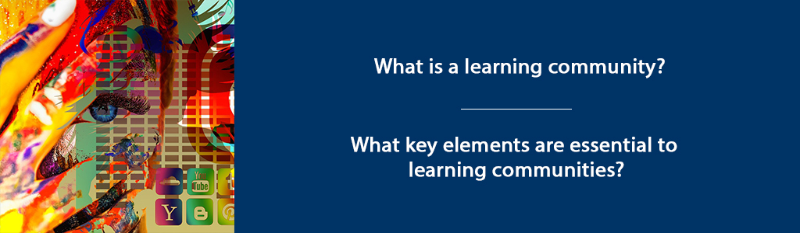
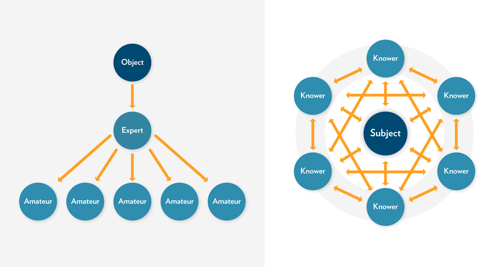
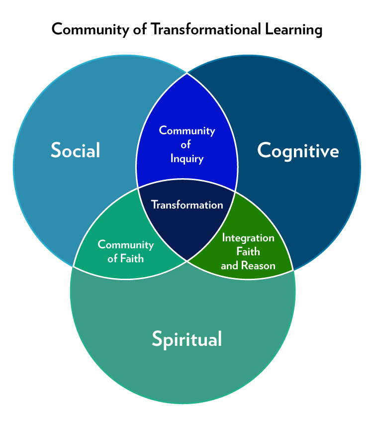

# Learning Communities



## Overview {-}

In this unit, we will review several models of “learning communities” that provide visual representations of educational learning environments. A learning community can be created within a specific course, academic program, or professional context. Learning communities can be found across university campuses and often include a set of interdisciplinary, paired-courses that students take as a cohort. They can be grounded in residence halls with an integration of living and learning. Or, they can be developed in formal educational environments with a focus on students learning together as a cohort. Professional learning communities have also emerged as an important force in education and other fields, as colleagues gather around a shared interest, a focus on continuous quality improvement, and a shared discipline.

Learning communities are authentic, emotionally-safe and inclusive spaces (whether physical or virtual) where learners and teachers come together to engage in deep learning. By definition, a learning community includes both LEARNING and COMMUNITY.

**Unit 4 focuses on 2 guiding questions:**

- What is a learning community?  
- What key elements are essential to learning communities?  

### Topics{-}

In this unit, our topics explore three different models of learning communities.

1. Pyramid Model of Learning Communities (Brower & Dettinger, 1998)  
2. The Community of Truth (Palmer, 2017)  
3. Trinity Community of Inquiry (Madland, 2017)  

### Learning Outcomes{-}

When you have completed this unit you should be able to:

- Describe elements of an authentic learning community.  
- Compare learning community models.  

### Activity Checklist {-}

These learning activities will engage you in considering the guiding questions for this unit. As you plan your week, be sure to include time for these important learning activities. *Note that not all activities are required. Your instructor will provide guidance on key activities to complete.*

```{block2, type='reflect'}

<span class="blockhead">Learning Activities</span>

- Read “What IS a Learning Community?” (Brower & Dettinger, 1998) and respond in your Reflective Journal. Alternatively, read and reflect on Defining and Measuring Academic Success (York et. Al).  
- Read and reflect on *The Courage to Teach,*  Chapter 4 Knowing in Community (Palmer, P. (2017).    
- Read and reflect on Trinity Community of Inquiry (Madland, 2017).  

```

```{block2, type='assessment'}

<span class="blockhead">Assessment</span>

- Complete your Discussion post and respond to two other peers.  

```

## Learning Community Pyramid

The Learning Community Pyramid, developed by Brower & Dettinger (1998) includes academic, social, and physical components. They describe academic components as those that focus on the curriculum and learning that takes place. The social components are the elements of trust and inclusivity that create space for community. The physical component is the “place or facility where the community meets or resides” (Brower & Dettinger, 1998, p. 17). In the case of this course, that “place” is the course hub.

Building on the foundation of social, physical, and academic elements, Brower and Dettinger (1998) contend that learning communities also include three areas of responsibility: ethical responsibility, civic responsibility, and professional responsibility (p. 17).

According to Brower & Dettinger (1998), “Learning communities, to be considered as such, must integrate academic subject matter and social interactions while providing the physical space or facility for an intellectually stimulating environment to emerge. Furthermore, learning communities must be designed to develop a triad of responsibilities within students—professional, ethical, and civic” (p. 16).

As you consider the learning community you will facilitate, consider how you might develop or model professional, ethical, and civic responsibility within that community. Do you think leaders should develop these same areas of responsibility with the organizations or companies they lead?

### Activity: Compare Community Models {-}

```{block2, type='reflect'}

Read [“What IS a Learning Community?” (Brower & Dettinger, 1998)](assets/unit4/Learning_community.pdf){target="_blank"}.

**In your Reflective Journal:**  
  - Write down three strengths of this learning community model.  
  - Write 2-3 questions you have about this learning community.  
  - Do you think this model accurately reflects the type of learning community you want to create?  
  - Why or Why not?  
  
**As we compare the other two models, feel free to organize your thoughts into a chart such as the following:**

| Strengths of model | Aspects Unique to this Model | Questions |
| ------------------ | ---------------------------- | --------- |
| Learning Community Pyramid (Brower & Dettinger, 1998)   |  |  |
| Community of Truth model (Palmer, 2017)                 |  |  |
| Trinity Community of Inquiry (Madland, 2017)            |  |  |

```

### Activity: York Reading and Reflection {-}

```{block2, type='reflect'}

Read York et.al - [Defining and Measuring Academic Success](https://eric.ed.gov/?q=EJ1059739){target="_blank"} (2015). Also available through the TWU library.

In your Reflective Journal, write down three strengths of the way York et.al defines and measures academic success.  How do these measure “fit” into an authentic learning community?

```

## The Community of Truth (Palmer, 2017)

Palmer’s learning community model (2017) incorporates both learning and community with a “subject” as the center, surrounded by “knowers” who are in relationship to both each other and the subject. Palmer (2017) assets that “the community of truth, far from being linear and static and hierarchical, is circular, interactive, and dynamic” (p. 106).




Figure 4.1: [Palmer’s Community of Truth model.](https://uncc.instructure.com/courses/342/pages/module-3-why-discussions){target="_blank"}

The learning that takes place in this model is captured in this statement: “I understand truth as the passionate and disciplined process of inquiry and dialogue itself, as the dynamic conversation of a community that keeps testing old conclusions and coming into new ones” (p. 106).

As teachers, we approach teaching with some sense that we have some thing (some subject) to teach students. Palmer (2017) challenges us to think differently about the teaching/learning experience. (See “The Objectivist Myth of Knowing,” p. 103 and “The Community of Truth,” p. 105).

Instead of solely focusing on what we must teach (and what students must learn), Palmer challenges us to consider how we all might learn something more together – more than is already known – through the teaching/learning experience. In this way, we must consider that we are not just engaged in transferring information or knowledge, but that (in addition to that), together we might create new knowledge.

> I know of no field, from science to religion, where what we regard as objective knowledge did not emerge from long and complex communal discourse that continues to this day, no field where the facts of the matter were delivered fully formed from on high (Palmer, 2017, p. 107).

Palmer’s (2017) model highlights the relational knowledge of learning communities, underscoring not just the relationship of the people involved, but also the relationships between people and subject. As you consider facilitating learning communities, give some thought to your own relationship to the subject to be taught and learned. Consider whether you “know” this subject objectively or subjectively.

### Activity:  Palmer Reading and Reflection {-}

```{block2, type='reflect'}
Read *The Courage to Teach,* Chapter 4 “Knowing in Community” (Palmer, 2017).

**In your Reflective Journal:**  
  - Write down three strengths of this learning community model.  
  - Write 2-3 questions you have about this learning community.  
  - Do you think this model accurately reflects the type of learning community you want to create?  
  - Why or Why not?  

```

## The TWU Community of Inquiry (Madland, 2017)

In our online courses, Trinity Western University seeks to create learning communities that engage student learning on a cognitive, social, and spiritual level. The TWU Community of Inquiry model is a visual representation of these three aspects of learning (Social, Cognitive, and Spiritual), and how they interact with each other. At the intersections of these elements, you find:

1. Community of Inquiry  
2. Community of Faith  
3. Integration of Faith and Reason  

Combined, these three elements can lead to transformational learning – an aspiration we hold in this course and program – and a fundamental goal of higher education in a broader sense.




<a rel="license" href="http://creativecommons.org/licenses/by-sa/4.0/"></a><br /><span xmlns:dct="http://purl.org/dc/terms/" href="http://purl.org/dc/dcmitype/StillImage" property="dct:title" rel="dct:type">Community of Transformational Learning</span> by <a xmlns:cc="http://creativecommons.org/ns#" href="https://oet.sandcats.io/shared/9NjzXVu8a3kpNBW_Y6QnnyFH65PLpnlO2nuJt14hBoC" property="cc:attributionName" rel="cc:attributionURL">Colin Madland</a> is licensed under a <a rel="license" href="http://creativecommons.org/licenses/by-sa/4.0/">Creative Commons Attribution-ShareAlike 4.0 International License</a>.

Figure 1. Transformational Learning Model from Madland, C. (2017). The TWU Community of Inquiry. Creative Commons
License.

### Activity:  Madland Reading and Reflection {-}

```{block2, type='reflect'}

Review the [The Trinity Community of Inquiry](assets/unit4/Madland-transformational-learning.pdf) (Madland, 2017).

**In your Reflective Journal:**  
  - Write down three strengths of this learning community model.  
  - Write 2-3 questions you have about this learning community.  
  - Do you think this model accurately reflects the type of learning community you want to create?  
  - Why or Why not?  

```

## Unit 4 Summary {-}

The learning community models we have considered in this unit share some similarities. In each model, there is an awareness that learners and learning is multidimensional. As we engage in teaching and learning, we must always be aware that the learning process is, fundamentally, transformative. It engages people, not only on an intellectual level, but also on a spiritual and social level. By designing curriculum, pedagogy, and learning around all aspects of learning – social, cognitive, and spiritual – we provide the foundation for transformational learning.

Palmer (2017) puts it this way:  

>The reality we belong to, the reality we long to know, extends far beyond human beings interacting with one another… This is a community held together not only by our personal powers of thought and feeling but also by the power of ‘the grace of great things’” (p. 109).

As Palmer (2017) points out, learning includes both thought (cognitive) and feeling (social), but also something beyond those – the overarching spiritual nature of life and learning.

## Assessment {-}

```{block2, type='assessment'}

<span class="blockhead">Unit 4 Discussion</span>

After completing this unit, including the learning activities, you are asked to write a 250-word discussion post on the following:

Provide a brief description of each of the three models (with citations as appropriate). Select the learning community model that most closely aligns with your identity and values as a teacher/facilitator. In your post, tell your readers the strengths you see in this model, explaining why it resonates with your concepts of teaching and learning.

```

```{block2, type='caution'}

*Please submit your assignments in the appropriate dropbox in Moodle. See the Assessment section for the Grading Criteria that explains how your assignments will be evaluated.*

```

### Checking your Learning {-}

```{block2, type='progress'}

**Use the learning outcomes for this unit as a checklist of understanding before you move to the next unit. Can you:**

- describe elements of an authentic learning community?  
- compare learning community models?  

```

## References {-}

- Athabasca University. (n.d.) Community of Inquiry Model. Retrieved from: https://coi.athabascau.ca/coi-model  
- Brower, A., Carlson-Dakes, C.G., Barger, S.S. (2007). A learning community model of graduate student professional teaching excellence. *Wisconsin Center for the Advancement of Postsecondary Education*. Retrieved from: https://minds.wisconsin.edu/bitstream/handle/1793/43615/WP010.pdf?sequence=1&isAllowed=y  
- Brower, A. & Dettinger, K. (1998). What is a learning community?: Toward a comprehensive model. *About Campus: Enriching the Student Experience. 3*(5), 15-21*.  
- Madland, C. (2017). The Trinity Community of Inquiry. Creative Commons License.  
- Palmer, P. (2017). *The courage to teach: Exploring the inner landscape of a teacher’s life.* San Francisco: Wiley.  
