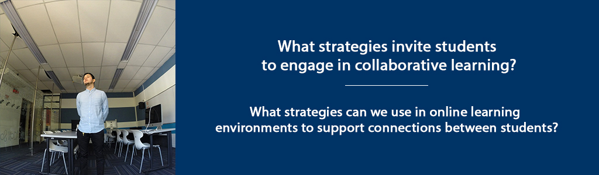

# Creating Space for All Learners

## Overview {-}

Building on our discussion of learning community models, in this unit we will explore specific strategies to engage students in collaborative learning, and support connections between learners.

Unit 5 focuses on two guiding questions:




##  Topics{-}
1. Creating Collaborative Learning in an Online Environment
2. Supporting Connections Between Learners


##  Learning Outcomes {-}

When you have completed this unit you should be able to:

1.  Identify facilitator strategies that invite students to engage in collaborative learning.
2.  Identify strategies in online learning environments that support connections between students.


## ✔️ Activity Checklist {-}

These learning activities will engage you in considering the guiding questions for this unit. As you plan your week, be sure to include time for these important learning activities. *Note that not all activities are required. Your instructor will provide guidance on key activities to complete.*

| **Activities**|
| ----- |
| Activity: Read: Palmer, P. (2017) *The Courage to Teach,*  Chapter 5 Teaching in Community; Chapter 6 Learning in Community, Chapter 7 Divided No More.|
| Activity: Review the [“Principles of Appreciative Inquiry”](https://appreciativeinquiry.champlain.edu/learn/appreciative-inquiry-introduction/5-classic-principles-ai) (also in Whitney & Trosten-Bloom, 2010). *The power of appreciative inquiry: A practical guide to positive change.* |
| Activity: Listen: Sarah Barreilles [Brave](https://www.youtube.com/watch?v=QUQsqBqxoR4). Watch: Kalhil KJ Adames [Identity Short Film](https://www.youtube.com/watch?v=ikGVWEvUzNM). Read: Brown, B. (2017) *Braving the Wilderness,* Chapter 7 Strong Back. Soft Front. Wild Heart.|
| Activity: Read Burwell & Huyser (2013). Practicing hospitality in the classroom. Respond in your Reflective Learning Journal.|
| AAssessment: Unit 5 Discussion - Part 1: Appreciative Inquiry & Part 2: **Peer Interview** |


## Creating Collaborative Learning in an Online Environment

In our role as a teacher or facilitator, we are engaged in leading learners through a transformational educational process. “Collaborative Inquiry” is a process through which we, as educators, engage in learning about the practice of teaching through collaborative inquiry and reflection (Donohoo & Velasco, 2016).

Athabasca University defines a *Community of Inquiry* as “a group of individuals who collaboratively engage in purposeful critical discourse and reflection to construct personal meaning and confirm mutual understanding” (Athabasca University, n.d.).

While *Collaborative Inquiry* is often used to describe a process used by professional learning communities to guide organizational change – or to describe *Communities of Practice* among educators – collaborative inquiry is also a practice that can be implemented within classrooms.

The fields of Collaborative Inquiry (Donohoo & Velasco, 2016) and Appreciative Inquiry (Whitney & Trosten-Bloom, 2010) are built on the premise that we must all collaborate together in a community of learners, and that by doing so, we can generate learning that goes beyond what we might learn on our own. It is a strengths-based approach to learning and change that has been described as “unifying moments when joy touches joy, strength touches strength, health touches health, inspiration combines with inspiration – and how to make the combinations happen more rapidly and frequently” (Cooperrider, D., as cited in Whitney & Trosten-Bloom, 2010, p. xiii).

Palmer’s (2017) “Community of Truth” that we explored in the last unit, incorporates the essence of collaborative learning, underscoring the importance of relationship within education. He writes, “What seems right for me, after many years of searching, is to sit in a circle with my students (or try to relate to the crowd in a lecture hall as if we were in a circle) and lead an inquiry into the great thing in our midst, But there are other ways to create community in the classroom, and some of them look nothing like the interactive encounter we normally associate with that word” (p. 139).

Whitney & Trosten-Bloom cast a compelling vision for collaborative environments where the act of engaging in appreciative inquiry can transform communities. They write: “Appreciative Inquiry transforms organizations into places that are free and alive, where people are eager and filled with positive power, and where the creativity of the whole never ceases to amaze, surprise, and innovate” (Whitney & Trosten-Bloom, 2010, p. xi). Learning communities, too, can become places that are free and alive, where all members of the community engage in challenging, authentic learning.

Appreciative Inquiry (Whitney & Trosten-Bloom, 2010) is built on eight principles, which can inform the way we support learners in an online learning context. These include:

1.  The Constructionist Principle  
2.  The Simultaneity Principle  
3.  The Poetic Principle  
4.  The Anticipatory Principle  
5.  The Positive Principle  
6.  The Wholeness Principle  
7.  The Enactment Principle  
8.  The Free-Choice Principle  
  *(Whitney & Trosten-Bloom, 2010, p. 52).*

These principles can serve as a guide for facilitating online discussions, designing lessons, and providing formative feedback to learners. For example, the “Simultaneity Principle” is based on the premise that by its nature, asking questions not only leads to change, but the very act of engaging in inquiry is, in fact, the first step in change. According to this principle, “the moment we ask a question, we begin to create a change” (Whitney & Trosten-Bloom, 2010, p. 52).

Likewise, the “Free-Choice Principle” contends that “people perform better and are more committed when they have freedom to choose how and what they contribute” (Whitney & Trosten-Bloom, 2010, p. 52). Facilitating discussions that allow learners to engage in conversation (whether face-to-face or online), determine some aspects of their assignments, select topics, etc., can have a powerful influence on student engagement with learning.

### 📘 Activity: Palmer Reading and Reflection

```{block, type='reflect'}

Read: Palmer, P. (2017) *The Courage to Teach,* Chapter 5 Teaching in Community; Chapter 6 Learning in Community, Chapter 7 Divided No More. In your Reflective Journal, make notes on the following questions:

1.  What specific actions could you take to invite students in to the “community of truth”?
2.  What questions can I ask to invite students to engage in collaborative, inquiry-based learning?
```


### 📘 Activity: AI Read and Discussion

```{block, type='reflect'}
Review the [“Principles of Appreciative Inquiry”](https://appreciativeinquiry.champlain.edu/learn/appreciative-inquiry-introduction/5-classic-principles-ai/) from the Appreciative Inquiry Commons at Champlain University, or in Whitney & Trosten-Bloom. (2010). *The power of appreciative inquiry: A practical guide to positive change.*

Select two of the Principles of Appreciative Inquiry. In a 250-word discussion post, describe a learning activity you would conduct with your class that integrates both of these principles. For example, how would you design a writing assignment that included “Positive Principle”? Or, describe an assignment through which you ask students to create a short video that incorporates the “Poetic Principle.”
```

## Supporting Connections Between Learners

Creating a positive, open, learning environment is a critical component for fostering authentic learning – a place where we can both belong to ourselves and to others.

Brown (2017) poses these questions:

> Are we willing to show up and be seen when we can’t control the outcome? Are we willing to create courageous spaces so we can be fully seen? (p. 154)

Palmer (2017), offers five suggestions for ways in which we can prepare students for engagement in authentic communities – both in education, our places of work, and our communities.

1.  We must help our students debunk the myth that institutions process autonomous, even ultimate, power over our lives.
2.  We must validate the importance of our students’ emotions as well as their intellect.
3.  We must teach our students how to “mine” their emotions for knowledge.
4.  We must teach them how to cultivate community or the sake of both knowing and doing.
5.  We must teach – and model for – our students what is meant to be on the journey toward “an undivided life.” (p. 205).

In this course, we are exploring concepts of education that include our emotional experiences with learning, the importance of community, the nature of knowledge, and the foundational importance of the teacher’s authenticity. For some academics, the acknowledgement of the emotional experience of education can be challenging, according to Palmer, who argues that the feelings we have influence our learning.

Donohoo and Velasco (2016), in their work on Collaborative Inquiry, also underscore the importance of acknowledging the emotional experiences of student. “There is no doubt that learning is interrupted when negative emotions and attitudes surface, as such feelings hinder our ability to make sense of things” (Donohoo and Velasco, 2016, p. 36).

### 📺 🎵 📘 Activity: View and Reflect

```{block, type='reflect'}
For this activity, you will spend some time reflecting on your own experience as a learner, in order to consider the needs of the students you lead in online and face-to-face learning environments. So pick up your Reflective Learning Journal, grab your laptop, and settle down into a comfy chair (or sit among some trees).

1.  Watch the short film *Identity* by Kalhil KJ Adames (5 minutes).

<iframe width="560" height="315" src="https://www.youtube.com/embed/ikGVWEvUzNM" frameborder="0" allow="accelerometer; autoplay; encrypted-media; gyroscope; picture-in-picture" allowfullscreen></iframe>

2.  Listen to the song "Brave" sung by Sarah Barreilles.

<iframe width="560" height="315" src="https://www.youtube.com/embed/QUQsqBqxoR4" frameborder="0" allow="accelerometer; autoplay; encrypted-media; gyroscope; picture-in-picture" allowfullscreen></iframe>

3.  Read Brown (2017) *Braving the Wilderness,* Chapter 7 Strong Back. Soft Front. Wild Heart.

Jot down some of your notes describing your own identity as a student. List 2-3 times in your educational experience where you have been “brave” by sharing your thoughts or concerns in a learning environment – whether with other learners or teachers. List 2-3 times when you wanted to speak up, but chose instead to remain silent. Reflect on how these actions impacted your experience as a learner. Consider what you might do, as a course facilitator, to encourage learners to speak up.
```


### 📘 Activity: Read and Strategize

```{block, type='reflect'}
Read Burwell & Huyser (2013). Practicing hospitality in the classroom (available through the [TWU Library](https://www.twu.ca/library)). In your Reflective Learning Journal, make a note of the “stances” described by the authors. For each Stance, list one strategy you can employ to practice hospitality in your classes. Be as specific as possible.
```


## Unit 5 Summary {-}

In this unit, we have considered how we can create learning environments where students belong, the essential nature of creating connections between learnings, and specific strategies we can use to support collaborative learning.

## ✏️ Assessment {-}
```{block, type='assessment'}
### Unit 5 Discussion

After completing this unit, including the learning activities, you are asked to write a discussion post on the following:

**Part 1: Principles of Appreciative Inquiry**

Select two of the Principles of Appreciative Inquiry. In a 250-word post, describe a learning activity you would conduct with your class that integrates both of these principles. For example, how would you design a writing assignment that included “Positive Principle”? Or, describe an assignment through which you ask students to create a short video that incorporates the “Poetic Principle.”


**Part 2: Peer Interview**
In this discussion, you will interview another student in this class to explore strategies for creating inclusive, collaborative learning communities.

First, develop a minimum of five questions to guide the interview process. The questions should be developed based on your course learning to date, and should integrate the articles, Ted talks, short films, and other resources we have reviewed together. Building on your learning, develop at least five questions that you will ask another learner, in order to answer the guiding questions of this unit:

1.  What strategies invite students to engage in collaborative learning?
2.  What strategies can we use in online learning environments to support connections between students?

Then, contact the student assigned to you for this assignment and schedule a time to meet, preferably in real-time, through zoom, skype, some other form of video conferencing, or by phone.

After you have completed the interview, prepare a 250-word discussion post, identifying at least three strategies you can use to engage students in collaborative learning as well as strategies you can use to support connections between students in online learning environments. Be sure to reference the other learner for her/his original ideas.

Please submit your discussion posts and responses in the **Unit 5 Discussion Forum** in Moodle.

See the Assessment section for the Grading Criteria that explains how your discussion contributions will be evaluated.

```


##  Checking your Learning {-}
```{block, type='progress'}

Use the learning outcomes for this unit as a checklist of understanding before you move to the next unit. Can you:

  - identify facilitator strategies that invite students to engage in collaborative learning?
  - identify strategies in online learning environments that support connections between students?

```

## References {-}

Bell, T., Urhahne, D., Schanze, S., & Ploetzner, R. (2009). Collaborative inquiry learning: models, tools, and challenges. *International Journal of Science Education. (32)*3, 349-377.

Brown, B. (2017). *Braving the wilderness: The quest for true belonging and the courage to stand alone.* New York: Penguin Random House.

Burwell, R. & Huyser, M. (2013). Practicing hospitality in the classroom. *International Journal of Christianity and Education. 17*(1), 9-24.

Donohoo, J. & Velasco, M. (2016). *The Transformative Power of Collaborative Inquiry.* Corwin (SAGE): Thousand Oaks, CA.

Palmer, P. (2017). *The courage to teach: Exploring the inner landscape of a teacher’s life.* San Francisco: Wiley.

Whitney, D., Trosten-Bloom, Amanda. *The Power of Appreciative Inquiry: A Practical Guide to Positive Change,  2nd Edition*. Berrett-Koehler Publishers, 03/2010.
