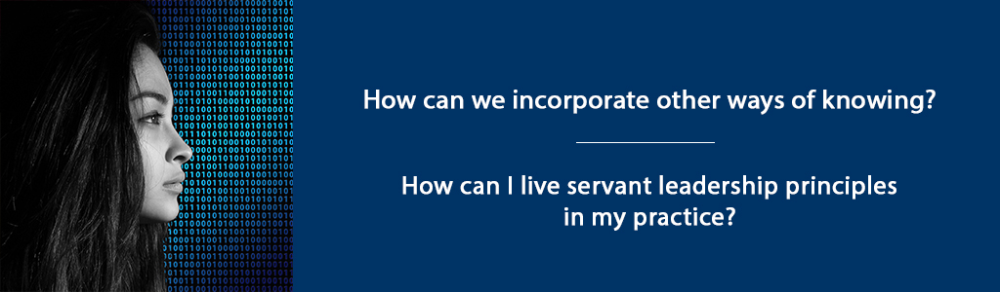

# The Role of Information and Perception in Choosing Strategies and an Appropriate Leadership Model



## Overview {-}

In this unit, you will learn about the role of information and perception in growth and development. This relates to learning communities in that communication among individuals related to information and growth in learning communities is so important. To put it another way, if information is miscommunicated or growth misrepresented, then the learning community is likely to experience challenges. You will explore the role of adult educator to be an advocate for adult learners. You will also explore the concept of the adult educator as servant leader and the importance of intentional practice based on this model of leadership. A servant leader has the interests of followers at heart therefore will make a greater effort to communicate effectively and assess growth of the community and individual in a fair manner.

**Unit 7 focuses on two guiding questions:**

- How can we incorporate other ways of knowing?  
- How can I live servant leadership principles in my practice?  

### Topics{-}

1. The Role of Information and Perception in Growth and Development  
2. The Adult Educator as Servant Leader  

### Learning Outcomes{-}

When you have completed this unit you should be able to:

- Choose and/or design strategies with a critical lens for using information to influence growth and development of learners.  
- Explain how an adult educator can be a servant leader.  

### Activity Checklist {-}

These learning activities will engage you in considering the guiding questions for this unit. As you plan your week, be sure to include time for these important learning activities. *Note that not all activities are required. Your instructor will provide guidance on key activities to complete.*

```{block2, type='reflect'}

<span class="blockhead">Learning Activities</span>

- Read assigned pages from Wheatley chapters 3, 5 and 7 and take notes in your journal.  
- View Wheatley video [Islands of Sanity](https://youtu.be/LtaYNxp56gs){target="_blank"}.  
- Browse Brookfield and Silberman for strategies related to critical thinking and jot down ideas in your journal.  
- View the Ali Fett video [*Servant Leadership - How a jar can change the way you lead and serve*](https://youtu.be/1vIPrR_clEg){target="_blank"}.  

```

```{block2, type='assessment'}

<span class="blockhead">Assessment</span>

- Respond in your discussion post for this unit.  

```
## The Role of Information and Perception in Growth and Development

> "Information is the source of all growth and development in a living system" (Wheatley, 2017, p. 101).

Wheatley goes on to explain how information has changed from "communications among people to high speed transmissions delivered in cyberspace" (p. 104).

While information is still important, it is the mode of delivery that has reshaped culture. She argues that the digital age has destroyed the information age. The adult educator can respond to her call to re-establish our relationships with the real world by choosing strategies that privilege connection and meaning and lead to better decisions. She illustrates this by describing in some depth the value of an 'After Action Review' (see pages 128-132). Consider how this might be adapted for the adult education setting in your context.

Perception based on scientific understanding is not the only way of knowing. Wheatley admonishes:

> "There are other ways of knowing reality, reliable methods that have served humans and earlier hominids for millennia. It is the arrogance of our science that denies their existence and their usefulness" (p. 179).

How can adult educators incorporate other ways of knowing? Cahalan, K. (2016) has identified eight ways of knowing that are essential to wise practice:

- Situated awareness is noticing and describing contextual factors.  
- Embodied realizing is developing skilled competence in bodily action.  
- Conceptual understanding is comprehending and remembering key information.  
- Critical thinking is analyzing and evaluating concepts and actions.  
- Emotional attunement is identifying and using awareness of feelings and affective states.  
- Creative insight is developing imaginative and creative responses.  
- Spiritual discernment is perceiving what is of God and not of God.  
- Practical reasoning is problem-solving, forming judgments, gaining a sense of salience, and acting wisely.  

How we perceive, and teach learners to perceive, matters greatly and is a foundational responsibility of the adult educator. For example, in choosing texts, articles or other resources the type of information you get students to pay attention to will affect their awareness of contextual factors. Embodied realizing in the classroom may take the form of an experiential learning activity where the students are asked to interview someone, ‘shadow’ them for a time or else listen to a podcast and describe their ‘gut reactions’ or impressions. Reading biographies is an excellent way for learners to become more emotionally attuned to the feelings and affective states of others. This develops empathy – a crucial component of being hospitable in a diverse, pluralistic society.

Wheatley identifies a warrior for the human spirit as

> a decent human being who aspires to be of service in an indecent, inhumane time (p. 255).

In this sense, adult educators are called to be warriors for the human spirit. Read pages 258-259 for ethical principles that are quite likely to move you and profoundly influence your perception of your role.

### Activity: Wheatley Reading and Reflection {-}

```{block2, type='reflect'}
Read Wheatley, M. (2017). *Who Do We Choose to Be? Facing Reality, Claiming Leadership, Restoring Sanity.* Oakland, CA: Berrett-Koehler Publishers. Wheatley chapters 3 (pages 100-139),  5 (pages 172-209 ) and 7 (pages 252-270).

**As you read answer the following questions in your Reflective Learning Journal:**

- How are adult educators ‘warriors for the human spirit’?  
- How does this relate specifically to your present or future context?  

```

### Activity: Wheatley Video {-}

```{block2, type='reflect'}

[Watch: Margaret Wheatley's *Islands of Sanity* (42 minutes)](https://www.youtube.com/watch?v=LtaYNxp56gs){target="_blank"}

<div class="video-container">

<iframe width="560" height="315" src="https://www.youtube.com/embed/LtaYNxp56gs" frameborder="0" allow="accelerometer; autoplay; encrypted-media; gyroscope; picture-in-picture" allowfullscreen></iframe>

</div>

<span class="blockhead">Questions to Consider</span>

- What is the meaning of your work as a coach/facilitator?  
- How and why do you persevere?  

```

### Activity: Strategies for Critical Thinking {-}

```{block2, type='reflect'}
Browse the following two resources and choose strategies that could be used to encourage critical thinking about information. Think about how you might adapt these strategies for your context. Jot down your ideas in your reflective journal.

- Brookfield, Stephen and Preskill, S. (2016). *The discussion book: 50 great ways to get people talking*. San Francisco: Jossey Bass.  
- Silberman, M. L., & Biech, E. (2015). *Active training: A handbook of techniques, designs, case examples, and tips* (4th ed.). Wiley.  

```

## The Adult Educator as Servant Leader

Servant Leadership requires a strong orientation to values that allow adult educators to know, care about, and serve their learners well. Since beliefs, influenced by context and culture influence decision making, expectations and emotions, it matters greatly what leadership model you adhere and aspire to. What we value, we prioritize and this shapes our work and lives.

By way of example of what servant leadership can look like as an adult educator, I share part of my own journey with you. As a Canadian educator one key challenge I face is the mandate to indigenize the curriculum. This is part of a broader call to educational leaders to work toward healing and reconciliation. In Canadian history, education was used as a tool of assimilation to extricate children from their culture and language. A statement of the Indigenous Healing Foundation succinctly summarizes the gravity of this call to action:

> No other population group in Canada’s history has endured such a deliberate, comprehensive, and prolonged assault on their human rights as that of Indigenous people. Yet, despite growing recognition of past wrongs, many Canadians remain unaware of the full scope of these injustices or their impacts. More than a political mandate however, educators need to realize our moral responsibilities to relate accurately and acknowledge fully our regrettable past. I propose that the effort educators in Canada are undergoing requires servant leadership dispositions. For me, this has been, and continues to be, a process of developing knowledge of my own ignorance, discovering my own prejudices and myths and having the courage to change views and practices. It has required the disposition to work through intellectual and emotional complexities that have caused confusion and frustration. But I am willing to be disturbed and unsettled. As I strive to live servant leadership principles, I approach this challenge with intellectual humility, curiosity and respect for all people which has taken much of the fear of 'doing it wrong' away.

Our world is in need of adult educators who strive to live servant leadership principles in their practice. The resulting wideness of spirit dedicated toward the welfare of others is magnanimity - what Aristotle called the crowing virtue in his hierarchy of virtues. The adult educator has an important role in creating a more peaceful world through education that serves people and influences others to do the same.

For more information about servant leadership, please see the resource section for this unit.

### Activity: Servant Leadership Video {-}

```{block2, type='reflect'}

Watch the video, *Ali Fett: Servant Leadership - How a jar can change the way
you lead and serve*.

**As you view this 18 minute video, consider the following:** 

- How might assumption and perceptions impact your role as an adult educator?  
- How are adult educators servant leaders?  

[Watch: Servant Leadership: How a jar can change the way you lead and serve](https://www.youtube.com/watch?v=1vIPrR_clEg){target="_blank"}

<div class="video-container">

<iframe width="560" height="315" src="https://www.youtube.com/embed/1vIPrR_clEg" frameborder="0" allow="accelerometer; autoplay; encrypted-media; gyroscope; picture-in-picture" allowfullscreen></iframe>

</div>

```

## Assessment {-}

```{block2, type='assessment'}

<span class="blockhead">Unit 7 Discussion</span>

**After viewing Fett’s Ted Talk (Sept. 2017), write a discussion post on the
following:**

- How are you going to live out the seven concepts of intentional practice Frett outlines? List each of the concepts and how you could live each one.  
- Reference the Silberman and Brookfield texts and find one strategy to apply to each of the seven concepts. List each concept of intentional practice and your chosen strategy beside it, include a brief description of the strategy.  
- In a general manner, explain how to use the strategies with intentionality to be a servant leader in the adult learning environment.   

```

```{block2, type='caution'}

*Please submit your assignments in the appropriate dropbox in Moodle. See the Assessment section for the Grading Criteria that explains how your assignments will be evaluated.*

```

## Unit Summary {-}

In this unit, you have had the opportunity to learn about the role of information and perception in growth and development. You explored the role of adult educator to be an advocate for adult learners. Hopefully the term 'warrior for the human spirit' is a compelling call to action for you as a result.

You also explored the concept of the adult educator as servant leader and the importance of intentional practice based on this model of leadership. An adult educator who acts and interacts for the good of learners brings meaning to work and can motivate learners to also find meaning beyond an instrumental, skills-focused view of education. This can lead to a sense of fulfillment and flourishing built on a greater purpose.

## Checking your Learning {-}

```{block2, type='progress'}

**Use the learning outcomes for this unit as a checklist of understanding before you move to the next unit. Can you:**  

- choose and/or design strategies with a critical lens for using information to influence growth and development of learners?  
- explain how an adult educator can be a servant leader?  

```

## Resources {-}

- Atha, D.L., Castellon, A.R., Strong, H., & Wu, T. (2017). *MA Leadership and MA in Educational Leadership Monograph 2018*. Unpublished Manuscript Trinity Western University, Langley BC, (70), 22–32.  
- Cahalan, K. (2016). Integrative knowing and practica wisdom in Reflective practice: *Formation and supervision in ministry.*  
- Castellon, A. (2017). *Indigenous Integration: 100+ Lesson Ideas for Secondary and College Teachers*. Vic: Tellwell.  
- Greenleaf, R. 1998. *The power of servant-leadership*. San Francisco, CA: Berrett-Koehler.  
- Parris, D.L. & Welty Peachey, J. 20130. A Systematic Literature Review of Servant Leadership Theory in Organizational Contexts. *J. of Bus. Ethics 113*: 377-393.  
