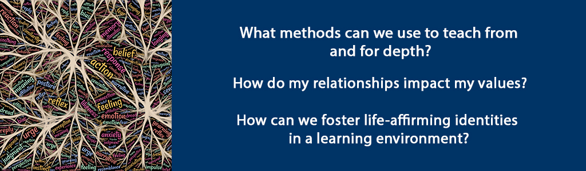

# Teaching from Depth, Interconnectedness and Integrity



## Overview {-}

In this unit you will consider how to teach with depth. This is grounded in who you are – recall the first units of the course. Teaching with depth in the workplace or in an academic setting is founded on relationships and values. In this unit you will apply your reflections to an analysis of a company’s adult learning initiatives.

**Unit 8 focuses on three guiding questions:**

- What methods can we use to teach from and for depth?  
- How do my relationships impact my values?  
- How can we foster life-affirming identities in a learning environment?  

### Topics{-}

1. Adult Education Methods to Teach from Depth  
2. Web of Relationships and Impact on Values  

### Learning Outcomes{-}

When you have completed this unit, you should be able to:

- Analyze the effectiveness of training and employee development.  
- Explain how to teach and lead for depth using discussion strategies and questions.  
- Evaluate adult education methods considering impact on organizational culture.  
- Articulate your personal web of relationship and impact on values.  

### Activity Checklist {-}

These learning activities will engage you in considering the guiding questions for this unit. As you plan your week, be sure to include time for these important learning activities. *Note that not all activities are required. Your instructor will provide guidance on key activities to complete.*

```{block2, type='reflect'}

<span class="blockhead">Learning Activities</span>

- View the *The Six Adult Learning Principles* video. Jot down the six principles in your reflection journal.  
- Read the Fenwick article. Jot down the eight categories of workplace learning in your journal.  
- Practice using role play by planning a teaching and learning activity that utilizes role play.  
- Read Wheatley chapter 6 and take notes in your reflection journal.  

```

```{block2, type='assessment'}

<span class="blockhead">Assessment</span>

- Complete your Unit 8 Discussion post.  
- Company Website Analysis (20%). Analyze the learning culture of an organization.  

```

## Adult Education Methods to Teach from Depth

What does it mean to teach from depth? It connects to the principle of
adult learning that adults are internally motivated and build on prior
life experience when they learn. Motivation is tapped into and amplified
through reflective techniques and critical discussions that help the
adult make sense of the new learning and situate it into what they
already know. Asking thoughtful questions can lead this inquiry so that
the learner constructs their own meaning. The facilitator of adult
learning recognizes what Fenwick (2010) refers to as ‘the mess’ of
learning and therefore strategically employs different levels of
learning, making connections and establishing networks of information,
while being aware of context and power dynamics.

Teaching from depth means nurturing and valuing self-awareness,
committing to self-reflection and mindfulness and practicing teaching
from depth. This last point is important in order to balance reflection
and introspection with action. Herminia Ibarra (2015) refers to this as
‘outsight’ (in contrast to insight) and argues that direct experiences
and experimentation are important in order to develop external
perspective. In the context of facilitating adult education this means
trying out various strategies and learning through trial, error,
refinement and adjustment. Where internal knowledge, past experience and
thinking contribute to insight, external knowledge, new experience and
acting contribute to outsight (p. 6). Teaching from depth involves
developing insight and outsight – through utilizing both reflective
practices and strategies and experiential learning.

One strategy that can be used to teach for depth is called
Stanislavski’s *Magic If* (Schuyler, p. 204). Stanislavski introduced
method acting in the early twentieth century. This method, often
referred to as role play, is where actors draw from their own life
experiences to produce truthful actions and emotions. In the context of
adult education, the learner imagines the circumstances of a particular
learning experience and tries to figure out what to do in that
situation. This technique is often applied in the classroom when case
studies are utilized so that the learner’s life experiences are bridged
via the imaginary situation, challenging the learner to construct and
integrate new meaning while being solutions-focused.

Among the many examples in Brookfield’s *Discussion Book* some of the strategies that foster teaching for depth include:

- Snowballing p. 49,  
- Critical Incident Questionnaire (CIQ) p. 59,  
- Nominating Questions p. 77 and  
- Writing Discussion p. 157.  

I encourage you to review these particular strategies and add to your proverbial ‘toolkit’.


### Activity: Video on Adult Learning Principles {-}

```{block2, type='reflect'}

Watch Cason Smith's, *The Six Adult Learning Principles*.

As you view this video, jot down the principles in your reflection journal for future reference when you complete the company website analysis assignment. Reflect one or two of these principles and consider how you might apply them to practice, and also how they relate to your “Philosophy of Learning Communities” you developed in Unit 5.

[Watch: The Six Adult Learning Principles](https://www.youtube.com/watch?v=vLJ7cRwKI-I){target="_blank"}

<div class="video-container">

<iframe width="560" height="315" src="https://www.youtube.com/embed/vLJ7cRwKI-I" frameborder="0" allow="accelerometer; autoplay; encrypted-media; gyroscope; picture-in-picture" allowfullscreen></iframe>

</div>
```

### Activity: Reading {-}

```{block2, type='reflect'}

Read Fenwick, T. (2010). [Workplace ‘Learning’ and Adult Education:
Messy Objects, blurry maps and making difference.](assets/unit8/Fenwick_2010.pdf) *European Journal for Research on the Education and Learning of Adults.* *I,* 79-95.

As you read this article, focus on the eight categories of workplace
learning beginning on page 81 and only read the rest of the article if
you are interested. Consider how these categories connect with the adult
learning principles you looked at in your website analysis assignment.

```

### Activity: Role Play {-}

```{block2, type='reflect'}

Practice using role play by planning a teaching and learning activity
that utilizes role play. Consider a discipline of interest to you or a
concept of leadership that you want students to engage with further.
Sketch out the directions to your future class for a role play activity.
Alternatively, you may want to practice role play with a colleague,
family member, or friend. Select a topic, such as belonging or
community, and develop a role play to teach that concept within an
online or face-to-face learning environment.

```

## Web of Relationships and Impact on Values

We are who we are partly because of who we associate with. Perhaps you remember your parents cautioning you to choose your friends wisely. Perhaps you are a parent who understands this and has given similar advice to your own children. Even the contemporary business literature recommends that as adults we are aware of whom we choose to associate.

In her book *Executive Presence*, Sylvia Ann Hewlett (2014) emphasizes how connections are fostered through eye contact, ‘commanding a room’ and ‘right-sizing your reputation’. To deepen gravitas, the chief component of executive presence, she suggests “living intentionally, guided by a set of values… surround[ing] yourself with people who are better than you… [and] empower[ing] others’ presence to build your own” (p. 40-41). Our interconnectedness and relationships incrementally construct a living, learning, self-organizing group or organization (Wheatley, p. 226-240). Chapter 6 encourages us to prioritize collaboration, belonging and community. As adult educators and transformational servant leaders, we should heed this call to action for the benefit of our learners.

Who we associate with impacts our values and our values have the potential to impact those with whom we associate. Being reliable, consistently following through on commitments is a foundational value that impacts and is impacted by the web of relationships we encounter in our work and life generally. Lytkina Botelho et al. (2017) did a ten-year study that identified specific attributes of high-performing CEOs. I would suggest that one of the attributes in particular can also describe high-performing adult educators and learners, that is, ‘delivering reliably’ (p. 10): “The ability to reliably produce results was possibly the most powerful of the four essential CEO behaviors.” (I encourage you to read the [article](https://hbr.org/2017/05/what-sets-successful-ceos-apart){target="_blank"} to learn more about the other essential behaviors for CEO success: deciding with speed and conviction, engaging for impact and adapting proactively.). Consider how your values are impacted by your associates and how your values impact others. Wheatley emphasizes the power of this network: “people adopt the mores of a culture, even those that contradict their personal values. … The culture is in control, and most people unconsciously adapt” (p. 229). She encourages us to be conscious in our rebellion and reclaim life-affirming identities by being “fully engaged, carefully observing what’s going on as we do our work, learning from experience, applying those learnings, adapting, changing” (p. 231). How might you foster life-affirming identities in your particular learning environment?


### Activity: Wheatley Reading and Reflection {-}

```{block2, type='reflect'}

Read Chapter 6 (pages 211-243) of Wheatley, M. (2017). *Who Do We Choose to Be: Facing Reality, Claiming Leadership, Restoring Sanity.* Oakland, CA: Berrett-Koehler Publishers.

As you read this chapter think about Archbishop Desmond Tutu’s comment

>We exist in a bundle of life. We say, ‘A person is a person through other people.’ It is not ‘I think therefore I am’ [but rather] I am human because I belong. I participate, I share (Wheatley, p. 223).

```

## Unit 8 Summary {-}

In this unit, you have had the opportunity to learn about teaching with depth and the importance and role of interconnectedness and integrity. So much of the global culture is superficial. We tweet in 140 characters or less, we get our news in sound bytes and we have become experts at multi-tasking to the point of distraction. As adult educators we can and need to go deeper with our learners by being grounded in who we are and by designing learning that privileges collaboration, values and systems leading to growth and transformation. When we are intentional about doing this, we develop our web of interconnectedness and strengthen our personal and professional integrity. Powerful indeed!

## Assessment {-}

```{block2, type='assessment'}

<span class="blockhead">Unit 8 Discussion</span>

**After reading Wheatley chapter 6, prepare the following for your discussion post:**

1. Who has influenced you to become the person you are? Who do you depend on as ground and support for your life?  
2. Demonstrate your network of relationships and annotate with the key values or wisdom you have learned from each person.  
3. Because of the influence of these individuals on your values, choose two strategies from Brookfield or Silberman and show how they align with these values. (Choose strategies not previously described in your discussion posts.)  

Create a concept map to show your networks of relationships using free Web 2.0 tools such as [bubbl.us](https://bubbl.us/){target="_blank"} or [popplet.com](http://popplet.com/){target="_blank"}, or draw a concept map on paper, take a picture and include it in your post. Reflect on how this relates to your teaching/facilitating work.

```

```{block2, type='assessment'}

<span class="blockhead">Assignment 2: Company Website Analysis (20%)</span>

Investigate the Human Resources or Faculty Development portion of a company's website, a higher education institution or adult learning facility, preferably one with which you are familiar. Focus on the faculty or employee development part of the website. In this assignment, you will apply the theory of teaching in/for/with depth by analyzing the learning culture of an organization.

**Here are some examples to get you started:**

- [McDonald’s](https://www.mcdonalds.com/ca/en-ca/careers/training-and-benefits.html){target="_blank"}  
- [TD Bank](https://jobs.td.com/en-CA/why-choose-us/training-development/){target="_blank"}  
- [Starbucks](https://www.starbucks.com.hk/about-us/become-a-partner/learning-and-development){target="_blank"}  

In a 4-5 page APA formatted paper, analyze the website by responding to the following questions in your report:

1. What can you infer about the company’s learning culture?  
2. From what is visible on the public website, would you say it is an authentic learning community? Why or why not? Discuss whether the website reflects aspects of one or more of the learning community models explored in previous lessons.  
3. Do you see evidence that interconnectedness and integrity are valued?  Explain.  
4. What traits and skills seem to be valued in employees?  
5. How does the company develop skills in its employees (e.g., workshops, seminars, mentoring)? Are the methods based on the principles of andragogy? (see Smith YouTube video). What specific adult learning strategies do you see reflected in the development/training opportunities for employees?  

Your paper should incorporate references to at least five scholarly sources you have studied in this course, or other scholarly sources you have identified.

**The paper should include:**

1. Introduction  
2. Analysis (responding to the prompts)  
3. Conclusion  
4. Reference List  

```

```{block2, type='assessment'}

<span class="blockhead">Assignment 3: Platform Paper - DRAFT (30%)</span>

For this assignment, you will write a contextualized Platform Paper in which you discuss your ideal learning community and your role as teacher/leader of that learning community. Select a context for your paper (i.e. facilitating in a FAR Centre in a specific country, teaching adult learners, facilitating employee development workshops, etc.).

Your paper should be written and referenced in APA format and include references to a minimum of 10 scholarly sources (this can include literature you read in this course).

You will write a draft of the Platform Paper in Unit 8 and post for Peer Review. In Unit 9, you will provide feedback to another learner on their paper. You will make revisions based on the Peer Review and, in Unit 10, you will submit the final Platform Paper. Peer reviewers will be assigned in advance.

**PAPER OUTLINE**

This paper will be 12-15 pages long, and should include:

1. Introduction (1-2 pages)  
2. Section 1: Ideal Learning Environment (5-7 pages)  
3. Section 2: Your Role as Teacher and Leader (5-7 pages)  
4. Conclusion (1-2 pages)  

**PAPER GUIDELINES**

- **Introduction:** Introduce the two sections in your paper, providing a brief description of the key points you will make in each section.  
-  **Section 1:** In section one, you will describe your ideal education learning environment. This section should demonstrate your learning about authentic learning communities, incorporating scholarly sources and your own analysis to depict your ideal learning environment. Incorporate a discussion of the learning community environment, learning experiences, student learning outcomes, and personal beliefs about teaching and learning.  
- **Section 2:** In this section, describe your role as a teacher or leader within an authentic learning community. Incorporating scholarly literature, analyze your role as a facilitator/leader in planning learning experiences, facilitating student learning, and assessing student learning. Describe the actions, practices, and strategies you will engage in to achieve your vision of the learning community you described in section one.  
- **Conclusion:** Summarize the key points you made in each section.  
- **References:** Include a reference list with references to at least 10 scholarly sources.  

```

```{block2, type='caution'}

*Please submit your assignments in the appropriate dropbox in Moodle. See the Assessment section for the Grading Criteria that explains how your assignments will be evaluated.*

```

## Checking your Learning {-}

```{block2, type='progress'}

**Use the learning outcomes for this unit as a checklist of understanding before you move to the next unit. Can you:**

- analyze the effectiveness of training and employee development?  
- explain how to teach and lead for depth using discussion strategies and compelling, provocative questions?  
- evaluate adult education methods considering impact on organizational culture?  
- articulate your personal web of relationship and impact on values?  

```

## References {-}

- Brookfield, S. (2016). *The discussion book: 50 great ways to get people talking*. San Francisco: Jossey-Bass.  
- Hewlett, S. (2014). *Executive presence*. New York: HarperCollins.  
- Ibarra, H. (2015). *Act like a leader, think like a leader*. Boston, MA. Harvard Business Review Press.  
- Lytkina Botelho, E. Rosenkoetter Powell, K, Kincaid, S. and Wang D. (May-June 2017). [*What sets successful CEOs apart*](https://hbr.org/2017/05/what-sets-successful-ceos-apart){target="_blank"} . Harvard Business Review.  
- Schuyler, K. (2014). *Leading with spirit, presence, & authenticity*. San Francisco: Jossey-Bass.  
- Wheatley, M. (2017). *Who do we choose to be: Facing reality, claiming leadership, restoring sanity*. Oakland, CA. Berrett-Koehler Publishers Inc.  
