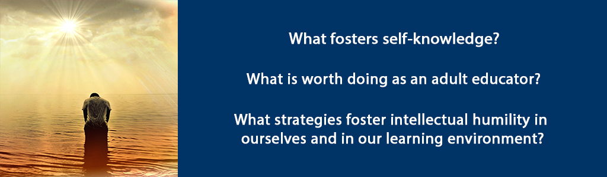

# Confidence and Humility



## Overview {-}

In this unit, you will explore the role of trust, confidence and intellectual humility in the practice and dispositions of the adult educator who is trying to establish an authentic learning community. You will consider your values as an individual as well as an educator and help you to define your role and purpose as an adult educator.

**Unit 9 focuses on three guiding questions:**

- What fosters self-knowledge?  
- What is worth doing as an adult educator?
- What strategies foster intellectual humility in ourselves and in our learning environment?

### Topics {-}

1. Learning to Trust Ourselves in Difficult Situations  
2. Approaches to Making a Contribution in an Intellectually Humble Way  

### Learning Outcomes: {-}

When you have completed this unit you should be able to:

- Explain why self-knowledge is an important part of being an effective adult educator and leads to increased self-confidence and humility.  
- Describe the contribution you want to make as an adult educator.  
- Define intellectual humility in your own words.  
- Describe strategies to foster intellectual humility in yourself and in your learning environment.  

### Activity Checklist {-}

These learning activities will engage you in considering the guiding questions for this unit. As you plan your week, be sure to include time for these important learning activities. *Note that not all activities are required. Your instructor will provide guidance on key activities to complete.*

```{block2, type='reflect'}

<span class="blockhead">Learning Activities</span>
- Read assigned pages from Wheatley chapter 8 and Coda. Consider the reflection question.  
- Watch [TedX talk](https://youtu.be/Xlg8zdSVjgg){target="_blank"} by Sam Horn and practice the technique.  
- Read Leary et al. article and engage in self-evaluation. Jot down practices related to intellectual humility.  
- Watch two videoclips of Andrew Pinsent and jot down some notes in your own words.  

```

```{block2, type='assessment'}
<span class="blockhead">Assessment</span>

- Complete your Unit 9 Discussion post.  
- Company Platform Paper (20%).  

```

## Learning to Trust Ourselves in Difficult Situations

We see the world through our own lens - which is why knowing ourselves is so very important. What parts of your past trigger reactions in you? Where do you find you are at your best? What is important to you? What bothers you? If you can articulate these things clearly then you will have more confidence and trust yourself in difficult situations. Why is this the case? Because when we honestly know ourselves and we join a sense of humble awareness with a sincere desire to work with others to make a positive impact, we have more confidence, self-efficacy and an increased willingness to engage – even in difficult situations. In the Bible we read that God is working through all things for our good (Romans 8:28). If we *really* believe this, consider how this belief might influence your thinking, allowing you to find peace and a humble confidence even in difficult situations.

How does one get to know oneself? Times of solitude spent reading, creating, walking in nature, relationships with others, new experiences, travel are all activities that allow us to get to know ourselves, depending on our frame of mind. If we read material that helps us ask some of the questions mentioned above through exploring the life of another person (fictional or real) or if we take part in experiences that help us discover what we are good or what matters to us, these will lead to increased self-knowledge. Flannery O’Connor illustrates the power of narrative saying:  

> There is something in us, as storytellers and as listeners to stories, that demands the redemptive act, that demands that what falls at least be offered the chance to be restored. (Arntz, V. 2018)  

Why does this matter for the adult educator? It matters because education is about transformation of people – not just their intellectual growth but themselves. Transformation requires knowing oneself first.

While Wheatley somewhat discounts the role of hope (278-280), Christian leaders and teachers are indeed people of hope and optimism who nonetheless realize the importance of Havel’s definition that  

> Hope is not the conviction that something will turn out well, but the certainty that something is worth doing no matter how it turns out” (Wheatley, 280).

In other words, we need to welcome the reality of whatever learners are bringing to the learning environment and look for the possibilities hidden in it - the possibilities for redemption and restoration. For example, some learners may have painful memories of school, a sense of inadequacy or else an inflated view of themselves. Some learners may have experienced severe trauma that affects their ability to process information. Some learners may have trouble reading or writing to the level we would hope they could achieve as graduate students. Whoever our learners are and whatever abilities or disabilities they bring, we need to create the conditions so they can become better human beings and more knowledgeable and skillful because of having spent time with us as their learning guides.

Our hope and vision must be rooted in the present (See [Daily Thoughts from JeanVanier](http://quotetab.com/quotes/by-jean-vanier){target="_blank"}). If that present is fraught with difficulties and challenges, the self-aware teacher leader embraces that reality and moves forward trusting themselves and, for the Christian, trusting God is working all things for our good. This requires courage – as Wheatley notes it is rooted in ‘coeur’ or heart (279). Courage with heart is needed to face the challenges of handling challenging situations when we ourselves might not feel equipped. Courage with heart tempered by intellectual humility is needed to transform lives through education. Effective adult educators are people with a vision for good, with confidence that they can influence positive change and help facilitate transformation in their learners because they are continually working on their own self-knowledge and will research the strategies and methods as well as the content that will be most helpful for their learners to be successful.

### Activity: Read and Reflect {-}

```{block2, type='reflect'}

Read Wheatley, M. (2017). *Who Do We Choose to Be?: Facing Reality, Claiming Leadership, Restoring Sanity.* Oakland, CA: Berrett-Koehler Publishers. Chapter 8 (pages 273-288 ) and Coda (pages 292-294).

**As you read this chapter and Coda, think about your own self perceptions and what you believe is worth doing as an adult educator.**

```

### Activity: Did You Know? {-}

```{block2, type='reflect'}

We will learn to trust ourselves more and build our confidence if we are able to convince even ourselves of our own self-efficacy! Watch this video (2014) ‘How to create interest and connect with anyone’ by Sam Horn.

[Watch: Intrigue - How to Create Interest and Connect with Anyone: Sam Horn at TEDxBethesdaWomen](https://www.youtube.com/watch?v=Xlg8zdSVjgg){target="_blank"}

<div class="video-container">

<iframe width="560" height="315" src="https://www.youtube.com/embed/Xlg8zdSVjgg" frameborder="0" allow="accelerometer; autoplay; encrypted-media; gyroscope; picture-in-picture" allowfullscreen></iframe>

</div>

The process described in this TedXtalk teaches the power of three ‘did you know’ questions followed by three attributes or solutions as a way to connect with others and help them understand what’s important to you and how you can help them.

**Practice this by asking yourself:**

- What is a project I care deeply about?  
- What are three questions or three statistics I can use to help explain the significance of this project?  

Follow Sam Horn’s suggested process to create your own intriguing pitch
and try it out with others until it sounds natural and comes easily to
you.

```

## Approaches to Making a Contribution in an Intellectually Humble Way

The Foundation for Critical Thinking defines [intellectual humility](http://www.criticalthinking.org/pages/valuable-intellectual-traits/528){target="_blank"}:

> Having a consciousness of the limits of one's knowledge, including a sensitivity to circumstances in which one's native egocentrism is likely to function self-deceptively; sensitivity to bias, prejudice and limitations of one's viewpoint. Intellectual humility depends on recognizing that one should not claim more than one actually knows. It does not imply spinelessness or submissiveness. It implies the lack of intellectual pretentiousness, boastfulness, or conceit, combined with insight into the logical foundations, or lack of such foundations, of one's beliefs. 

As a Christian adult educator, aim to be a servant leader-teacher. As servant leader *teacher*, seek to engage people’s heads, hearts and hopes and empower learners to turn their newfound knowledge and skills into action. Infuse your role with a perspective of the common good and engage confidently in contemporary cultural tensions. With students who are Christian this perspective of the common good finds its roots and expression in a relationship with Jesus Christ. For students who are not of the Christian faith, strive to espouse this in word and example in a way that is respectful of their heritage and traditions while at the same time giving them an understanding of the Christian worldview. Take the time to listen for what is important to them and to understand their beliefs in order to build bridges of understanding through respect.

Realizing that our core values, personality traits and characteristics impact to how we learn and teach, take the time to discern your essential values. For example, I have identified the following six essential values to incorporate into my life and teaching: honesty, integrity, persistence, desire to learn, compassion/empathy and community. Because I value compassion/empathy and community, I put the learner first and design my curricula and methodologies to suit the learners in my class. Because I value persistence and the desire to learn, I don’t give up on students and I try to find ways to help them learn through different methods and alternate ways that they can demonstrate their learning.

These values direct my entire teaching methodology; I espouse the goals of differentiated instruction (basically changing instructional methods to adapt to different learners) and aim to create a space for learning that empowers all students to succeed. (See [here](https://study.com/academy/lesson/what-is-differentiated-instruction-examples-definition-activities.html){target="_blank"} for more information). Differentiated instruction is a seamless part of my instructional planning and practice and I intentionally create opportunities to learn about students’ strengths, needs, interests, preferences and ways of learning. [Here](http://www.educationplanner.org/students/self-assessments/learning-styles-quiz.shtml){target="_blank"} is an example of a self-assessment tool to help identify a learner’s learning style. To this end I use meaningful [engaging tasks](https://www.prolaera.com/7-effective-way-to-engage-adult-learners/){target="_blank"}, [flexible grouping](https://www.kpu.ca/sites/default/files/Teaching%20and%20Learning/TD.1.3_Bedford%26Wiebe%26Tschida_Flexible_Grouping.pdf){target="_blank"}, and ongoing [assessment and adjustment](https://lincs.ed.gov/state-resources/federal-initiatives/teal/guide/formativeassessment){target="_blank"}. I differentiate the content, process, or product components of the educational experience by using a range of strategies and methods, e.g., anchor activities, tiered lessons, small-group instruction, and varied tasks.

I’ve used my own practice as a Christian educator as an example to give you some ideas and direction. Please take the time to explore the resources linked in the notes and other resources in your Brookfield and Silberman texts. The approach taken throughout this course is an intellectually humble one. In chapters five and six Brookfield (2013) particularly addresses the power dynamic in the classroom, awareness of which may foster a more intellectually humble approach. You are encouraged to use your texts as primary resources for more detailed information about specific strategies and approaches to making a contribution as an adult educator while remaining intellectually humble.

### Activity: Reading {-}

```{block2, type='reflect'}

**Read this article:** Leary, Mark & J. Diebels, Kate & K. Davisson, Erin & P. Jongman-Sereno, Katrina & Isherwood, Jennifer & Raimi, Kaitlin & Deffler, Samantha & Hoyle, Rick. (2017). Cognitive and Interpersonal Features of Intellectual Humility. *Personality and Social Psychology Bulletin. 43*. 014616721769769. 10.1177/0146167217697695.

The above [article](https://journals-sagepub-com.ezproxy.student.twu.ca/doi/pdf/10.1177/0146167217697695?){target="_blank"} can be accessed through the TWU
library:

As you read this article, self-evaluate your level of openness, curiosity, tolerance of ambiguity and dogmaticism.

**In your reflective journal, consider:**

- What two or three actions can you incorporate into your practice as an adult educator and leader to nurture your own intellectual humility and foster it in your students?  

```

### Activity: Pinsent Videos {-}

```{block2, type='reflect'}

Watch this video (2016) where Andrew Pinsent, Research Director at Oxford University answers the question: "Why is intellectual humility important for the flourishing of persons?"

[Watch: Andrew Pinsent - Why is intellectual humility important for the flourishing of persons?](https://www.youtube.com/watch?v=ny5m64sjm14){target="_blank"}

<div class="video-container">

<iframe width="560" height="315" src="https://www.youtube.com/embed/ny5m64sjm14" frameborder="0" allow="accelerometer; autoplay; encrypted-media; gyroscope; picture-in-picture" allowfullscreen></iframe>

</div>

Then watch this video (2016) where he answers the question: "What is still interesting about Aquinas’ concept of humility?"

[Watch: Andrew Pinsent - What is still interesting about Aquinas concept of humility?](https://www.youtube.com/watch?v=j25KL5qw_tY){target="_blank"}

<div class="video-container">

<iframe width="560" height="315" src="https://www.youtube.com/embed/j25KL5qw_tY" frameborder="0" allow="accelerometer; autoplay; encrypted-media; gyroscope; picture-in-picture" allowfullscreen></iframe>

</div>

**As you view the short video clips jot down some notes in your own words or any questions that you want to explore further about the topic of intellectual humility.**

```

## Unit 9 Summary {-}

In this unit, you have had the opportunity to learn about the role of trust, confidence and intellectual humility in the practice and dispositions of the adult educator. You have considered your values as an individual as well as an educator and further defined your role and purpose as an adult educator. As you move on to the last unit of this course, consider your values and how you view your role as an adult educator. The culminating assignment is a platform of beliefs where this will be important.

## Assessment {-}

```{block2, type='assessment'}

<span class="blockhead">Unit 9 Discussion</span>

**After having read the introductory notes, Wheatley chapter 8 and Coda:**

Write 300 words in response to the following quote by Thomas Merton, quoted in Wheatley p. 294:

> “Humans have a responsibility to find themselves where they are, in their own proper time and place, in the history to which they belong and to which they must inevitably contribute either their response or their evasions, either truth and act, or mere slogan and gesture.”

```

```{block2, type='assessment'}

<span class="blockhead">Assignment 3: Platform Paper - Peer Review Feedback (30%)</span>

For this assignment, you will write a contextualized Platform Paper in which you discuss your ideal learning community and your role as teacher/leader of that learning community. Select a context for your paper (i.e. facilitating in a FAR Centre in a specific country, teaching adult learners, facilitating employee development workshops, etc.).

Your paper should be written and referenced in APA format and include references to a minimum of 10 scholarly sources (this can include literature you read in
this course).

You will write a draft of the Platform Paper in Unit 8 and post for Peer Review. In Unit 9, you will provide feedback to another learner on their paper. You will make revisions based on the Peer Review and, in Unit 10, you will submit the final Platform Paper. Peer reviewers will be assigned in advance.

**PAPER OUTLINE**

**This paper will be 12-15 pages long, and should include:**

1. Introduction (1-2 pages)  
2. Section 1: Ideal Learning Environment (5-7 pages)  
3. Section 2: Your Role as Teacher and Leader (5-7 pages)  
4. Conclusion (1-2 pages)  

**PAPER GUIDELINES**

- **Introduction:** Introduce the two sections in your paper, providing a brief description of the key points you will make in each section.  
- **Section 1:** In section one, you will describe your ideal education learning environment. This section should demonstrate your learning about authentic learning communities, incorporating scholarly sources and your own analysis to depict your ideal learning environment. Incorporate a discussion of the learning community environment, learning experiences, student learning outcomes, and personal beliefs about teaching and learning.  
- **Section 2:** In this section, describe your role as a teacher or leader within an authentic learning community. Incorporating scholarly literature, analyze your role as a facilitator/leader in planning learning experiences, facilitating student learning, and assessing student learning. Describe the actions, practices, and strategies you will engage in to achieve your vision of the learning community you described in section one.  
- **Conclusion:** Summarize the key points you made in each section.  
- **References:** Include a reference list with references to at least 10 scholarly sources.  

*Please submit your feedback to your peer by emailing them through Moodle or their TWU account.*


```

```{block2, type='caution'}

*Please submit your assignments in the appropriate dropbox in Moodle. See the Assessment section for the Grading Criteria that explains how your assignments will be evaluated.*

```

## Checking your Learning {-}

```{block2, type='progress'}

**Use the learning outcomes for this unit as a checklist of understanding before you move to the next unit.**

- Can you explain why self-knowledge is an important part of being an effective adult educator and leads to increased self-confidence and humility?  
- Can you describe the contribution you want to make as an adult educator?  
- Can you define intellectual humility in your own words?  
- Can you describe strategies to foster intellectual humility in yourself and in your learning environment?  

```

## References {-}

- Arntz, V. 2018. Flannery O’Connor & redemption amidst the grotesque. Available at <https://catholicexchange.com/flannery-oconnor-redemption-amidst-grotesque>.  
- Brookfield, S. (2013). *Powerful techniques for teaching adults*. San Francisco: Jossey-Bass.  
- Brookfield, S. and Preskill, S. (2016). *The discussion book: 50 great ways to get people talking*. San Francisco: Jossey Bass.  
- Leary, Mark & J. Diebels, Kate & K. Davisson, Erin & P. Jongman-Sereno, Katrina & Isherwood, Jennifer & Raimi, Kaitlin & Deffler, Samantha & Hoyle, Rick. (2017). [Cognitive and interpersonal features of intellectual humility](https://journals-sagepub-com.ezproxy.student.twu.ca/doi/pdf/10.1177/0146167217697695?){target="_blank"}. *Personality and Social Psychology Bulletin. 43*. DOI:10.1177/0146167217697695.  
- Silberman, M. L., & Biech, E. (2015). *Active training: A handbook of techniques, designs, case examples, and tips* (4th ed.). Wiley.
- Wheatley, M. (2017). *Who do we choose to be? Facing reality, claiming leadership, restoring sanity.*  
