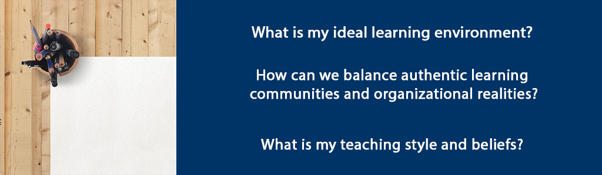

# Bringing It All Together



## Overview {-}

In this culminating unit you will bring together what you have learned about creating authentic learning communities for adult learners. Throughout the course you have explored theoretical foundations of learning communities, evaluated strategies for creating authentic learning communities, and how to apply those strategies in a learning/coaching context. In addition, you have explored teaching and learning through the lens of personal transformation and considered challenges of leading for an authentic learning environment. The themes you read and discussed included identity, perception, interconnectedness, humility and learning organizations.

Now it is time to develop a personal philosophy of Learning Communities, exploring what it means to be personally authentic and how to lead authentically in a learning environment. Your main task will be to consider two subtopics and write a platform paper that will synthesize your learning about teaching, learning and context as well as administrative and supervisory aspects of the role of adult educator. As an adult educator you have the opportunity to be a transformational leader. The development of a platform of beliefs will provide substantive proof of your readiness to serve in this capacity as well as increase your confidence and sense of self-efficacy.

**Unit 10 focuses on three guiding questions:**

- What is my ideal learning environment?  
- How can we balance authentic learning communities and organizational realities?  
- What is my teaching style and beliefs?  

### Topics {-}

1. Teaching, Learning and Context  
2. Administrative and Supervisory Aspects of an Adult Educator  

### Learning Outcomes: {-}

When you have completed this unit you should be able to:

- Describe your ideal adult learning environment.  
- Describe the supervisory and/or administrative aspects for which adult educators are accountable.  
- Create a platform of beliefs regarding adult learning for a specific context/organization.  

### Activity Checklist {-}

These learning activities will engage you in considering the guiding questions for this unit. As you plan your week, be sure to include time for these important learning activities. *Note that not all activities are required. Your instructor will provide guidance on key activities to complete.*

```{block2, type='reflect'}

<span class="blockhead">Learning Activities</span>

- Add sticky notes to your textbooks.  
- Watch video about adult learning styles.  
- Listen to the Steve Bell song.  

```

```{block2, type='assessment'}

<span class="blockhead">Assessment</span>

- Complete your Unit 10 Discussion post.  
- Submit your final draft of platform paper, incorporating Peer Feedback from last week (30%).  

```

## Teaching, Learning and Context

What is your ideal learning environment? You can learn a lot about your own teaching style from the way you like to be taught. Thinking about teachers you’ve liked will also give you clues to the sorts of things that are important to you, such as using critical thinking, humour, precise details, or visual reinforcement in the lesson. These are practical aspects of the role that you need to consider in addition to the methods and strategies you have been reading about in the course and in other certificate courses.

It is important to keep in mind that your personal likes and style will not be the same as your learners so you need to be flexible enough to build in variety. Generally, the more collective and participatory the methods, the more effective and engaging the class experience will be.

### Activity: Sticky Note Challenge! {-}

```{block2, type='reflect'}

Go through the Silberman and Brookfield texts and put a ‘sticky note’ on the pages of strategies that you like and plan to use. Think about why you like these facilitation techniques and what they say about your teaching and learning style.

```

### Activity: Learning Styles Video {-}

```{block2, type='reflect'}

Watch this 5 minute video about the 4 Adult Learning Styles explained with JC Melvin.

As you watch, consider how you can best get through to learners. What activities might you use to motivate, inform, coach for implementation and evaluate how the information will be applicable and helpful in learners’ lives?

[Watch: The 4 adult learning cycles & styles explained with JC Melvin](https://www.youtube.com/watch?v=5mApEVWZESA){target="_blank"}

<div class="video-container">

<iframe width="560" height="315" src="https://www.youtube.com/embed/5mApEVWZESA" frameborder="0" allow="accelerometer; autoplay; encrypted-media; gyroscope; picture-in-picture" allowfullscreen></iframe>

</div>

```

## Administrative and Supervisory Aspects of an Adult Educator

Teaching a group of learners also involves non-instructional duties. Sometimes there is a tension between our philosophical beliefs about authentic teaching and learning and the organizational realities we face. In addition to creating authentic learning experiences, your teaching responsibilities will often require you to track and report on learners’ progress, submit grades or summary reports to the organization, order textbooks or supplies, work with an assistant such as a learning coach or teacher assistant, book classrooms…. The possibilities are many!

Beyond your own classroom, you may be asked to contribute to committees and other meetings about the operational aspects of the education facility. Few educators work alone. We are almost all part of an organizational context which has implications for our work. Organizations have expectations and the relationship between the adult educator and the organization is important to consider. Sometimes what is asked of us organizationally conflicts with our philosophy of how to carry out assessment or what it means to advise and guide students on their educational journey. The time invested in meetings is important for the organization to flourish and enable the teaching and learning to happen at all yet, this time commitment can detract from planning authentic learning experiences and having the time to give extensive formative feedback. Every organization is driven by a set of values which will apply to the educational environment. If there is an outside funder for example, then reports to demonstrate progress and results will need great care and handling since this is what makes programs possible at all. Educators must not only promote what they consider the best way to do things but also take into account what others expect and need from the program.

During this course you have focused on how to develop authentic learning communities. Authentic learning communities take place within organizational contexts. Priorities between these two – developing authentic learning communities and organizational realities are not always aligned. However, it behooves the critical thinker to figure out how to align them as much as possible. This is a challenge worth embracing in order to be personally and professionally fulfilled.

> No matter how hopeful our dialogue has been, no matter how many of our colleagues have embraced a new vision, no matter how many practical possibilities we have explored, someone will say, ‘These are wonderful ideas, but every last one of them will be defeated by conditions in my school’ (Palmer, 2017, p. 170).

Palmer (2017) suggests that change begins when we, as individual teachers and facilitators, “make an inward decision to live *‘divided no more,’* finding a center for their lives outside of institutions” and “begin to discover one another and form *communities of congruence* that offer mutual support and opportunities to develop a shared vision” (pp. 172-3).

### Activity: Closing Song {-}

```{block2, type='reflect'}

As a closing activity, enjoy listening to this song. The whole effort of taking this certificate program, of wanting to be involved in transforming others through education and indeed of all our efforts in life, is in anticipation of something more - something ‘fresh and green’. And here is a song to inspire your continued efforts: ["Fresh and Green"](https://www.youtube.com/watch?v=uKjVQ5VSaXc){target="_blank"} by Steve Bell.

<div class="video-container">

<iframe width="560" height="315" src="https://www.youtube-nocookie.com/embed/uKjVQ5VSaXc" title="YouTube video player" frameborder="0" allow="accelerometer; autoplay; clipboard-write; encrypted-media; gyroscope; picture-in-picture; web-share" allowfullscreen></iframe>

</div>

> **FRESH AND GREEN (Psalm 92)**    
> *music and lyrics by Steve Bell*

>  Fresh and green we will remain    
>  Bearing fruit to a ripe old age    
>  Happy to tell about Your name   
>  A blessed endeavour    
>  The righteous flourish like the palm    
> And grow like cedars of Lebanon    
> Planted in the courts of God    
> Forever and ever    
> The senseless person doesn’t know    
> The wonders of Your glory    
> And yet their hoppers overflow    
> But they don’t understand    
> That folly springs up like the grass    
> And spreads throughout these vast lands    
> But harvesting will come to pass    
> When everything is shown    
> Everything will be exposed    
> Fresh and green…    
> It is so good to sing of You    
> At the first light of the morning    
> And at night Your faithfulness review    
> Before I close my eyes    
> And sometimes in the dimming light    
> I stumble on Your glory    
> That overwhelming sudden fright    
> But not the daunting kind    
> It’s so hard to describe.    

```

## Unit 10 Summary {-}

In this unit, you have had the opportunity to discern your teaching style and beliefs as well as consider certain pragmatic aspects of the role. Through writing the platform paper you had the opportunity to think critically about what you’ve learned in this course about authentic learning communities, your personal and professional identity. Teaching and coaching adults is not easy – challenges and indeed failures are to be expected no matter how much experience you have. But it is a very rewarding vocation if you put in the thought, time and talent into good content, design and facilitation.

In the role of adult educator, you have the opportunity to change lives and cultivate growth of the mind and spirit. May the work you undertake grow within you a greatness of vision, stir your spirit so that you can see and love the common good more, and create an environment where all whom you serve can thrive.

## Assessment {-}

```{block2, type='assessment'}

<span class="blockhead">Assignment 3: Platform Paper (30%)</span>

Last week you submitted your draft to your assigned peer for Peer Review.  Incorporate the feedback and submit a final draft to your instructor via Moodle. See details below.

For this assignment, you will write a contextualized Platform Paper in which you discuss your ideal learning community and your role as teacher/leader of that learning community. Select a context for your paper (i.e. facilitating in a FAR Centre in a specific country, teaching adult learners, facilitating employee development workshops, etc.).

Your paper should be written and referenced in APA format and include references to a minimum of 10 scholarly sources (this can include literature you read in this course).

You will write a draft of the Platform Paper in Unit 8 and post for Peer Review. In Unit 9, you will provide feedback to another learner on their paper. You will make revisions based on the Peer Review and, in Unit 10, you will submit the final Platform Paper. Peer reviewers will be assigned in advance.

**PAPER OUTLINE**

**This paper will be 12-15 pages long, and should include:**

1.  Introduction (1-2 pages)
2.  Section 1: Ideal Learning Environment (5-7 pages)
3.  Section 2: Your Role as Teacher and Leader (5-7 pages)
4.  Conclusion (1-2 pages)

**PAPER GUIDELINES**

- **Introduction:** Introduce the two sections in your paper, providing a brief description of the key points you will make in each section.  
- **Section 1:** In section one, you will describe your ideal education learning environment. This section should demonstrate your learning about authentic learning communities, incorporating scholarly sources and your own analysis to depict your ideal learning environment. Incorporate a discussion of the learning community environment, learning experiences, student learning outcomes, and personal beliefs about teaching and learning.  
- **Section 2:** In this section, describe your role as a teacher or leader within an authentic learning community. Incorporating scholarly literature, analyze your role as a facilitator/leader in planning learning experiences, facilitating student learning, and assessing student learning. Describe the actions, practices, and strategies you will engage in to achieve your vision of the learning community you described in section one.  
- **Conclusion:** Summarize the key points you made in each section.  
- **References:** Include a reference list with references to at least 10 scholarly sources.  

```

```{block2, type='caution'}

*Please submit your assignments in the appropriate dropbox in Moodle. See the Assessment section for the Grading Criteria that explains how your assignments will be evaluated.*

```

## Checking your Learning {-}

```{block2, type='progress'}

**Use the learning outcomes for this unit as a checklist of understanding before you move to the next unit. Can you:**

- describe your ideal adult learning environment?  
- describe the supervisory and administrative aspects for which you may be accountable?  
- articulate your platform of beliefs regarding adult learning for a specific context/organization?  

```

## References {-}

- Brookfield, S. (2013). *Powerful techniques for teaching adults*. San Francisco: Jossey-Bass.  
- Brookfield, S. and Preskill, S. (2016). *The discussion book: 50 great ways to get people talking*. San Francisco: Jossey Bass.  
- Palmer, P. (2017). *The courage to teach: Exploring the inner landscape of a teacher’s life*. San Francisco: Wiley.  
- Silberman, M. L., & Biech, E. (2015). *Active training: A handbook of techniques, designs, case examples, and tips* (4th ed.). Wiley.  
- Wheatley, M. (2017). *Who do we choose to be? Facing reality, claiming leadership, restoring sanity.*  
