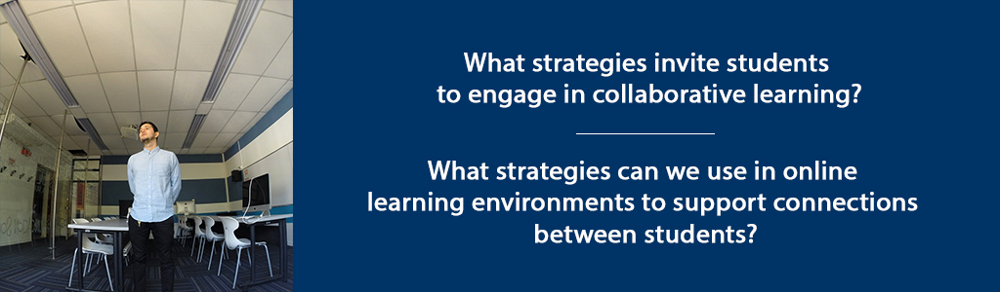

# Course Description{-}

Learners explore theoretical foundations of learning communities, evaluate strategies for creating authentic learning communities, and apply those strategies in a learning/coaching context.   Learners explore teaching and learning through the lens of personal transformation and then widen their lens to consider systems theory and challenges of leading for an authentic learning environment. Learners explore themes such as identity, perception, interconnectedness and learning organizations. Learners will develop a personal philosophy of Learning Communities, exploring what it means to be personally authentic and how to lead authentically in a learning environment. 

> **The syllabus includes key information about the course schedule, assignments, and policies. Please read the full course syllabus located at the bottom of the Welcome page in Moodle.**


This course is part of the *Graduate Certificate in Adult Learning: Coaching and Facilitation* and qualifies as an elective in the MA Leadership program.

---

## Course Learning Outcomes{-}

On successfully completing this course, students should be able to:

1.  Interpret the influence of teacher authenticity on student learning.

2.  Develop a personal philosophy of their role as facilitator in creating authentic learning communities.

3.  Create a platform of beliefs regarding adult learning for a specific organization.

4.  Evaluate strategies for developing learning connections with and between students.

5.  Apply strategies for creating authentic learning communities that include indigenous ways of knowing.

6.  Analyze the effectiveness of training and employee development.

---

## Course Activities/Requirements{-}

Activities include participation in discussions, assignments, and various ungraded learning activities designed to prepare students for assessments.  See course outline below for details on activities and assignments.


## Determination Of Final Grade{-}

| **Assessment**                         | **Grade** | Learning Outcome|
|----------------------------------------|-----------|-----------|
| Community of Inquiry (Discussions)     | 30%       | 1-7 |
| Assignment 1: Identity as a Teacher    | 20%       | 2,4,5,6 |
| Assignment 2: Company Website Analysis | 20%       | 2,3,4,5 |
| Assignment 3: Platform Paper           | 30%       | 4-5 |


See **Assessments** section in Moodle for specific assignment details, including
grading rubrics.

---

## Course Topics{-}

 Unit 1: The Heart of a Teacher

 Unit 2: Belonging to One’s Self

 Unit 3: Belonging to Others

 Unit 4:  Creating A Sense of Belonging

 Unit 5: Creating Space for All Learners

 Unit 6: Authentic Learning and Identity

 Unit 7: Information and Perception

 Unit 8:  Interconnectedness and Integrity

 Unit 9: Confidence and Humility

 Unit 10: Conclusions  

---

## Course Resources{-}
 The following are key resources used in LDRS 664.  

  1.  Brown, B. (2017). *Braving the wilderness: The quest for true belonging and the courage to stand alone.* New York: Random House.

 1.  Gardner, B., Avolio, B., Luthans, F., May, D. & Walumbwa, F. (2005) Can you see the real me? A self-based model of authentic leader and follower development. *The Leadership Quarterly* 16, pp. 343–372.

 1.  Palmer, P.J. (2017). *The courage to teach: Exploring the inner landscape of a teacher's life*. Hoboken, NJ: Jossey-Bass.

 1.  Silberman, M. L., & Biech, E. (2015). *Active training: A handbook of techniques, designs, case examples, and tips* (4th ed.). Wiley. (also used in LDRS 627)

 1.  Wheatley, M. (2017). *Who do we choose to be? Facing reality, claiming leadership, restoring sanity*. Oakland, CA: Berrett-Koehler Publishers.

1.  Brookfield, S. & Preskill, S. (2016). *The discussion book: 50 great ways to get people talking*. San Francisco: Jossey-Bass. (*There is no assigned reading from this text but it is an excellent resource book.*)

 1.  All other resources will be provided online.

```{block, type='caution'}
Note that not all sections of LDRS 664 use all of the above resources. Please confirm which of the following texts are required by ***checking your course syllabus.***
```
---

## Course Navigation{-}

### Course Units{-}
 This course is organized into 10 units. Each unit of the course will provide you with the following information:

 - A general overview of the key concepts that will be addressed during the unit.
 - Specific learning outcomes and topics for the unit.
 - Learning activities to help you engage with the concepts. These often include key readings, videos, and reflective prompts.
 - The Assessment section provides details on assignments you will need to complete throughout the course to demonstrate your understanding of the course learning outcomes.

 ```{block, type='caution'}
 Note that assessments, including assignments and discussion posts will be submitted in Moodle.  See the Assessment tab in Moodle for the assignment dropboxes.
 ```

### Course Activities{-}
 Below is some key information on features you will see throughout the course. 

 ```{block, type='reflect'}
***Learning Activity***  
This box will prompt you to engage in course concepts, often by viewing resources and reflecting on your experience and/or learning. Most learning activities are ungraded and are designed to help prepare you for the assessment in this course.
 ```

 ```{block, type='assessment'}
***Assessment***  
This box will signify an assignment or discussion post you will submit in Moodle.  Note that these demonstrate your understanding of the course learning outcomes. Be sure to review the grading rubrics for each assignment.
 ```

 ```{block, type='progress'}
***Checking Your Learning***  
This box is for checking your understanding, to make sure you are ready for what follows.
 ```

 ```{block, type='video'}
***Media***  
This box is for displaying/linking to media, such as videos or songs, in order to help illustrate or communicate concepts.
 ```

 ```{block, type='caution'}
***Note***  
This box signifies key notes, such as where to submit assignments.  It may also warn you of possible problems or pitfalls you may encounter!
 ```


### How To Navigate This Book{-}
 To move quickly to different portions of the book, click on the appropriate chapter or section in the table of contents on the left. The buttons at the top of the page allow you to show/hide the table of contents, search the book, change font settings, download a pdf or ebook copy of this book, or get hints on various sections of the book.
 ```{r, echo=F, fig.cap="Top menu bar", fig.show="hold", results='asis'}
 knitr::include_graphics("assets/course-intro/menu.png")
 ```

 The faint left and right arrows at the sides of each page (or bottom of the page if it’s narrow enough) allow you to step to the next/previous section. Here’s what they look like:
 ```{r, echo=F, fig.cap="Left and right navigation arrows", fig.show="hold", results='asis'}
 knitr::include_graphics("assets/course-intro/left_arrow.png")
 knitr::include_graphics("assets/course-intro/right_arrow.png")
 ```

 ---

## Graduate Level Writing Standards{-}

For students in LDRS 664, graduate level writing standards following APA 7 are expected. Please consult the [OWL Purdue website](https://owl.purdue.edu/owl/research_and_citation/apa_style/apa_style_introduction.html){target="_blank"} for guidance and seek assistance from the TWU Writing Center and writing coaches as needed. Assignments have rubrics that attribute some marks to APA formatting and cannot be graded as fully meeting expectations if there are APA errors. That said, your conceptual understanding remains of primary importance. It is your responsibility to ensure polished work to the highest standard of which you are capable. This demands meticulous attention to detail, which will become more 'natural' with practice. Please seek any necessary clarification from your instructor.

```{block, type='caution'}
***It will be assumed that you have read, understand, and agree to the information provided at the [Academic Dishonesty Policy website](https://www.twu.ca/student-handbook/university-policies/academic-misconduct/procedures-dealing-acts-academic-0){target="_blank"}. If you have any questions at all please contact your instructor.***
```

<!--chapter:end:index.Rmd-->

# LDRS 664 Communities{-}

As this course focuses on building community with your learners, how will you build community with your colleagues?

In this course, we have the following tools available to help foster community in your course, including other students who have previously taken LDRS 664. Some of these tools will be prescribed and graded (e.g. Moodle Discussion Forums), others will be up to you to take advantage of.

Check with your course syllabus for which community tools will be used, and consider building your own Community of Practice with your classmates and external colleagues.

## Communication Tools
**Moodle Discussion Forums**: In this course, we ask you to discuss ideas with your colleagues, challenging one another and analyzing key course resources. Refer to the course syllabus for assessment details, as well as the unit Assessment section for discussion questions.  Submit your responses in Moodle.

**Video Conferencing**: We will have scheduled online meetings (Zoom or Teams). Take advantage of these face-to-face conferences! Come prepared with your questions and assigned activities. Refer to the course syllabus and unit activity instructions for details.

*Optional:*

Your cohort may want to engage in other informal discussions to build community and support each other.  Consider using the following:  

**Learning Cafe:** This discussion forum in Moodle is a place for you to interact about things going on, share resources, and generally get to know one another. Your posts don't have to be course related. Take this opportunity to connect with fellow learners and learn from one another!

**Teams:** Every TWU course has a Teams channel, mostly to manage videos. Feel free to use the messaging feature to connect with peers.

**Twitter hashtag #LDRS664:** You can tweet about this course using #LDRS664.

**What's App:** Feel free to use a platform that works for you!!  What's App is a popular chat forum that learners use for discussions, class projects, etc.


A key takeaway...make these forums work for you!  Interact with your peers, learn from each other, and make connections that will stay with you beyond this course.

With that, let's begin the journey together!


<!--chapter:end:01-community.Rmd-->

# The Heart of a Teacher

## Overview {-}

As humans, we long for authenticity in our relationships. We want to feel "at home" in the organizations that are part of our lives -- our families, schools, communities, places of worship. We seek connection. We search for a place where we are known.

This sense of being "at home" is essential to our experience as learners. Deep, authentic learning happens in spaces where we feel connected with others -- places and spaces where we are known. Palmer (1998) refers to this as the "spiritual quest for connectedness" (p. 5).

In this course, we will explore together the theoretical foundations of learning communities, evaluating key elements essential to creating authentic learning communities, where learners are known and learning is authentic. In this unit, we will engage with the writings of Parker Palmer, a teacher and writer who has written several important works regarding the essential role of authenticity in teaching and learning.

In addition to reading, throughout this course, we will also listen to music and view several short films that will allow us to more deeply engage with the concepts of belonging and authenticity within the teaching/learning experience.

Unit 1 focuses on two guiding questions:


##  Topics{-}

1.  Authenticity in Teaching and Learning

2.  Identity and Integrity as a Coach/Facilitator


##  Learning Outcomes{-}

When you have completed this unit you should be able to:

1.  Describe your own personal identity as a facilitator/teacher.

2.  Identify your personal beliefs about your role as a facilitator/teacher.

3.  Discuss key elements of an authentic learning community.


##  Activity Checklist{-}

These learning activities will engage you in considering the guiding questions for this unit. As you plan your week, be sure to include time for these important learning activities. *Note that not all activities are required. Your instructor will provide guidance on key activities to complete.*

|Learning Activities|
|---|
|Activity: Read: Palmer, P. (2017): Introduction, Chapter 1: The Heart of a Teacher: Identity and Integrity in Teaching; Chapter 3: The Hidden Wholeness: Paradox in Teaching and Learning. Alternatively read Goode, Joanna: [If you Build Teachers, will students come?](https://journals-sagepub-com.twu.idm.oclc.org/doi/pdf/10.2190/2102-5G77-QL77-5506){target="_blank"}
|
|Activity: Reflect on your values and respond in your Reflective Learning Journal.|
|Activity:   Rank the strategies listed to create an authentic learning space that is hospitable and open. Then, read: Herrington, J. &amp; Oliver, R. (2000). [An instructional design framework for authentic learning environments.](https://ro.uow.edu.au/edupapers/31/){target="_blank"} Educational Technology Research and Development. 48(3), pp 23-48. |
|Assessment:  Unit 1 Discussion: Incorporating the readings in this unit, you will write a 150-250 word discussion post that addresses your values related to teaching and learning and the key elements of authentic learning spaces. See the Assessment sections for full details.|


## Authenticity in Teaching and Learning

Teaching and learning are deeply personal experiences. Learning is, by definition, a transformative experience; we change as a result of learning. Teaching is also a transformative experience; we change as a result of teaching.

  

Figure 1.1: Authentic Learners and Authentic Teachers Model designed by Penfold Navarro, C. (2018)

In his book, *The Courage to Teach: Exploring the Inner Landscape of a Teacher's Life*, Parker Palmer (2017) argues that the "inner landscape of teaching" is an essential foundation out of which authentic learning experiences emerge.

>*Teachers possess the power to create conditions that can help students learn a great deal -- or keep them from learning much at all. Teaching is the intentional act of creating those conditions, and good teaching requires that we understand the inner sources of both the intent and the act.* -- Palmer (2017, p. 7)

###  Activity: Reading

```{block, type='reflect'}
As we explore the importance of the “inner life of the teacher” as a foundation for authentic learning, read Chapter 1: The Heart of a Teacher: Identity and Integrity in Teaching in The Courage to Teach (Palmer, 2017). Alternatively, read [If you Build Teachers, will students come?](https://journals-sagepub-com.twu.idm.oclc.org/doi/pdf/10.2190/2102-5G77-QL77-5506) (Goode, 2007).   

For this course, you will keep a Reflective Learning Journal, which will provide the basis for many of your blog posts. Writing can be a powerful learning experience, as we engage in reflection and critical analysis of the new concepts we discover. Through regular writing, we are challenged to think critically, organize, and integrate these new concepts with our prior understanding, as you prepare for your future teaching/coaching.

💭 ***Consider the following questions:***  

•	In your Reflective Learning Journal, write a summary sentence for each major idea/concept that relates to your understanding of what it means to be a teacher/facilitator/coach.  
•	Choose the concept that most resonates with you and write a short paragraph summary of this concept, applied to your professional/personal context.  
•	Formulate one question that emerged from this reading that you will explore and consider in future course readings and discussions.  
•	As you prepare your discussions, refer to these notes.

```

## Identity and Integrity as a Coach/Facilitator

Identity and integrity are foundational to good teaching. This means we must endeavour to know ourselves and to create learning spaces that foster integrity in our students, allowing them to authentically engage with each other, with us, and with the discipline we are studying.

In order to have integrity, we must know our own values and strengths, our own beliefs about teaching and learning, and our own perspective on the work we are doing.

> If the work we do lacks integrity for us, then we, the work, and the people we do it with will suffer. -- Palmer (2017, p. 16)

###  Activity: Reflect and Respond
```{block, type='reflect'}
As teachers, it’s important to identify and reflect on your own values.   
💭 Consider why you are taking this course. Why do you want to coach/facilitate learning? What are your beliefs about learning? What are your values about learning? What are your strengths? Where do you need help?

Take some time to answer the questions above in your Reflective Learning journal.
```

## Creating Authentic Learning Spaces

> *For now we see in a mirror dimly, but then face to face; now I know in part, but then I will know fully just as **I also have been fully known***. -- 1 Corinthians 13:12 (ESV)

As we begin thinking about creating authentic learning spaces, consider a time when you have felt “at home” within a learning community, whether in formal education, your faith community, or your employment. What elements made that learning space feel like “home?”

In the song, *Home**, Phillip Phillips sings about the universal need we share as humans to “belong.” Take a moment now to listen to this song, considering what the lyrics say about what it means to belong.

> Just know you’re not alone
> 'Cause I’m going to make this place your home.
> -- Phillip Phillips,

```{block, type='video'}
<iframe width="560" height="315" src="https://www.youtube.com/embed/HoRkntoHkIE" frameborder="0" allow="accelerometer; autoplay; encrypted-media; gyroscope; picture-in-picture" allowfullscreen></iframe>
```


In order for students to authentically learn, we must create learning spaces that are safe, where students know and feel that they belong. Palmer (1998) refers to this need for belonging as the "spiritual quest for connectedness" (p.5).

If a sense of belonging provides a foundation for learning, then in our role as teachers, facilitators, or coaches, we must endeavour to create spaces where students know and feel that they belong.

> *Good teachers possess a capacity for connectedness. They are able to eave a complex web of connections among themselves, their subjects, and their students so that students can learn to weave a world for themselves.* -- Palmer (2017, p. 11)

But how is this done?

In “*To Know As We Are Known,*” Palmer (1993) suggests that learning spaces must include openness, boundaries, and an air of hospitality. These learning spaces, according to Palmer (1993) can be spaces “both to be and to become” (p. 71).

###  Activity: Ranking
```{block, type='reflect'}
Rank the following strategies according to your comfort level. For each strategy, list one practical action you can take in an online learning environment (as facilitator or learner) to create an authentic learning space that is hospitable and open.*

“To study with a teacher who not only **speaks** but l**istens**, who not **only gives answers** but **asks questions** and **welcomes our insights**, who **provides information and theories** that **do not close doors** but **open new ones**, who **encourages students** to help each other learn – to study with such a teacher is to know the power of a learning space” (Palmer, 1997, pp. 70-71)

1.  Speaking

2.  Listening

3.  Giving answers

4.  Asking questions

5.  Providing information/theories that open doors

6.  Encouraging students to help each other learn

---

Next, read the discussion of authentic learning environments in Herrington and Oliver (2000), consider how the elements they discuss align with or differ from Palmer’s (2017) description of learning communities.

 Herrington, J. and Oliver, R. (2000). [An instructional design framework for authentic learning environments](https://ro.uow.edu.au/edupapers/31/){target="_blank"}.

💭 ***Questions to Consider***

After completing the activities above, consider the following questions:

- What are the important values that will guide my teaching/facilitation?
- What elements matter most to me in a learning community?
- What can I do to create hospitable learning spaces?
```

## Unit 1 Summary{-}

In this first unit, you have had the opportunity to think and learn about your identify and beliefs about your role as a facilitator/teacher, and consider key elements of authentic learning communities. The hunger for authentic human relationships and authentic learning can and should compel us to consider our own identity and integrity, both as teachers and learners. In our next unit, we will explore ideas related to vulnerability in leadership, and learning to be “at home” with ourselves so we can, in turn, lead and teach others.

##  Assessment{-}
```{block, type='assessment'}
### Unit 1 Discussion {-}
 After completing this unit, including the learning activities, you are asked to write a discussion post on the following:

**Part 1**   
Incorporating the readings in this unit, write a 150-250 word discussion post that addresses the following:

*List and describe three values you hold related to teaching and learning. Write a personal statement about your identity as a coach/facilitator.*

**Part 2**  
For the second part of your discussion, write a 150-250 response to the following:    

*Consider the key elements of authentic learning spaces, outlined by Palmer (2017) in Chapter 3. Select two of these elements that you consider to be important. Introduce the element and discuss some practical steps you could take to create an authentic learning space. Respond to at least two other learners, providing additional suggestions regarding the elements they have chosen. Be sure to cite Palmer (2017) and other authors in both your initial posting and your responses to other learner to demonstrate ways in which your thinking aligns with, contrasts with, or builds on the writing of the authors.*

Please submit your discussion posts and responses in the **Unit 1 Discussion Forum** in Moodle.

See the Assessment section for the Grading Criteria that explains how your discussion contributions will be evaluated.
```

##  Checking your Learning{-}
```{block, type='progress'}
Use the learning outcomes for this unit as a checklist of understanding before you move to the next unit. Can you:

- describe your own personal identity as a facilitator/teacher?
- identify your personal beliefs about your role as a facilitator/teacher?
- discuss key elements of an authentic learning community?  
```

<!--chapter:end:02-u1.Rmd-->

# Belonging to One’s Self

## Overview {-}

As we began to explore in Unit 1, creating authentic learning communities begins with personal authenticity -- with knowing one's self. Palmer (2017) argues that "good teaching comes from the *identity* and *integrity* of the teacher" (p. 13, italics added).

In this unit, we will explore the importance of identity and integrity as teachers/coaches, considering our own sense of identity as teachers, and what it means to belong to one’s self.


Unit 2 focuses on two guiding questions:


##  Topics{-}
 1. Belonging to Myself
 2. Vulnerability in Learning Communities
 3. Creating Connections with Learners


##  Learning Outcomes{-}

When you have completed this unit you should be able to:

* Articulate a sense of identity as a teacher/facilitator.

* Analyze the influence of teacher authenticity on student learning.


##  Activity Checklist {-}

These learning activities will engage you in considering the guiding questions for this unit. As you plan your week, be sure to include time for these important learning activities. *Note that not all activities are required. Your instructor will provide guidance on key activities to complete.*

| **Learning Activities**|
|---|
| **Activity:** In a non-graded discussion post, share a little more about yourself with your peers.|
| **Activity:** Read Brown, B. (2017). Chapter 1: Everywhere and Nowhere, Then, watch: Maya Angelou: [Interview with Bill Moyers ](http://billmoyers.com/content/conversation-maya-angelou/){target="_blank"} (7 minutes).     |
| **Activity:** Watch Brene Brown: [The Power of Vulnerability](https://www.ted.com/talks/brene_brown_on_vulnerability){target="_blank"} (20 minutes)|
| **Activity:** Read Brown, B. (2017). Chapter 2: The Quest for True Belonging.|
| **Activity:** In your Reflective Learning Journal, consider a time when you were your “true self” in a professional or personal setting in which you wondered if you really “belonged.” What part of yourself did you share? How did this make you feel vulnerable? What were the results?|
| **Activity:** Listen to [Brave](https://www.youtube.com/watch?v=QUQsqBqxoR4){target="_blank"} by Sara Bareilles.   |
| **Activity:** Take the [“Clance Imposter Phenomenon”](https://paulineroseclance.com/pdf/IPscoringtest.pdf){target="_blank"} assessment from *The impostor phenomenon: When success makes you feel like a fake* (pp. 20-22), by P.R. Clance, 1985, Toronto: Bantam Books, ABPP.|
| **Activity:** Read Gardner, B., Avolio, B., Luthans, F., May, D. & Walumbwa, F. (2005) Can you see the real me? A self-based model of authentic leader and follower development. *The Leadership Quarterly 16*, pp. 343–372. Optional Read: Cuddy, A. (2016). [I don’t deserve to be here: Presence and the imposter syndrome.](https://leanin.org/news-inspiration/overcoming-imposter-syndrome-to-reveal-your-presence){target="_blank"} |
| **Activity:** Participate in the exercise, “Nine Why’s”  |
| **Assessment: Unit 2 Discussion**: Write a discussion post on belonging and the “Nine Why’s” activity. See the Assessments section for more details.   |

## Belonging to Myself

In order to create authentic, safe learning spaces for others, we must first be comfortable with who we are.

**Identity:** Knowing ourselves as teachers means that we must explore what Palmer (2017) calls the “inner landscape.” We must be aware of the character traits, personal experiences, values, beliefs, and cultural environment in which we were raised and now live. These elements are part of our identity -- and we bring our identity with us into the classroom and learning spaces in which we coach and teach others (Palmer, 2017).

**Integrity:** So, too, our integrity comes with us into the learning spaces in which we teach. Integrity, from Palmer's (2017) discussion, is not about ethics, but about an integrated sense of self -- a self that is whole, integrating life experiences and values and beliefs in a meaningful, authentic way.

Whether we are aware of it or not, our integrity and identity are part of who we are as teachers. It is on this foundation that we build connections with students, and are able to invite them into spaces where personal transformation and authentic learning will take place.

Authenticity is also an essential ingredient for effective leadership. Authentic leadership includes elements of both self-knowledge and identity, as well as collaboration with others within the context of relationship (Northhouse, 2019). Avolio, Walumbwa and Weber (2009) provide a model of authentic leadership that includes "self-awareness, internalized moral perspective, balanced processing, and relational transparency" (as cited in Northhouse, 2019, p. 198).

However, even when we long to be vulnerable and authentic within our roles as teachers or leaders, we are often challenged by our own desire to project competence and strength, thinking that vulnerability and strength are mutually exclusive. Despite our need for authentic leaders and teachers, many of us remain reluctant to share any level of vulnerability – perhaps even more so when we are in positions of influence, as teachers, coaches, or leaders.

In her book, *Imposter Phenomenon: When Success Makes You Feel Like a Fake*, Clance (1985) argues that many of us enter the arena of public engagement and career with concerns about whether we really belong. This fear often means we are afraid that being vulnerable or authentic will reveal to others that we do not truly “belong” in our roles.

The first step to belonging, as seen in the work of Brown (2017) and Palmer (2017) is a sense of our own identity – including both our strengths and our areas of disconnection or discontent. Both these scholars urge us to understand our own humanity – to “learn to trust ourselves and trust others” (Brown, 2017, p. 37).

As poet [Maya Angelou](http://billmoyers.com/content/conversation-maya-angelou/) discusses, belonging to one's self is an ongoing journey -- a journey that is not always easy.

> I belong to myself. -- Maya Angelou, 1973


### Activity: Who are you?

```{block, type='reflect'}
For this activity, you are asked to share a little more about yourself with your peers. First, find a quote about either identity or integrity. For example, you may want to perform a Google image search for “identity quote.” Find one that resonates with you, and then include a picture of something that tells us something about you. Post the quote and your image to the Unit 2 Discussion forum with a 1-2 sentence explanation. This is a non-graded activity, but may help you reflect on this topic and to prepare for the assignment in this unit.
```

###  Activity: View and Reflect
```{block, type='reflect'}

View the following resources and reflect on your learning:  
- Read. Brown, B. (2017). Chapter 1: Everywhere and Nowhere.  
- Watch: Maya Angelou: [Interview with Bill Moyers](http://billmoyers.com/content/conversation-maya-angelou/) (7 minutes).
```   

## Vulnerability in Learning Communities

Learning to be vulnerable enough to share our authentic selves can be challenging – and knowing how much to be vulnerable (and when\!) also poses a challenge, both in teaching and leadership. Students also wrestle with similar questions – How much of myself should I share in this class? This paper? This blog? Is this a safe space to express my own feelings of vulnerability?

Authenticity is built on trust
– spaces in which you are comfortable enough to share your true self
– your identity. Brown (2017) argues that “self-trust” provides a foundation for belonging.

> Authenticity involves both owning one’s personal experiences (values, thoughts, emotions and beliefs) and acting in accordance with one’s true self (expressing what you really think and believe and behaving accordingly) (Harter, 2002, as cited in Gardner, Avolio, Luthans, May, and Walumbwa, 2005, pp. 344-5).

Gardner et al. (2005) describe authentic leadership is demonstrated when “relationships are characterized by: a) transparency, openness, and trust, b) guidance toward worthy objectives, and c) an emphasis on follower development” (p. 345).

If effective relationships include these characteristics, then authentic teachers and leaders must consider what it means to be transparent and open, as well as what it means to extend trust.

###  Activity: Vulnerability Video
```{block, type='video'}

Watch the TedTalk by Brene Brown: (20 minutes)

<iframe width="560" height="315" src="https://www.youtube.com/embed/iCvmsMzlF7o" frameborder="0" allow="accelerometer; autoplay; encrypted-media; gyroscope; picture-in-picture" allowfullscreen></iframe>


💭 As you watch, consider the following questions:

1.  What elements of a learning community would create conditions for learners to be vulnerable about their fears about the course, their concerns about learning, and their questions regarding whether they are capable of achieving success in their course?

2.  In what ways do you feel vulnerable as a teacher/facilitator? Are there people with whom you can share this vulnerability?

You may want to answer these questions in your Reflective Learning Journal, and refer back to them as you complete the assessment for this unit.
```

###  Activity: Brown Reading & Reflection
```{block, type='reflect'}

Brown (2017) argues that authenticity is essential to belonging.

> You will always belong anywhere you show up as yourself and talk about yourself and your work in a real way. -- Brene Brown (2017, p. 26)

As you read Brown (2017) Chapter 2, answer the following questions in your Reflective Learning Journal:

- Write a summary sentence for each major idea/concept that relates to belonging.

- Choose the concept that you would like to apply in your own learning communities, both as a student and teacher/facilitator.

- Formulate one question that emerged from this reading that you will explore and consider in future course readings and discussions.

- As you prepare your discussion post, refer to these notes.
```

###  Activity: Sharing your Identity
```{block, type='reflect'}

Being vulnerable involves sharing something of our true selves, which we might not always be comfortable doing in certain environments. In your Reflective Learning Journal, consider a time when you were your “true self” in a professional or personal setting in which you wondered if you really “belonged.” Perhaps this is a time when shared your spoke up about an issue that was important to you, lead a team in a new direction, or created a process that felt more authentic to you. What part of yourself did you share? How did this make you feel vulnerable? What were the results?
```

## Creating Connections with Learners

In our role as teachers, we are asked to connect students with new ways of thinking and knowing, as well as new knowledge. But the first (and perhaps most important) connections we make (and the connections on which all learning is built) are connections between students, and between students and teachers.

> Good teachers join self and subject and students in the fabric of life. -- Parker Palmer (1998, p. 11)

Leadership, like teaching, relies not just on the relationships that teachers form with learners, but also on the identity of the teacher. "Authentic leaders understand their own *values* and *behave* toward others based on these values" (Northouse, 2019, p. 201).

These relationships will form the basis for learning in the classroom. Learning is, at its heart, a personal activity. Learners often experience vulnerability as they enter into (and continue through) the learning experience, wondering if they belong, if they are up to the challenge, and if they will succeed.


###  Activity: Listen and Reflect
```{block, type='video'}

Listen to “Brave” sung by Sara Bareilles.

<iframe width="560" height="315" src="https://www.youtube.com/embed/QUQsqBqxoR4" frameborder="0" allow="accelerometer; autoplay; encrypted-media; gyroscope; picture-in-picture" allowfullscreen></iframe>


💭 As you listen to this song, consider the following questions:

1.  Is there an area in my current professional work where I need to be brave and speak up?

2.  What fears would keep me from sharing my thoughts or experience?

3.  How will I create a learning community that allows learners to share their thoughts authentically?
```

###  Activity: Self-Test (non-graded)
```{block, type='assessment'}

Take the [Clance Imposter Phenomenon test](http://paulineroseclance.com/pdf/IPscoringtest.pdf). As you take the test, consider the areas in which you feel vulnerable in your work as a learner. How would you address these concerns for learners in courses you facilitate?

```

###  Activity: Readings
```{block, type='reflect'}

Read: Gardner, B., Avolio, B., Luthans, F., May, D. & Walumbwa, F. (2005) Can you see the real me? A self-based model of authentic leader and follower development. The Leadership Quarterly 16, pp. 343–372.

Optional Read: Cuddy, A. (2016). [I don’t deserve to be here: Presence and the imposter syndrome](https://leanin.org/news-inspiration/overcoming-imposter-syndrome-to-reveal-your-presence){target="_blank"}.

```

### Activity: Connection Activities  & Discussion
```{block, type='reflect'}

“[Liberating Structures](https://www.liberatingstructures.com/ls-menu){target="_blank"}” (Lipmanowicz & McCandless, 2013) are used in collaborative learning and work environments to create space for all participants to engage in collaborative inquiry and unleash innovation. One of these “Liberating Structures” is the strategy of the “Nine Whys,” which allows participants to clarify what is important in their work. You may choose to use a strategy like this in your role as a facilitator and teacher. For this learning activity, however, you will use the strategy of the “Nine Whys” to consider your own identity as a teacher/facilitator.
Identify someone in your life who knows you well, with whom you have a history of talking about your goals or dreams. Ask them to participate in this exercise with you.

1.  Begin by telling them why you are taking this course, as well as why you want to engage in teaching/coaching/facilitation.

2.  When you have finished talking, your “Nine Whys” partner will ask you: Why is that important to you?

3.  Your partner should continue asking that question up to nine times, or until you cannot go any deeper.

4.  At this point, you will have uncovered something fundamental about your identity as a teacher/facilitator.

As you complete this exercise, take detailed notes in your Reflective Learning Journal. You will be asked to create a discussion post about this experience in the Unit 2 Assessment.
```

## Unit 2 Summary{-}

In this unit, we have explored the importance of identity, authenticity, and vulnerability in creating authentic learning communities. Our own identity as a teacher will go with us into the classroom, and we will be able to build on our own abilities to create connections as we share our authentic selves with students. In the next unit, we will focus on strategies to create a sense of belonging among students, building on our own understanding of vulnerability to create spaces where students, too, can bring their authentic selves to the learning experience.

##  Assessment{-}
```{block, type='assessment'}

### Unit 2 Discussion{-}

**Part 1: Belonging**   
After completing this unit, including the learning activities, you are asked to write a discussion post on the following:

Referring to Brown (2017) Chapter 2, answer the following questions:

- Write a summary sentence for each major idea/concept that relates to belonging.

- Choose the concept that you would like to apply in your own learning communities, both as a student and teacher/facilitator.

- Formulate one question that emerged from this reading that you will explore and consider in future course readings and discussions.


**Part 2: Liberating Structure Activity**

In this unit, you were asked to use the strategy of the “Nine Whys” to consider your own identity as a teacher/facilitator. You asked a friend/family member to help you with this activity, asking questions about your engagement with this course and teaching/coaching/facilitation.

Write 250 word discussion post on this process, including your “why” for teaching/facilitating.

Please submit your discussion posts and responses in the **Unit 2 Discussion Forum** in Moodle.

See the Assessment section for the Grading Criteria that explains how your discussion contributions will be evaluated.
```


##  Checking your Learning{-}
```{block, type='progress'}
Use the learning outcomes for this unit as a checklist of understanding before you move to the next unit. Can you:

- articulate a sense of identity as a teacher/facilitator?
- analyze the influence of teacher authenticity on student learning?

```

## References:{-}

Gardner, W.L., Avolio, B.J., Luthans, F., May, D.R., & Walumbwa, F. (2005). *“Can you see the real me?” A self-based model of authentic leader and follower development.* The Leadership Quarterly, (16), pp. 343-372.

Lipmanowicz, H. & McCandless, K. (2013). *The surprising power of liberating structures: Simple rules to unleash a culture of innovation.* Liberating Structures Press.


 

<!--chapter:end:03-u2.Rmd-->

# Belonging to Others

## Overview {-}

Building on our discussion of “belonging to ourselves” in the previous
unit, in this unit we will explore the concept of “belonging to others.”
This key concept is foundational to the creation of authentic learning
communities – spaces where students experience genuine connection with
other learners, with the facilitator, and with the discipline they are
studying.

Unit 3 focuses on two guiding questions:


##  Topics{-}
1. Belonging to Others
2. Creating Learning Spaces Where Students Belong


##  Learning Outcomes{-}

When you have completed this unit you should be able to:

- Discuss how we can authentically belong to others.

- Describe elements of a learning community that create a sense of
    belonging.

- Identify problems that affect learning communities.

- Plan a learning activity that builds community.


##  Activity Checklist {-}

These learning activities will engage you in considering the guiding questions for this unit. As you plan your week, be sure to include time for these important learning activities. *Note that not all activities are required. Your instructor will provide guidance on key activities to complete.*  


| **Learning Activities**|
|---|
| **Activity:** Read: Brown (2017). Chapters 3-4. Then, reflect on Rilke, R.M. *[Ah, Not to be Cut Off](https://gladdestthing.com/poems/ah-not-to-be-cut-off)*.|
| **Activity:** Read: Palmer, P. (2017) *The Courage to Teach,* Chapter 2: A Culture of Fear|
| **Activity:** Read: Brown (2017). Chapters 5-6. Reflect on the BRAVING checklist (p.114).|   
| **Activity:** Listen and respond to Taylor Swift's *A Place in this World*.
| **Assessment: Unit 3 Discussion** Write a post in response to the BRAVING checklist (Brown, 2017, p. 114). Then, create a learning activity you would use in a course that incorporates elements of belonging.       |
| **Assignment 1: Identity as a Teacher Paper (20%)**: Write a 3-4 page paper in which you describe your identity as a teacher/facilitator.    


## Belonging to Others

In *Braving the Wilderness: The Quest for True Belonging and the Courage to Stand Alone,* Brene Brown (2017) discusses the universal human need for belonging -- and the importance of belonging authentically. She contrasts a true sense of "belonging" to "fitting in" which she describes as a sense of being accepted, but not as one's true self.
> We want to be part of something, but we need it to be real -- not conditional or fake or constantly up for negotiation. We need true belonging. -- Brene Brown (2017, p. 31)

According to Brown (2017), belonging involves a certain level of vulnerability, because it means we are must show up as our true selves – and those selves often include some level of doubt or weakness or insecurity.

She defines “belonging” this way:

> Belonging is the innate human desire to be part of something larger than us. Because this yearning is so primal, we often try to acquire it by fitting in and by seeking approval, which are not only hollow substitutes for belonging, but often barriers to it. Because **true belonging** only happens when we present our authentic, imperfect selves to the world, our sense of belonging can never be greater than our level of self-acceptance -- (Brown, 2017, p. 32).

Part of our role as teachers and facilitates or to foster learning communities where students can truly belong.

## Creating Learning Spaces Where Students Belong

Learning, by its nature, requires us to wrestle with ideas and facts and theoretical perspectives that are new or contradict our current knowledge or beliefs. Therefore, learning spaces must serve as spaces where we can be challenged by new ideas and challenge our current thinking, while at the same time feel confident that our thoughts and perspective are valued. These learning spaces must simultaneously allow us to be our authentic selves – and allow others to be authentic as well.

Brene Brown (2017) discusses key concepts of creating spaces that facilitate a sense of belonging – including civility, inclusive language, truth, and respect. Often, the balance between truth and civility can be challenging – as we seek to authentically discuss new ideas – but in a manner that is both civil and respectful of others.

Trust is at the heart of authentic learning communities. Brown (2017) uses the acronym “BRAVING” to describe key elements of trust. These elements include Boundaries, Reliability, Accountability, Vault, Integrity, Non-Judgement, and Generosity (p. 114).

Palmer (2017) also argues that spaces free of fear are necessary for authentic learning. He describes a “shutdown” that occurs as we seek to protect ourselves – both teachers and students – and as we think about learning and knowing in from an either-or perspective, failing to acknowledge the great vastness of truth. Learning communities, then, must be places of trust, with a focus on learning that incorporates both “profound truth” and “paradox” (Palmer, 2017, p. 65).

Brower and Dettinger (1998) contend that diversity of thought and perspective is an essential element of a learning community. “When we define a community as a group of individuals committed to shared values and goals, who purposefully come together and work together to reach these goals, then diversity is encouraged not just for ideological reasons but also because different perspectives, experiences, and backgrounds contribute to the collaborative efforts to achieve the community’s goals” (Brower & Dettinger, 1998, p. 16).


###  Activity: Brown Reading and Reflection
```{block, type='reflect'}

Read: Brown (2017). Chapters 3-4.

Then, find a quiet space in your home or outdoors. Make your favourite beverage. With your iced coffee or hot tea with honey next to you, settle into a comfortable position. Read the poem by Rainer Maria Rilke [“Ah, not to be cut off”](https://gladdestthing.com/poems/ah-not-to-be-cut-off){target="_blank"}. Sit for a moment with this poem. Re-read it. Consider the words and ideas expressed by Rilke. In your Reflective Journal, jot down your thoughts. Consider how you have, in your own learning experiences, experienced “the winds of homecoming” or the desire “not to be cut off.”


*Image by <a href="https://pixabay.com/users/engin_akyurt-3656355/?utm_source=link-attribution&amp;utm_medium=referral&amp;utm_campaign=image&amp;utm_content=2242212">Engin Akyurt</a> from <a href="https://pixabay.com/?utm_source=link-attribution&amp;utm_medium=referral&amp;utm_campaign=image&amp;utm_content=2242212">Pixabay</a>*
```


###  Activity: Palmer Reading and Reflection
```{block, type='reflect'}
Read Palmer (2017) Chapter 2. As you read, consider these
questions:

1.  How am I “at home in a universe that embraces both the smallness of ‘I’ and the vastness of all that is ‘not I,’”? (Palmer, 2017, p. 59).
2.  What fears do I need to overcome as a teacher so I can create space for students to express their fears?
```

###  Activity: Brown Reading and Reflection
```{block, type='reflect'}

Read: Brown (2017). Chapters 5-6.

In preparation for the discussion in this unit, reflect on the BRAVING checklist (p. 114). How would you apply this concept in a course to create an inclusive, authentic learning community?

```

###  Activity: Listen and Reflect
```{block, type='video'}
Listen to *A Place in this World*, sung by Taylor Swift.


<iframe width="560" height="315" src="https://www.youtube.com/embed/DscfyMJP7U4" frameborder="0" allow="accelerometer; autoplay; encrypted-media; gyroscope; picture-in-picture" allowfullscreen></iframe>


💭 Consider the following scenario:
Imagine a student in a course you are facilitating. A young student submits a poorly written assignment and then does not complete the next week’s assignment. When you ask the student to meet with you, she shares this song with you and shares that she feels all alone, she doesn’t feel confident writing at an academic level, and she didn’t do this week’s assignment because she’s afraid she will fail. She thinks she probably shouldn’t have been admitted to this program.

In your Reflective Journal, compose an email or talking points for a conversation with the student, specifically describing why she belongs in this course.

```


## Unit 3 Summary {-}

In this unit, you have had the opportunity to consider concepts related to our own sense of “belonging to others” and what it means to create safe learning spaces, built on trust and an awareness that learning is both vast and paradoxical. Bringing our selves to the educational experience – both as teachers/facilitators and as students/learners, we must seek to authentically engage in the learning experience – and to form connections with other learners. In the next unit, we will move from the philosophical and self-reflective to explore practical strategies for creating authentic learning communities.

##  Assessment{-}
```{block, type='assessment'}

### Unit 3 Discussion

#### Part A: BRAVING
Using the BRAVING checklist (Brown, 2017, p. 114), write a 250-word discussion post that includes a description of each element of the checklist, as well as a 2-3 sentence description of how you would apply this concept in a course to create an inclusive, authentic learning community.


#### Part B: Belonging Learning Activity
Based on the learning activities in this unit, create a learning activity you would use in a course that incorporates elements of belonging, discussed in the course readings and your blog posts. Include the learning outcome for the activity, the learning activity, and a discussion of how the different elements of the learning activity would serve to support a sense of belonging for students.

Please submit your discussion posts and responses in the **Unit 3 Discussion Forum** in Moodle.

See the Assessment section for the Grading Criteria that explains how your discussion contributions will be evaluated.
```

```{block, type='assessment'}
### Assignment 1: Identity as a Teacher Paper (20%)

Building on your learning in the first three weeks of class, write a 3-4 page paper in which you describe your identity as a teacher/facilitator. Incorporate references to the Brown (2017) and Palmer (2017) texts, as well as other resources from your graduate coursework. The paper should include an introduction, a statement of your identity as a teacher/facilitator, and a discussion of three important aspects of that identity. Your conclusion should include a discussion of how you will use your identity to create authentic spaces for learning in the courses you facilitate/teach.

Please submit your assignment in the **Identity as a Teacher Paper** dropbox in Moodle.

See the Assessment section for the Grading Criteria that explains how your assignment will be evaluated.
```


##  Checking your Learning {-}
```{block, type='progress'}
Use the learning outcomes for this unit as a checklist of understanding before you move to the next unit. Can you:

 - discuss how we can authentically belong to others?
 - describe elements of a learning community that create a sense of
        belonging?
 - identify problems that affect learning communities?
 - plan a learning activity that builds community?
```

<!--chapter:end:04-u3.Rmd-->

# Learning Communities

## Overview {-}
In this unit, we will review several models of “learning communities” that provide visual representations of educational learning environments. A learning community can be created within a specific course, academic program, or professional context. Learning communities can be found across university campuses and often include a set of interdisciplinary, paired-courses that students take as a cohort. They can be grounded in residence halls with an integration of living and learning. Or, they can be developed in formal educational environments with a focus on students learning together as a cohort. Professional learning communities have also emerged as an important force in education and other fields, as colleagues gather around a shared interest, a focus on continuous quality improvement, and a shared discipline.

Learning communities are authentic, emotionally-safe and inclusive spaces (whether physical or virtual) where learners and teachers come together to engage in deep learning. By definition, a learning community includes both LEARNING and COMMUNITY.

Unit 4 focuses on 2 guiding questions:


##  Topics{-}

In this unit, our topics explore three different models of learning communities.

1.  Pyramid Model of Learning Communities (Brower & Dettinger, 1998)
2.  The Community of Truth (Palmer, 2017)
3.  Trinity Community of Inquiry (Madland, 2017)


##  Learning Outcomes{-}

When you have completed this unit you should be able to:

- Describe elements of an authentic learning community.
- Compare learning community models.


##  Activity Checklist {-}

These learning activities will engage you in considering the guiding questions for this unit. As you plan your week, be sure to include time for these important learning activities. *Note that not all activities are required. Your instructor will provide guidance on key activities to complete.*
                                                                                            
| **Learning Activities**|
|----|
| Activity: Read “What IS a Learning Community?” (Brower & Dettinger, 1998) and respond in your Reflective Journal. Alternatively, read and reflect on Defining and Measuring Academic Success (York et. Al).  |
| Activity: Read and reflect on *The Courage to Teach,*  Chapter 4 Knowing in Community (Palmer, P. (2017).    |
| Activity: Read and reflect on Trinity Community of Inquiry (Madland, 2017).             |
| **Assessment**: Complete your Discussion post and respond to two other peers.                    |

## Learning Community Pyramid

The Learning Community Pyramid, developed by Brower & Dettinger (1998) includes academic, social, and physical components. They describe academic components as those that focus on the curriculum and learning that takes place. The social components are the elements of trust and inclusivity that create space for community. The physical component is the “place or facility where the community meets or resides” (Brower & Dettinger, 1998, p. 17). In the case of this course, that “place” is the course hub.

Building on the foundation of social, physical, and academic elements, Brower and Dettinger (1998) contend that learning communities also include three areas of responsibility: ethical responsibility, civic responsibility, and professional responsibility (p. 17).

According to Brower & Dettinger (1998), “Learning communities, to be considered as such, must integrate academic subject matter and social interactions while providing the physical space or facility for an intellectually stimulating environment to emerge. Furthermore, learning communities must be designed to develop a triad of responsibilities within students—professional, ethical, and civic” (p. 16).

As you consider the learning community you will facilitate, consider how you might develop or model professional, ethical, and civic responsibility within that community. Do you think leaders should develop these same areas of responsibility with the organizations or companies they lead?

###  Activity: Compare Community Models

```{block, type='reflect'}

Read [“What IS a Learning Community?” (Brower & Dettinger, 1998)](Learning_community.pdf).

In your Reflective Journal, write down three strengths of this learning community model. Write 2-3 questions you have about this learning community. Do you think this model accurately reflects the type of learning community you want to create? Why or Why not? As we compare the other two models, feel free to organize your thoughts into a chart such as the following:


|                                                      | Strengths of model | Aspects Unique to this Model | Questions |
| ---------------------------------------------------- | ------------------ | ---------------------------- | --------- |
| Learning Community Pyramid (Brower & Dettinger, 1998) |                    |                              |           |
| Community of Truth model (Palmer, 2017)              |                    |                              |           |
| Trinity Community of Inquiry (Madland, 2017)         |                    |                              |           |
```

### Activity:  York Reading and Reflection

```{block, type='reflect'}

Read York et.al - [Defining and Measuring Academic Success](https://eric.ed.gov/?q=EJ1059739){target="_blank"} (2015). Also available through the TWU library.

In your Reflective Journal, write down three strengths of the way York et.al defines and measures academic success.  How do these measure “fit” into an authentic learning community?

```

## The Community of Truth (Palmer, 2017)

Palmer’s learning community model (2017) incorporates both learning and community with a “subject” as the center, surrounded by “knowers” who are in relationship to both each other and the subject. Palmer (2017) assets that “the community of truth, far from being linear and static and hierarchical, is circular, interactive, and dynamic” (p. 106).


Figure 4.1: [Palmer’s Community of Truth model.](https://uncc.instructure.com/courses/342/pages/module-3-why-discussions){target="_blank"}

The learning that takes place in this model is captured in this statement: “I understand truth as the passionate and disciplined process of inquiry and dialogue itself, as the dynamic conversation of a community that keeps testing old conclusions and coming into new ones” (p. 106).

As teachers, we approach teaching with some sense that we have some thing (some subject) to teach students. Palmer (2017) challenges us to think differently about the teaching/learning experience. (See “The Objectivist Myth of Knowing,” p. 103 and “The Community of Truth,” p. 105).

Instead of solely focusing on what we must teach (and what students must learn), Palmer challenges us to consider how we all might learn something more together – more than is already known – through the teaching/learning experience. In this way, we must consider that we are not just engaged in transferring information or knowledge, but that (in addition to that), together we might create new knowledge.

> I know of no field, from science to religion, where what we regard as objective knowledge did not emerge from long and complex communal discourse that continues to this day, no field where the facts of the matter were delivered fully formed from on high (Palmer, 2017, p. 107).

Palmer’s (2017) model highlights the relational knowledge of learning communities, underscoring not just the relationship of the people involved, but also the relationships between people and subject. As you consider facilitating learning communities, give some thought to your own relationship to the subject to be taught and learned. Consider whether you “know” this subject objectively or subjectively.

### Activity:  Palmer Reading and Reflection

```{block, type='reflect'}
Read *The Courage to Teach,* Chapter 4 “Knowing in Community” (Palmer, 2017).

In your Reflective Journal, write down three strengths of this learning community model. Write 2-3 questions you have about this learning community. Do you think this model accurately reflects the type of learning community you want to create? Why or Why not?
```

## The TWU Community of Inquiry (Madland, 2017)

In our online courses, Trinity Western University seeks to create learning communities that engage student learning on a cognitive, social, and spiritual level. The TWU Community of Inquiry model is a visual representation of these three aspects of learning (Social, Cognitive, and Spiritual), and how they interact with each other. At the intersections of these elements, you find:

1.  Community of Inquiry
2.  Community of Faith
3.  Integration of Faith and Reason

Combined, these three elements can lead to transformational learning – an aspiration we hold in this course and program – and a fundamental goal of higher education in a broader sense.


<a rel="license" href="http://creativecommons.org/licenses/by-sa/4.0/"></a><br /><span xmlns:dct="http://purl.org/dc/terms/" href="http://purl.org/dc/dcmitype/StillImage" property="dct:title" rel="dct:type">Community of Transformational Learning</span> by <a xmlns:cc="http://creativecommons.org/ns#" href="https://oet.sandcats.io/shared/9NjzXVu8a3kpNBW_Y6QnnyFH65PLpnlO2nuJt14hBoC" property="cc:attributionName" rel="cc:attributionURL">Colin Madland</a> is licensed under a <a rel="license" href="http://creativecommons.org/licenses/by-sa/4.0/">Creative Commons Attribution-ShareAlike 4.0 International License</a>.

Figure 1. Transformational Learning Model from Madland, C. (2017). The TWU Community of Inquiry. Creative Commons
License.

### Activity:  Madland Reading and Reflection

```{block, type='reflect'}

Review the [The Trinity Community of Inquiry](assets/unit4/Madland-transformational-learning.pdf)(Madland, 2017).
In your Reflective Journal, write down three strengths of this learning community model. Write 2-3 questions you have about this learning community? Do you think this model accurately reflects the type of learning community you want to create? Why or Why not?
```


## Unit 4 Summary {-}

The learning community models we have considered in this unit share some similarities. In each model, there is an awareness that learners and learning is multidimensional. As we engage in teaching and learning, we must always be aware that the learning process is, fundamentally, transformative. It engages people, not only on an intellectual level, but also on a spiritual and social level. By designing curriculum, pedagogy, and learning around all aspects of learning – social, cognitive, and spiritual – we provide the foundation for transformational learning.

Palmer (2017) puts it this way:   
>The reality we belong to, the reality we long to know, extends far beyond human beings interacting with one another… This is a community held together not only by our personal powers of thought and feeling but also by the power of ‘the grace of great things’” (p. 109).

As Palmer (2017) points out, learning includes both thought (cognitive) and feeling (social), but also something beyond those – the overarching spiritual nature of life and learning.

##  Assessment {-}
```{block, type='assessment'}
### Unit 4 Discussion

After completing this unit, including the learning activities, you are asked to write a 250-word discussion post on the following:

Provide a brief description of each of the three models (with citations as appropriate). Select the learning community model that most closely aligns with your identity and values as a teacher/facilitator. In your post, tell your readers the strengths you see in this model, explaining why it resonates with your concepts of teaching and learning.

Please submit your discussion posts and responses in the **Unit 4 Discussion Forum** in Moodle.

See the Assessment section for the Grading Criteria that explains how your discussion contributions will be evaluated.

```

###  Checking your Learning {-}
```{block, type='progress'}
Use the learning outcomes for this unit as a checklist of understanding before you move to the next unit. Can you:

  - describe elements of an authentic learning community?
  - compare learning community models?
```

## References {-}

Athabasca University. (n.d.) Community of Inquiry Model. Retrieved from: https://coi.athabascau.ca/coi-model

Brower, A., Carlson-Dakes, C.G., Barger, S.S. (2007). A learning community model of graduate student professional teaching excellence. *Wisconsin Center for the Advancement of Postsecondary Education*. Retrieved from: https://minds.wisconsin.edu/bitstream/handle/1793/43615/WP010.pdf?sequence=1&isAllowed=y

Brower, A. & Dettinger, K. (1998). What is a learning community?: Toward a comprehensive model. *About Campus: Enriching the Student Experience. 3*(5), 15-21*. *

Madland, C. (2017). The Trinity Community of Inquiry. Creative Commons License.

Palmer, P. (2017). *The courage to teach: Exploring the inner landscape of a teacher’s life.* San Francisco: Wiley.

<!--chapter:end:05-u4.Rmd-->

# Creating Space for All Learners

## Overview {-}

Building on our discussion of learning community models, in this unit we will explore specific strategies to engage students in collaborative learning, and support connections between learners.

Unit 5 focuses on two guiding questions:




##  Topics{-}
1. Creating Collaborative Learning in an Online Environment
2. Supporting Connections Between Learners


##  Learning Outcomes {-}

When you have completed this unit you should be able to:

1.  Identify facilitator strategies that invite students to engage in collaborative learning.
2.  Identify strategies in online learning environments that support connections between students.


##  Activity Checklist {-}

These learning activities will engage you in considering the guiding questions for this unit. As you plan your week, be sure to include time for these important learning activities. *Note that not all activities are required. Your instructor will provide guidance on key activities to complete.*

| **Activities**|
| ----- |
| Activity: Read: Palmer, P. (2017) *The Courage to Teach,*  Chapter 5 Teaching in Community; Chapter 6 Learning in Community, Chapter 7 Divided No More.|
| Activity: Review the [“Principles of Appreciative Inquiry”](https://appreciativeinquiry.champlain.edu/learn/appreciative-inquiry-introduction/5-classic-principles-ai){target="_blank"}  |
| Activity: Listen: Sarah Bareilles [Brave](https://www.youtube.com/watch?v=QUQsqBqxoR4){target="_blank"}. Watch: Kalhil KJ Adames [Identity Short Film](https://www.youtube.com/watch?v=ikGVWEvUzNM){target="_blank"}. Read: Brown, B. (2017) *Braving the Wilderness,* Chapter 7 Strong Back. Soft Front. Wild Heart.|
| Activity: Read Burwell & Huyser (2013). Practicing hospitality in the classroom. Respond in your Reflective Learning Journal.|
| Assessment: Unit 5 Discussion - Part 1: Appreciative Inquiry & Part 2: **Peer Interview** |


## Creating Collaborative Learning in an Online Environment

In our role as a teacher or facilitator, we are engaged in leading learners through a transformational educational process. “Collaborative Inquiry” is a process through which we, as educators, engage in learning about the practice of teaching through collaborative inquiry and reflection (Donohoo & Velasco, 2016).

Athabasca University defines a *Community of Inquiry* as “a group of individuals who collaboratively engage in purposeful critical discourse and reflection to construct personal meaning and confirm mutual understanding” (Athabasca University, n.d.).

While *Collaborative Inquiry* is often used to describe a process used by professional learning communities to guide organizational change – or to describe *Communities of Practice* among educators – collaborative inquiry is also a practice that can be implemented within classrooms.

The fields of Collaborative Inquiry (Donohoo & Velasco, 2016) and Appreciative Inquiry (Whitney & Trosten-Bloom, 2010) are built on the premise that we must all collaborate together in a community of learners, and that by doing so, we can generate learning that goes beyond what we might learn on our own. It is a strengths-based approach to learning and change that has been described as “unifying moments when joy touches joy, strength touches strength, health touches health, inspiration combines with inspiration – and how to make the combinations happen more rapidly and frequently” (Cooperrider, D., as cited in Whitney & Trosten-Bloom, 2010, p. xiii).

Palmer’s (2017) “Community of Truth” that we explored in the last unit, incorporates the essence of collaborative learning, underscoring the importance of relationship within education. He writes, “What seems right for me, after many years of searching, is to sit in a circle with my students (or try to relate to the crowd in a lecture hall as if we were in a circle) and lead an inquiry into the great thing in our midst, But there are other ways to create community in the classroom, and some of them look nothing like the interactive encounter we normally associate with that word” (p. 139).

Whitney & Trosten-Bloom cast a compelling vision for collaborative environments where the act of engaging in appreciative inquiry can transform communities. They write: “Appreciative Inquiry transforms organizations into places that are free and alive, where people are eager and filled with positive power, and where the creativity of the whole never ceases to amaze, surprise, and innovate” (Whitney & Trosten-Bloom, 2010, p. xi). Learning communities, too, can become places that are free and alive, where all members of the community engage in challenging, authentic learning.

Appreciative Inquiry (Whitney & Trosten-Bloom, 2010) is built on eight principles, which can inform the way we support learners in an online learning context. These include:

1.  The Constructionist Principle  
2.  The Simultaneity Principle  
3.  The Poetic Principle  
4.  The Anticipatory Principle  
5.  The Positive Principle  
6.  The Wholeness Principle  
7.  The Enactment Principle  
8.  The Free-Choice Principle  
  *(Whitney & Trosten-Bloom, 2010, p. 52).*

These principles can serve as a guide for facilitating online discussions, designing lessons, and providing formative feedback to learners. For example, the “Simultaneity Principle” is based on the premise that by its nature, asking questions not only leads to change, but the very act of engaging in inquiry is, in fact, the first step in change. According to this principle, “the moment we ask a question, we begin to create a change” (Whitney & Trosten-Bloom, 2010, p. 52).

Likewise, the “Free-Choice Principle” contends that “people perform better and are more committed when they have freedom to choose how and what they contribute” (Whitney & Trosten-Bloom, 2010, p. 52). Facilitating discussions that allow learners to engage in conversation (whether face-to-face or online), determine some aspects of their assignments, select topics, etc., can have a powerful influence on student engagement with learning.

###  Activity: Palmer Reading and Reflection

```{block, type='reflect'}

Read: Palmer, P. (2017) *The Courage to Teach,* Chapter 5 Teaching in Community; Chapter 6 Learning in Community, Chapter 7 Divided No More.

In your Reflective Journal, make notes on the following questions:

1.  What specific actions could you take to invite students in to the “community of truth”?
2.  What questions can I ask to invite students to engage in collaborative, inquiry-based learning?
```


###  Activity: AI Read and Discussion

```{block, type='reflect'}
Review the [“Principles of Appreciative Inquiry”](https://appreciativeinquiry.champlain.edu/learn/appreciative-inquiry-introduction/5-classic-principles-ai/){target="_blank"} from the Appreciative Inquiry Commons at Champlain University. (Also in Whitney & Trosten-Bloom. (2010). *The power of appreciative inquiry: A practical guide to positive change.*)

Select two of the Principles of Appreciative Inquiry. In a 250-word discussion post, describe a learning activity you would conduct with your class that integrates both of these principles. For example, how would you design a writing assignment that included “Positive Principle”? Or, describe an assignment through which you ask students to create a short video that incorporates the “Poetic Principle.”
```

## Supporting Connections Between Learners

Creating a positive, open, learning environment is a critical component for fostering authentic learning – a place where we can both belong to ourselves and to others.

Brown (2017) poses these questions:

> Are we willing to show up and be seen when we can’t control the outcome? Are we willing to create courageous spaces so we can be fully seen? (p. 154)

Palmer (2017), offers five suggestions for ways in which we can prepare students for engagement in authentic communities – both in education, our places of work, and our communities.

1.  We must help our students debunk the myth that institutions process autonomous, even ultimate, power over our lives.
2.  We must validate the importance of our students’ emotions as well as their intellect.
3.  We must teach our students how to “mine” their emotions for knowledge.
4.  We must teach them how to cultivate community or the sake of both knowing and doing.
5.  We must teach – and model for – our students what is meant to be on the journey toward “an undivided life.” (p. 205).

In this course, we are exploring concepts of education that include our emotional experiences with learning, the importance of community, the nature of knowledge, and the foundational importance of the teacher’s authenticity. For some academics, the acknowledgement of the emotional experience of education can be challenging, according to Palmer, who argues that the feelings we have influence our learning.

Donohoo and Velasco (2016), in their work on Collaborative Inquiry, also underscore the importance of acknowledging the emotional experiences of student. “There is no doubt that learning is interrupted when negative emotions and attitudes surface, as such feelings hinder our ability to make sense of things” (Donohoo and Velasco, 2016, p. 36).

###    Activity: View and Reflect

```{block, type='reflect'}
For this activity, you will spend some time reflecting on your own experience as a learner, in order to consider the needs of the students you lead in online and face-to-face learning environments. So pick up your Reflective Learning Journal, grab your laptop, and settle down into a comfy chair (or sit among some trees).

1.  Watch the short film *Identity* by Kalhil KJ Adames (5 minutes).

<iframe width="560" height="315" src="https://www.youtube.com/embed/ikGVWEvUzNM" frameborder="0" allow="accelerometer; autoplay; encrypted-media; gyroscope; picture-in-picture" allowfullscreen></iframe>

2.  Listen to the song "Brave" sung by Sarah Bareilles.

<iframe width="560" height="315" src="https://www.youtube.com/embed/QUQsqBqxoR4" frameborder="0" allow="accelerometer; autoplay; encrypted-media; gyroscope; picture-in-picture" allowfullscreen></iframe>

3.  Read Brown (2017) *Braving the Wilderness,* Chapter 7 Strong Back. Soft Front. Wild Heart.

Jot down some of your notes describing your own identity as a student. List 2-3 times in your educational experience where you have been “brave” by sharing your thoughts or concerns in a learning environment – whether with other learners or teachers. List 2-3 times when you wanted to speak up, but chose instead to remain silent. Reflect on how these actions impacted your experience as a learner. Consider what you might do, as a course facilitator, to encourage learners to speak up.
```


###  Activity: Read and Strategize

```{block, type='reflect'}
Read Burwell & Huyser (2013). Practicing hospitality in the classroom (available through the [TWU Library](https://www.twu.ca/library)){target="_blank"}. In your Reflective Learning Journal, make a note of the “stances” described by the authors. For each Stance, list one strategy you can employ to practice hospitality in your classes. Be as specific as possible.
```


## Unit 5 Summary {-}

In this unit, we have considered how we can create learning environments where students belong, the essential nature of creating connections between learnings, and specific strategies we can use to support collaborative learning.

##  Assessment {-}
```{block, type='assessment'}
### Unit 5 Discussion

After completing this unit, including the learning activities, you are asked to write a discussion post on the following:

**Part 1: Principles of Appreciative Inquiry**

Select two of the Principles of Appreciative Inquiry. In a 250-word post, describe a learning activity you would conduct with your class that integrates both of these principles. For example, how would you design a writing assignment that included “Positive Principle”? Or, describe an assignment through which you ask students to create a short video that incorporates the “Poetic Principle.”


**Part 2: Peer Interview**
In this discussion, you will interview another student in this class to explore strategies for creating inclusive, collaborative learning communities.

First, develop a minimum of five questions to guide the interview process. The questions should be developed based on your course learning to date, and should integrate the articles, Ted talks, short films, and other resources we have reviewed together. Building on your learning, develop at least five questions that you will ask another learner, in order to answer the guiding questions of this unit:

1.  What strategies invite students to engage in collaborative learning?
2.  What strategies can we use in online learning environments to support connections between students?

Then, contact the student assigned to you for this assignment and schedule a time to meet, preferably in real-time, through zoom, skype, some other form of video conferencing, or by phone.

After you have completed the interview, prepare a 250-word discussion post, identifying at least three strategies you can use to engage students in collaborative learning as well as strategies you can use to support connections between students in online learning environments. Be sure to reference the other learner for her/his original ideas.

Please submit your discussion posts and responses in the **Unit 5 Discussion Forum** in Moodle.

See the Assessment section for the Grading Criteria that explains how your discussion contributions will be evaluated.

```


##  Checking your Learning {-}
```{block, type='progress'}

Use the learning outcomes for this unit as a checklist of understanding before you move to the next unit. Can you:

  - identify facilitator strategies that invite students to engage in collaborative learning?
  - identify strategies in online learning environments that support connections between students?

```

## References {-}

Bell, T., Urhahne, D., Schanze, S., & Ploetzner, R. (2009). Collaborative inquiry learning: models, tools, and challenges. *International Journal of Science Education. (32)*3, 349-377.

Brown, B. (2017). *Braving the wilderness: The quest for true belonging and the courage to stand alone.* New York: Penguin Random House.

Burwell, R. & Huyser, M. (2013). Practicing hospitality in the classroom. *International Journal of Christianity and Education. 17*(1), 9-24.

Donohoo, J. & Velasco, M. (2016). *The Transformative Power of Collaborative Inquiry.* Corwin (SAGE): Thousand Oaks, CA.

Palmer, P. (2017). *The courage to teach: Exploring the inner landscape of a teacher’s life.* San Francisco: Wiley.

Whitney, D., Trosten-Bloom, Amanda. *The Power of Appreciative Inquiry: A Practical Guide to Positive Change,  2nd Edition*. Berrett-Koehler Publishers, 03/2010.

<!--chapter:end:06-u5.Rmd-->

# Authentic Learning and Identity

## Overview {-}

As you have explored in units 1-5, personal authenticity refers to genuineness, vulnerability and connectedness. In units 5-10 we will broaden the lens to consider the adult educator as authentic leader and facilitator in the learning environment. We will engage with the writings of [Margaret Wheatley](http://margaretwheatley.com/home/), a peace activist, philosopher, world traveler and management consultant. Before you begin the second half of the course, I invite you to take a few minutes to explore her website and get a sense of her work as it relates to creating authentic learning communities. Her book contains powerful concepts that will challenge you to see leadership with a new lens. She suggests that her book not be read but savoured because the concepts need to be dwelt upon. I agree that you will get more out the book if you take your time, pause frequently and note ideas in your reflective journal.

In this unit we will consider the impact of identity in a learning environment and the adult educator as creator and leader of a learner centered environment. Given the prominence of technology in contemporary society, we will consider Wheatley’s comments about the use of technology and how this influences leadership and communication.

Unit 6 focuses on two guiding questions:


##  Topics{-}
1. The Impact of Identity in a Learning Environment
2. The Adult Educator as Creator and Leader of a Learner Centered Learning Environment


##  Learning Outcomes {-}

When you have completed this unit you should be able to:

1. Evaluate personal and professional attitudes towards technology in light of authentic learning and identity.
2. Develop a personal philosophy of the role of facilitator in creating authentic learning communities
3. Evaluate and choose strategies to adapt to the identity and learning needs of participants.

##  Activity Checklist {-}

These learning activities will engage you in considering the guiding questions for this unit. As you plan your week, be sure to include time for these important learning activities. *Note that not all activities are required. Your instructor will provide guidance on key activities to complete.*

|**Learning Activities**|
|---|
| Activity: Read Wheatley: Opening and chapters 1 and 2, and take notes in your Reflective Journal. |
| Activity: Browse the Brookfield, Silberman texts and the [*Liberating Structures* website](http://www.liberatingstructures.com/ls-menu/). Take notes in your journal about the impact of technology. |
| **Assessment**: Choose one of the two topics listed and write your discussion post |

## The Impact of Identity in a Learning Environment

An essential question for adult educators to reflect on is: *What matters to me and how can my work advance this in some way?* Discovering and acting upon a purpose beyond oneself brings meaning to work and can motivate learners to find meaning also. This leads to a deeper commitment and sense of fulfillment. Having a greater purpose creates unity and fights fragmentation in the activities of life. The words of Jean Vanier are a call to action for all adult educators:

> It is always good for individuals, communities and indeed nations, to remember that their present situation is a result of the thousands of gestures of love or hate that came before. This obliges us to remember that the community of tomorrow is being born of our fidelity to the present. We discover that we are at the same time very insignificant and very important because each of our actions is preparing the humanity of tomorrow; it is a tiny contribution to the huge and glorious final humanity. (Vanier, 1989, p.152)

What we value, we prioritize, and this directs our work and lives, shaping not just what we do but who we become. We need to start practicing now who we want to be in the future (Bregman, P., 2016).
Adult educators have a privileged position in the lives of their students that can be leveraged to help them develop the skills, attitudes and dispositions they need to improve their lives and those of others. In this sense, an adult educator is a leader of self and a leader in the classroom. *Who* we are matters.

Figuring out how our identity impacts the learning environment involves discerning our personal values through self-reflection. What makes us act and react the way we do? Through what screens do we view and respond to life? On what basis do we make decisions? Questions, like those in the following list (Atha et al., 2018, p. 26), can assist with the values and identity discernment process:

1. What is important to me?
2. What makes me feel fulfilled?
3. What make me feel angry or indignant?
4. What makes my life meaningful?
5. What makes me feel fulfilled and gets my adrenalin flowing?
6. What influences my decision-making process?
7. How do I like to be treated?
8. How do I treat others?


###   Activity: Wheatley Reading and Reflection

```{block, type='reflect'}
Read Wheatley, M. (2017). *Who Do We Choose to Be? : Facing Reality, Claiming Leadership, Restoring Sanity.* Oakland, CA: Berrett-Koehler Publishers. Opening pages 2-25; Chapters 1 (pages 28-61 and 2 (pages 63-97). As you read these pages think about a teacher, instructor or professor who is/was a leader in your eyes - someone you’ve most admired. What were their behaviours? How did you feel in their classroom? What kind of student were you, including the quality of what you produced? How do you feel about them now?


💭 As you read Wheatley (2017) answer the following questions in your Reflective Learning Journal:

- Write a summary sentence for each major idea/concept that relates to belonging.
- Choose the concept that you would like to apply in your own learning communities, both as a student and teacher/facilitator.
- Formulate one question that emerged from this reading that you will explore and consider in future course readings and discussions.

As you prepare your discussion post, refer to these notes.
```

## The Adult Educator as Creator and Leader of a Learner Centered Learning Environment

Being ‘learner centered’ means teaching people not subjects. It means
thinking about who is in your class, their prior knowledge about the
topic, any fears or resistance they may bring to the topic and only then
planning for facilitation of content. The person of the learner - not
the curriculum - is the primary focus. A skillful educator however, will
use the content to impact the learner and attain learning objectives.
For adult educators who strive to be servant leaders, the undergirding
value is human dignity, as philosopher Immanuel Kant admonishes:

> Act so that you treat humanity, whether in your own person or in that of another, always as an end and never as a means only. (Rachels, 1986, p. 1)

Servant leadership is an appropriate model for adult educators who
strive to:

> serve others by investing in their development and well-being for the benefit of the common good. … aspire to be great only in their service to others… with integrity, humility, sincere concern, a generous, forgiving and giving heart, and self-discipline… by investing, empowering, caring for, and consulting others. (Atha et al, 2018, p. 1)

The resources you have in Brookfield, Silberman and Lipmanowiz and
McCandess are learner centered in that their goal is learner engagement.
Skillful adult educators try to avoid what Lipmanowicz and McCandless
(2013) assert:

> Unwittingly, the conventional structures used to organize how people routinely work together stifle inclusion and engagement. Conventional structures are either too inhibiting (presentations, status reports and managed discussions) or too loose and disorganized (open discussions and brainstorms) to creatively engage people in shaping their own future. They frequently generate feelings of frustration and/or exclusion and fail to provide space for good ideas to emerge and germinate. (from <http://www.liberatingstructures.com/home/>)

By incorporating liberating structures or those suggested by Brookfield and Silberman, you will indeed avoid methods and processes that stifle. Instead, you will liberate learners to express themselves and be transformed into agents of transformation. Strategies for engagement build confidence and can have a strong, positive impact on self-efficacy and identity in the sense of empowering learners to take action. As an adult educator you have a role of equipping leaders – whether for self-leadership or leadership with others. This broader view of the role can also be purpose-filled and motivating so embrace and enjoy it!

###  Activity: Strategies for Supporting Learners

```{block, type='reflect'}
> The belief in technology to fix the messes we’ve made and to save us from decline has been labeled by Ronald Wright, ‘The Progress Trap’ (Wheatley, p. 41).

Wheatley’s point is that an over-reliance on technology is not helpful in the creation of an adult learning environment. What is then?

Browse through the Brookfield, Silberman texts and the [*Liberating Structures* website](http://www.liberatingstructures.com/ls-menu/). Jot down in your journal what actions and strategies (whether technology-oriented or not) an adult educator can choose, to support and focus on people and relationships in a technologically-driven world.
```


## Unit 6 Summary {-}

In this unit, you have had the opportunity to learn about the adult educator as authentic leader and facilitator in the learning environment. You have considered the impact of identity in a learning environment and the adult educator as creator and leader of a learner centered environment.


##  Assessment {-}
```{block, type='assessment'}
### Unit 6 Discussion
After completing this unit, including the learning activities, you are asked to choose one of the two themes to write on:

Do some research about a marginalized group related to your current or future working context.  What will be important for you to understand about this group in order to teach authentically in that space?  What indigenous perspectives need to be considered? Consider how your own
identity impacts your ability to interact in this space.  

OR

Explore the concept of Assimilation

Have you ever tried to hide your home language, religion or any other aspect of your family’s culture from your friends or classmates? If so, why? Describe the experience, how it felt, and what, if anything, about the situation you would change if you could.

Please submit your discussion posts and responses in the **Unit 6 Discussion Forum** in Moodle.

See the Assessment section for the Grading Criteria that explains how your discussion contributions will be evaluated.
```

##  Checking your Learning {-}
```{block, type='progress'}
Use the learning outcomes for this unit as a checklist of understanding
before you move to the next unit. Can you:

- evaluate personal and professional attitudes towards technology in light of authentic learning and identity?
- develop a personal philosophy of the role of facilitator in creating authentic learning communities?
- evaluate and choose strategies to adapt to the identity and learning needs of participants?
```

## Resources {-}

Atha, D.L., Castellon, A.R., Strong, H., & Wu, T. (2017). MA Leadership and MA in Educational Leadership Monograph 2018. *Unpublished Manuscript Trinity Western University, Langley BC*, (70), 22–32.

Brookfield, Stephen and Preskill, S. (2016). *The Discussion Book: 50 Great Ways to Get People Talking*. San Francisco: Jossey Bass.  Various; as needed

Lipmanowicz, H., McCandless, K. (2013) *Liberating Structures.* Creative Commons License. Liberating Structures Press. Retrieved from: https://www.liberatingstructures.com/

Rachels, J. (1986). *The Elements of Moral Philosophy*, pp. 114-17,122-23. NY: Random House, Inc.

Silberman, M. L., & Biech, E. (2015). *Active training: A handbook of techniques, designs, case examples, and tips* (4th ed.). Wiley. Various; as needed.

Wheatley, M. (2017). *Who Do We Choose to Be? : Facing Reality, Claiming Leadership, Restoring Sanity.* Oakland, CA: Berrett-Koehler Publishers.

<!--chapter:end:07-u6.Rmd-->

# The Role of Information and Perception in Choosing Strategies and an Appropriate Leadership Model

## Overview {-}

In this unit, you will learn about the role of information and perception in growth and development. This relates to learning communities in that communication among individuals related to information and growth in learning communities is so important. To put it another way, if information is miscommunicated or growth misrepresented, then the learning community is likely to experience challenges. You will explore the role of adult educator to be an advocate for adult learners. You will also explore the concept of the adult educator as servant leader and the importance of intentional practice based on this model of leadership. A servant leader has the interests of followers at heart therefore will make a greater effort to communicate effectively and assess growth of the community and individual in a fair manner.

##  Topics{-}
1. The Role of Information and Perception in Growth and Development
1. The Adult Educator as Servant Leader


##  Learning Outcomes{-}

When you have completed this unit you should be able to:

- Choose and/or design strategies with a critical lens for using information to influence growth and development of learners.
- Explain how an adult educator can be a servant leader.

##  Activity Checklist {-}

These learning activities will engage you in considering the guiding questions for this unit. As you plan your week, be sure to include time for these important learning activities. *Note that not all activities are required. Your instructor will provide guidance on key activities to complete.*

| **Learning Activities**|
|----|
| Activity: Read assigned pages from Wheatley chapters 3, 5 and 7 and take notes in your journal.  |
| Activity: View Wheatley video [Islands of Sanity](https://youtu.be/LtaYNxp56gs){target="_blank"}.   |
| Activity: Browse Brookfield and Silberman for strategies related to critical thinking and jot down ideas in your journal.    |
| Activity: View the Ali Fett video [*Servant Leadership - How a jar can change the way you lead and serve*](https://youtu.be/1vIPrR_clEg){target="_blank"}.   |
| **Assessment**: Respond in your discussion post for this unit.   |

## The Role of Information and Perception in Growth and Development

> "Information is the source of all growth and development in a living system" (Wheatley, 2017, p. 101).

Wheatley goes on to explain how information has changed from "communications among people to high speed transmissions delivered in cyberspace" (p. 104).

While information is still important, it is the mode of delivery that has reshaped culture. She argues that the digital age has destroyed the information age. The adult educator can respond to her call to re-establish our relationships with the real world by choosing strategies that privilege connection and meaning and lead to better decisions. She illustrates this by describing in some depth the value of an 'After Action Review' (see pages 128-132). Consider how this might be adapted for the adult education setting in your context.

Perception based on scientific understanding is not the only way of knowing. Wheatley admonishes:

> "There are other ways of knowing reality, reliable methods that have served humans and earlier hominids for millennia. It is the arrogance of our science that denies their existence and their usefulness" (p. 179).

How can adult educators incorporate other ways of knowing? Cahalan, K. (2016) has identified eight ways of knowing that are essential to wise practice:

- Situated awareness is noticing and describing contextual factors.
- Embodied realizing is developing skilled competence in bodily action.
- Conceptual understanding is comprehending and remembering key information.
- Critical thinking is analyzing and evaluating concepts and actions.
- Emotional attunement is identifying and using awareness of feelings and affective states.
- Creative insight is developing imaginative and creative responses.
- Spiritual discernment is perceiving what is of God and not of God.
- Practical reasoning is problem-solving, forming judgments, gaining a sense of salience, and acting wisely.

How we perceive, and teach learners to perceive, matters greatly and is a foundational responsibility of the adult educator. For example, in choosing texts, articles or other resources the type of information you get students to pay attention to will affect their awareness of contextual factors. Embodied realizing in the classroom may take the form of an experiential learning activity where the students are asked to interview someone, ‘shadow’ them for a time or else listen to a podcast and describe their ‘gut reactions’ or impressions. Reading biographies is an excellent way for learners to become more emotionally attuned to the feelings and affective states of others. This develops empathy – a crucial component of being hospitable in a diverse, pluralistic society.

Wheatley identifies a warrior for the human spirit as

> a decent human being who aspires to be of service in an indecent, inhumane time (p. 255).

In this sense, adult educators are called to be warriors for the human spirit. Read pages 258-259 for ethical principles that are quite likely to move you and profoundly influence your perception of your role.

###  Activity: Wheatley Reading and Reflection

```{block, type='reflect'}
Read Wheatley, M. (2017). *Who Do We Choose to Be? Facing Reality, Claiming Leadership, Restoring Sanity.* Oakland, CA: Berrett-Koehler Publishers. Wheatley chapters 3 (pages 100-139),  5 (pages 172-209 ) and 7 (pages 252-270).

💭 As you read answer the following questions in your Reflective Learning Journal:

- How are adult educators ‘warriors for the human spirit’?
- How does this relate specifically to your present or future context?
```

###  Activity: Wheatley Video
```{block, type='video'}
View Margaret Wheatley's *Islands of Sanity* (42 minutes).

<iframe width="560" height="315" src="https://www.youtube.com/embed/LtaYNxp56gs" frameborder="0" allow="accelerometer; autoplay; encrypted-media; gyroscope; picture-in-picture" allowfullscreen></iframe>

💭 After viewing the video and reading chapters 3, 5 and 7 of Wheatley, consider the following:

- What is the meaning of your work as a coach/facilitator?
- How and why do you persevere?
```


###  Activity: Strategies for Critical Thinking

```{block, type='reflect'}
Browse the following two resources and choose strategies that could be used to encourage critical thinking about information. Think about how you might adapt these strategies for your context. Jot down your ideas in your reflective journal.

- Brookfield, Stephen and Preskill, S. (2016). *The discussion book: 50 great ways to get people talking*. San Francisco: Jossey Bass.  
- Silberman, M. L., & Biech, E. (2015). *Active training: A handbook of techniques, designs, case examples, and tips* (4th ed.). Wiley.
```


## The Adult Educator as Servant Leader

Servant Leadership requires a strong orientation to values that allow adult
educators to know, care about, and serve their learners well. Since beliefs,
influenced by context and culture influence decision making, expectations and
emotions, it matters greatly what leadership model you adhere and aspire to.
What we value, we prioritize and this shapes our work and lives.

By way of example of what servant leadership can look like as an adult educator,
I share part of my own journey with you. As a Canadian educator one key
challenge I face is the mandate to indigenize the curriculum. This is part of a
broader call to educational leaders to work toward healing and reconciliation.
In Canadian history, education was used as a tool of assimilation to extricate
children from their culture and language. A statement of the Indigenous Healing
Foundation succinctly summarizes the gravity of this call to action:

> No other population group in Canada’s history has endured such a deliberate,
comprehensive, and prolonged assault on their human rights as that of Indigenous
people. Yet, despite growing recognition of past wrongs, many Canadians remain
unaware of the full scope of these injustices or their impacts.
More than a political mandate however, educators need to realize our moral
responsibilities to relate accurately and acknowledge fully our regrettable
past. I propose that the effort educators in Canada are undergoing requires
servant leadership dispositions. For me, this has been, and continues to be, a
process of developing knowledge of my own ignorance, discovering my own
prejudices and myths and having the courage to change views and practices. It
has required the disposition to work through intellectual and emotional
complexities that have caused confusion and frustration. But I am willing to be
disturbed and unsettled. As I strive to live servant leadership principles, I
approach this challenge with intellectual humility, curiosity and respect for
all people which has taken much of the fear of 'doing it wrong' away.

Our world is in need of adult educators who strive to live servant leadership
principles in their practice. The resulting wideness of spirit dedicated toward
the welfare of others is magnanimity - what Aristotle called the crowing virtue
in his hierarchy of virtues. The adult educator has an important role in
creating a more peaceful world through education that serves people and
influences others to do the same.

For more information about servant leadership, please see the resource section
for this unit.

###  Activity: Servant Leadership Video
```{block, type='reflect'}
Watch the video, *Ali Fett: Servant Leadership - How a jar can change the way
you lead and serve*.

💭 As you view this 18 minute video, consider the following:  
-   How might assumption and perceptions impact your role as an adult educator?  
-   How are adult educators servant leaders?  

<iframe width="560" height="315" src="https://www.youtube.com/embed/1vIPrR_clEg" frameborder="0" allow="accelerometer; autoplay; encrypted-media; gyroscope; picture-in-picture" allowfullscreen></iframe>

```

##  Assessment {-}
```{block, type='assessment'}
### Unit 7 Discussion
After viewing Fett’s Ted Talk (Sept. 2017), write a discussion post on the
following:
-   How are you going to live out the seven concepts of intentional practice
    Frett outlines? List each of the concepts and how you could live each one.
-   Reference the Silberman and Brookfield texts and find one strategy to apply
    to each of the seven concepts. List each concept of intentional practice and
    your chosen strategy beside it, include a brief description of the strategy.
-   In a general manner, explain how to use the strategies with intentionality
    to be a servant leader in the adult learning environment.   

Please submit your discussion posts and responses in the **Unit 7 Discussion Forum** in Moodle.

See the Assessment section for the Grading Criteria that explains how your discussion contributions will be evaluated.
```

## Unit Summary

In this unit, you have had the opportunity to learn about the role of
information and perception in growth and development. You explored the role of
adult educator to be an advocate for adult learners. Hopefully the term 'warrior
for the human spirit' is a compelling call to action for you as a result.

You also explored the concept of the adult educator as servant leader and the
importance of intentional practice based on this model of leadership. An adult
educator who acts and interacts for the good of learners brings meaning to work
and can motivate learners to also find meaning beyond an instrumental,
skills-focused view of education. This can lead to a sense of fulfillment and
flourishing built on a greater purpose.


##  Checking your Learning
```{block, type='progress'}
Use the learning outcomes for this unit as a checklist of understanding before
you move to the next unit. Can you:  
- choose and/or design strategies with a critical lens for using
    information to influence growth and development of learners?  
- explain how an adult educator can be a servant leader?
```

## Resources

Atha, D.L., Castellon, A.R., Strong, H., & Wu, T. (2017). *MA Leadership and MA
in Educational Leadership Monograph 2018*. Unpublished Manuscript Trinity
Western University, Langley BC, (70), 22–32.

Cahalan, K. (2016). Integrative knowing and practica wisdom in Reflective
practice: *Formation and supervision in ministry.*

Castellon, A. (2017). *Indigenous Integration: 100+ Lesson Ideas for Secondary
and College Teachers*. Vic: Tellwell.

Greenleaf, R. 1998. *The power of servant-leadership*. San Francisco, CA:
Berrett-Koehler.

Parris, D.L. & Welty Peachey, J. (20130. A Systematic Literature Review of
Servant Leadership Theory in Organizational Contexts. *J. of Bus. Ethics 113*:
377-393.

<!--chapter:end:08-u7.Rmd-->

# Teaching from Depth, Interconnectedness and Integrity

## Overview {-}

In this unit you will consider how to teach with depth. This is grounded
in who you are – recall the first units of the course. Teaching with
depth in the workplace or in an academic setting is founded on
relationships and values. In this unit you will apply your reflections
to an analysis of a company’s adult learning initiatives.

##  Topics{-}
1.  Adult Education Methods to Teach from Depth

2.  Web of Relationships and Impact on Values


##  Learning Outcomes{-}

When you have completed this unit, you should be able to:

  - Analyze the effectiveness of training and employee development.

  - Explain how to teach and lead for depth using discussion strategies
    and questions

  - Evaluate adult education methods considering impact on
    organizational culture.

  - Articulate your personal web of relationship and impact on values.

##  Activity Checklist {-}

These learning activities will engage you in considering the guiding questions for this unit. As you plan your week, be sure to include time for these important learning activities. *Note that not all activities are required. Your instructor will provide guidance on key activities to complete.*


 | Learning Activities|
 |----|
 | Activity: View the *The Six Adult Learning Principles* video. Jot down the six principles in your reflection journal.  |
 | Activity: Read the Fenwick article. Jot down the eight categories of workplace learning in your journal.   |
 | Activity: Practice using role play by planning a teaching and learning activity that utilizes role play.    |
 | Activity: Read Wheatley chapter 6 and take notes in your reflection journal.   |
 | **Assessment**: Complete your Unit 8 Discussion post.   |
 | **Assessment**: Company Website Analysis (20%). Analyze the learning culture of an organization.   |

## Adult Education Methods to Teach from Depth

What does it mean to teach from depth? It connects to the principle of
adult learning that adults are internally motivated and build on prior
life experience when they learn. Motivation is tapped into and amplified
through reflective techniques and critical discussions that help the
adult make sense of the new learning and situate it into what they
already know. Asking thoughtful questions can lead this inquiry so that
the learner constructs their own meaning. The facilitator of adult
learning recognizes what Fenwick (2010) refers to as ‘the mess’ of
learning and therefore strategically employs different levels of
learning, making connections and establishing networks of information,
while being aware of context and power dynamics.

Teaching from depth means nurturing and valuing self-awareness,
committing to self-reflection and mindfulness and practicing teaching
from depth. This last point is important in order to balance reflection
and introspection with action. Herminia Ibarra (2015) refers to this as
‘outsight’ (in contrast to insight) and argues that direct experiences
and experimentation are important in order to develop external
perspective. In the context of facilitating adult education this means
trying out various strategies and learning through trial, error,
refinement and adjustment. Where internal knowledge, past experience and
thinking contribute to insight, external knowledge, new experience and
acting contribute to outsight (p. 6). Teaching from depth involves
developing insight and outsight – through utilizing both reflective
practices and strategies and experiential learning.

One strategy that can be used to teach for depth is called
Stanislavski’s *Magic If* (Schuyler, p. 204). Stanislavski introduced
method acting in the early twentieth century. This method, often
referred to as role play, is where actors draw from their own life
experiences to produce truthful actions and emotions. In the context of
adult education, the learner imagines the circumstances of a particular
learning experience and tries to figure out what to do in that
situation. This technique is often applied in the classroom when case
studies are utilized so that the learner’s life experiences are bridged
via the imaginary situation, challenging the learner to construct and
integrate new meaning while being solutions-focused.

Among the many examples in Brookfield’s *Discussion Book* some of the strategies that foster teaching for depth include:  
- Snowballing p. 49,  
- Critical Incident Questionnaire (CIQ) p. 59,  
- Nominating Questions p. 77 and  
- Writing Discussion p. 157.  

I encourage you to review these particular strategies and add to your proverbial ‘toolkit’.


###  Activity: Video on Adult Learning Principles
```{block, type='reflect'}

Watch Cason Smith's, *The Six Adult Learning Principles*.

As you view this video, jot down the principles in your reflection
journal for future reference when you complete the company website
analysis assignment. Reflect one or two of these principles and consider
how you might apply them to practice, and also how they relate to your
“Philosophy of Learning Communities” you developed in Unit 5.

<iframe width="560" height="315" src="https://www.youtube.com/embed/vLJ7cRwKI-I" frameborder="0" allow="accelerometer; autoplay; encrypted-media; gyroscope; picture-in-picture" allowfullscreen></iframe>
```

###  Activity: Reading

```{block, type='reflect'}
Read Fenwick, T. (2010). [Workplace ‘Learning’ and Adult Education:
Messy Objects, blurry maps and making difference.](assets/unit8/Fenwick_2010.pdf) *European Journal for Research on the Education and Learning of Adults.* *I,* 79-95.

As you read this article, focus on the eight categories of workplace
learning beginning on page 81 and only read the rest of the article if
you are interested. Consider how these categories connect with the adult
learning principles you looked at in your website analysis assignment.
```

###  Activity: Role Play

```{block, type='reflect'}
Practice using role play by planning a teaching and learning activity
that utilizes role play. Consider a discipline of interest to you or a
concept of leadership that you want students to engage with further.
Sketch out the directions to your future class for a role play activity.
Alternatively, you may want to practice role play with a colleague,
family member, or friend. Select a topic, such as belonging or
community, and develop a role play to teach that concept within an
online or face-to-face learning environment.
```

## Web of Relationships and Impact on Values

We are who we are partly because of who we associate with. Perhaps you remember your parents cautioning you to choose your friends wisely.
Perhaps you are a parent who understands this and has given similar advice to your own children. Even the contemporary business literature recommends that as adults we are aware of whom we choose to associate.

In her book *Executive Presence*, Sylvia Ann Hewlett (2014) emphasizes how connections are fostered through eye contact, ‘commanding a room’ and ‘right-sizing your reputation’. To deepen gravitas, the chief component of executive presence, she suggests “living intentionally, guided by a set of values… surround[ing] yourself with people who are better than you… [and] empower[ing] others’ presence to build your own” (p. 40-41). Our interconnectedness and relationships incrementally construct a living, learning, self-organizing group or organization (Wheatley, p. 226-240). Chapter 6 encourages us to prioritize collaboration, belonging and community. As adult educators and transformational servant leaders, we should heed this call to action for the benefit of our learners.

Who we associate with impacts our values and our values have the potential to impact those with whom we associate. Being reliable, consistently following through on commitments is a foundational value that impacts and is impacted by the web of relationships we encounter in our work and life generally. Lytkina Botelho et al. (2017) did a ten-year study that identified specific attributes of high-performing CEOs. I would suggest that one of the attributes in particular can also describe high-performing adult educators and learners, that is, ‘delivering reliably’ (p. 10): “The ability to reliably produce results was possibly the most powerful of the four essential CEO behaviors.” (I encourage you to read the [article](https://hbr.org/2017/05/what-sets-successful-ceos-apart){target="_blank"} to learn more about the other essential behaviors for CEO success: deciding with speed and conviction, engaging for impact and adapting proactively.). Consider how your values are impacted by your associates and how your values impact others. Wheatley emphasizes the power of this network: “people adopt the mores of a culture, even those that contradict their personal values. … The culture is in control, and most people unconsciously adapt” (p. 229). She encourages us to be conscious in our rebellion and reclaim life-affirming identities by being “fully engaged, carefully observing what’s going on as we do our work, learning from experience, applying those learnings, adapting, changing” (p. 231). How might you foster life-affirming identities in your particular learning environment?


###  Activity: Wheatley Reading and Reflection

```{block, type='reflect'}
Read Chapter 6 (pages 211-243) of Wheatley, M. (2017). *Who Do We Choose to Be: Facing Reality, Claiming Leadership, Restoring Sanity.* Oakland, CA: Berrett-Koehler Publishers.

As you read this chapter think about Archbishop Desmond Tutu’s comment

>We exist in a bundle of life. We say, ‘A person is a person through other people.’ It is not ‘I think therefore I am’ [but rather] I am human because I belong. I participate, I share (Wheatley, p. 223).
```


## Unit 8 Summary {-}

In this unit, you have had the opportunity to learn about teaching with depth and the importance and role of interconnectedness and integrity. So much of the global culture is superficial. We tweet in 140 characters or less, we get our news in sound bytes and we have become experts at multi-tasking to the point of distraction. As adult educators we can and need to go deeper with our learners by being grounded in who we are and by designing learning that privileges collaboration, values and systems leading to growth and transformation. When we are intentional about doing this, we develop our web of interconnectedness and strengthen our personal and professional integrity. Powerful indeed\!

##  Assessment {-}
```{block, type='assessment'}
### Unit 8 Discussion {-}

After reading Wheatley chapter 6, prepare the following for your discussion post:

a) Who has influenced you to become the person you are? Who do you depend on as ground and support for your life?
b) Demonstrate your network of relationships and annotate with the key values or wisdom you have learned from each person.
c) Because of the influence of these individuals on your values, choose two strategies from Brookfield or Silberman and show how they align with these values. (Choose strategies not previously described in your discussion posts.)

Create a concept map to show your networks of relationships using free Web 2.0 tools such as [bubbl.us](https://bubbl.us/){target="_blank"} or [popplet.com](http://popplet.com/){target="_blank"}, or draw a concept map on paper, take a picture and include it in your post. Reflect on how this relates to your teaching/facilitating work.
Please submit your discussion posts and responses in the **Unit 8 Discussion Forum** in Moodle.

See the Assessment section for the Grading Criteria that explains how your discussion contributions will be evaluated.
```

```{block, type='assessment'}
## Assignment 2: Company Website Analysis (20%) {-}

Investigate the Human Resources or Faculty Development portion of a company's website, a higher education institution or adult learning facility, preferably one with which you are familiar. Focus on the faculty or employee development part of the website. In this assignment, you will apply the theory of teaching in/for/with depth by analyzing the learning culture of an organization.

Here are some examples to get you started:  
  - [McDonald’s](https://www.mcdonalds.com/ca/en-ca/careers/training-and-benefits.html){target="_blank"}  
  - [TD Bank](https://jobs.td.com/en-CA/why-choose-us/training-development/){target="_blank"}  
  - [Starbucks](https://www.starbucks.com.hk/about-us/become-a-partner/learning-and-development){target="_blank"}  

In a 4-5 page APA formatted paper, analyze the website by responding to the following questions in your report:

1.  What can you infer about the company’s learning culture?
2.  From what is visible on the public website, would you say it is an authentic learning community? Why or why not? Discuss whether the website reflects aspects of one or more of the learning community models explored in previous lessons.
3.  Do you see evidence that interconnectedness and integrity are valued?  Explain.
4.  What traits and skills seem to be valued in employees?
5.  How does the company develop skills in its employees (e.g., workshops, seminars, mentoring)? Are the methods based on the principles of andragogy? (see Smith YouTube video). What specific adult learning strategies do you see reflected in the development/training opportunities for employees?

Your paper should incorporate references to at least five scholarly sources you have studied in this course, or other scholarly sources you have identified.

The paper should include:

1.  Introduction
2.  Analysis (responding to the prompts)
3.  Conclusion
4.  Reference List

Please submit your assignment in the **Company Website Analysis** dropbox in Moodle.

See the Assessment section for the Grading Criteria that explains how your assignment will be evaluated.

```

```{block, type='assessment'}
## Assignment 3: Platform Paper - DRAFT (30%) {-}

For this assignment, you will write a contextualized Platform Paper in which you discuss your ideal learning community and your role as teacher/leader of that learning community. Select a context for your paper (i.e. facilitating in a FAR Centre in a specific country, teaching adult learners, facilitating employee development workshops, etc.).

Your paper should be written and referenced in APA format and include references to a minimum of 10 scholarly sources (this can include literature you read in this course).

You will write a draft of the Platform Paper in Unit 8 and post for Peer Review. In Unit 9, you will provide feedback to another learner on their paper. You will make revisions based on the Peer Review and, in Unit 10, you will submit the final Platform Paper. Peer reviewers will be assigned in advance.

**PAPER OUTLINE**

This paper will be 12-15 pages long, and should include:

1.  Introduction (1-2 pages)
2.  Section 1: Ideal Learning Environment (5-7 pages)
3.  Section 2: Your Role as Teacher and Leader (5-7 pages)
4.  Conclusion (1-2 pages)

**PAPER GUIDELINES**

-   **Introduction:** Introduce the two sections in your paper, providing a brief description of the key points you will make in each section.
-   **Section 1:** In section one, you will describe your ideal education learning environment. This section should demonstrate your learning about authentic learning communities, incorporating scholarly sources and your own analysis to depict your ideal learning environment. Incorporate a discussion of the learning community environment, learning experiences, student learning outcomes, and personal beliefs about teaching and learning.
-   **Section 2:** In this section, describe your role as a teacher or leader within an authentic learning community. Incorporating scholarly literature, analyze your role as a facilitator/leader in planning learning experiences, facilitating student learning, and assessing student learning. Describe the actions, practices, and strategies you will engage in to achieve your vision of the learning community you described in section one.
-   **Conclusion:** Summarize the key points you made in each section.
-   **References:** Include a reference list with references to at least 10 scholarly sources.

Please submit your assignment in the **Platform Paper - DRAFT for Peer Review** dropbox in Moodle.

See the Assessment section for the Grading Criteria that explains how your assignment will be evaluated.

```


##  Checking your Learning {-}
```{block, type='progress'}
Use the learning outcomes for this unit as a checklist of understanding before you move to the next unit. Can you:

  - analyze the effectiveness of training and employee development?  
  - explain how to teach and lead for depth using discussion strategies
    and compelling, provocative questions?  
  - evaluate adult education methods considering impact on
    organizational culture?  
  - articulate your personal web of relationship and impact on values?  
```

## References {-}

Brookfield, S. (2016). *The discussion book: 50 great ways to get people talking*. San Francisco: Jossey-Bass.

Hewlett, S. (2014). *Executive presence*. New York: HarperCollins.

Ibarra, H. (2015). *Act like a leader, think like a leader*. Boston, MA. Harvard Business Review Press.

Lytkina Botelho, E. Rosenkoetter Powell, K, Kincaid, S. and Wang D. (May-June 2017). [*What sets successful CEOs apart*](https://hbr.org/2017/05/what-sets-successful-ceos-apart){target="_blank"} . Harvard Business Review.

Schuyler, K. (2014). *Leading with spirit, presence, & authenticity*. San Francisco: Jossey-Bass.

Wheatley, M. (2017). *Who do we choose to be: Facing reality, claiming leadership, restoring sanity*. Oakland, CA. Berrett-Koehler Publishers Inc.

<!--chapter:end:09-u8.Rmd-->

# Confidence and Humility

## Overview {-}

In this unit, you will explore the role of trust, confidence and intellectual humility in the practice and dispositions of the adult educator who is trying to establish an authentic learning community. You will consider your values as an individual as well as an educator and help you to define your role and purpose as an adult educator.

##  Topics {-}

1.  Learning to Trust Ourselves in Difficult Situations
2.  Approaches to Making a Contribution in an Intellectually Humble Way


##  Learning Outcomes: {-}

When you have completed this unit you should be able to:

  - Explain why self-knowledge is an important part of being an effective adult educator and leads to increased self-confidence and humility.
  - Describe the contribution you want to make as an adult educator.
  - Define intellectual humility in your own words.
  - Describe strategies to foster intellectual humility in yourself and in your learning environment.

##  Activity Checklist {-}

These learning activities will engage you in considering the guiding questions for this unit. As you plan your week, be sure to include time for these important learning activities. *Note that not all activities are required. Your instructor will provide guidance on key activities to complete.*

 | Learning Activities|
 |----|
 | Activity: Read assigned pages from Wheatley chapter 8 and Coda. Consider the reflection question.  |
 | Activity: Watch [TedX talk](https://youtu.be/Xlg8zdSVjgg){target="_blank"} by Sam Horn and practice the technique.     |
 | Activity: Read Leary et al. article and engage in self-evaluation. Jot down practices related to intellectual humility. |
 | Activity: Watch two videoclips of Andrew Pinsent and jot down some notes in your own words. |   
 | **Assessment**: Complete your Unit 9 Discussion post.   |
| **Assessment**: Company Platform Paper (20%).   |


## Learning to Trust Ourselves in Difficult Situations

We see the world through our own lens - which is why knowing ourselves is so very important. What parts of your past trigger reactions in you? Where do you find you are at your best? What is important to you? What bothers you? If you can articulate these things clearly then you will have more confidence and trust yourself in difficult situations. Why is this the case? Because when we honestly know ourselves and we join a sense of humble awareness with a sincere desire to work with others to make a positive impact, we have more confidence, self-efficacy and an increased willingness to engage – even in difficult situations. In the Bible we read that God is working through all things for our good (Romans 8:28). If we *really* believe this, consider how this belief might influence your thinking, allowing you to find peace and a humble confidence even in difficult situations.

How does one get to know oneself? Times of solitude spent reading, creating, walking in nature, relationships with others, new experiences, travel are all activities that allow us to get to know ourselves, depending on our frame of mind. If we read material that helps us ask some of the questions mentioned above through exploring the life of another person (fictional or real) or if we take part in experiences that help us discover what we are good or what matters to us, these will lead to increased self-knowledge. Flannery O’Connor illustrates the power of narrative saying:  

> There is something in us, as storytellers and as listeners to stories, that demands the redemptive act, that demands that what falls at least be offered the chance to be restored. (Arntz, V. 2018)  

Why does this matter for the adult educator? It matters because education is about transformation of people – not just their intellectual growth but themselves. Transformation requires knowing oneself first.

While Wheatley somewhat discounts the role of hope (278-280), Christian leaders and teachers are indeed people of hope and optimism who nonetheless realize the importance of Havel’s definition that  

> Hope is not the conviction that something will turn out well, but the certainty that something is worth doing no matter how it turns out” (Wheatley, 280).

In other words, we need to welcome the reality of whatever learners are bringing to the learning environment and look for the possibilities hidden in it - the possibilities for redemption and restoration. For example, some learners may have painful memories of school, a sense of inadequacy or else an inflated view of themselves. Some learners may have experienced severe trauma that affects their ability to process information. Some learners may have trouble reading or writing to the level we would hope they could achieve as graduate students. Whoever our learners are and whatever abilities or disabilities they bring, we need to create the conditions so they can become better human beings and more knowledgeable and skillful because of having spent time with us as their learning guides.

Our hope and vision must be rooted in the present (See [Daily Thoughts from JeanVanier](http://quotetab.com/quotes/by-jean-vanier){target="_blank"}). If that present is fraught with difficulties and challenges, the self-aware teacher leader embraces that reality and moves forward trusting themselves and, for the Christian, trusting God is working all things for our good. This requires courage – as Wheatley notes it is rooted in ‘coeur’ or heart (279). Courage with heart is needed to face the challenges of handling challenging situations when we ourselves might not feel equipped. Courage with heart tempered by intellectual humility is needed to transform lives through education. Effective adult educators are people with a vision for good, with confidence that they can influence positive change and help facilitate transformation in their learners because they are continually working on their own self-knowledge and will research the strategies and methods as well as the content that will be most helpful for their learners to be successful.

###  Activity: Read and Reflect
```{block, type='reflect'}

Read Wheatley, M. (2017). *Who Do We Choose to Be?: Facing Reality, Claiming Leadership, Restoring Sanity.* Oakland, CA: Berrett-Koehler Publishers. Chapter 8 (pages 273-288 ) and Coda (pages 292-294).

As you read this chapter and Coda, think about your own self perceptions and what you believe is worth doing as an adult educator.
```


###   Activity: Did You Know?
```{block, type='reflect'}
We will learn to trust ourselves more and build our confidence if we are able to convince even ourselves of our own self-efficacy! Watch this video (2014) ‘How to create interest and connect with anyone’ by Sam Horn.

<iframe width="560" height="315" src="https://www.youtube.com/embed/Xlg8zdSVjgg" frameborder="0" allow="accelerometer; autoplay; encrypted-media; gyroscope; picture-in-picture" allowfullscreen></iframe>

The process described in this TedXtalk teaches the power of three ‘did you know’ questions followed by three attributes or solutions as a way to connect with others and help them understand what’s important to you and how you can help them.

Practice this by asking yourself:

  - What is a project I care deeply about?
  - What are three questions or three statistics I can use to help explain the significance of this project?

Follow Sam Horn’s suggested process to create your own intriguing pitch
and try it out with others until it sounds natural and comes easily to
you.
```

## Approaches to Making a Contribution in an Intellectually Humble Way

The Foundation for Critical Thinking defines [intellectual humility](http://www.criticalthinking.org/pages/valuable-intellectual-traits/528){target="_blank"}:

> Having a consciousness of the limits of one's knowledge, including a sensitivity to circumstances in which one's native egocentrism is likely to function self-deceptively; sensitivity to bias, prejudice and limitations of one's viewpoint. Intellectual humility depends on recognizing that one should not claim more than one actually knows. It does not imply spinelessness or submissiveness. It implies the lack of intellectual pretentiousness, boastfulness, or conceit, combined with insight into the logical foundations, or lack of such foundations, of one's beliefs. 

As a Christian adult educator, aim to be a servant leader-teacher. As servant leader *teacher*, seek to engage people’s heads, hearts and hopes and empower learners to turn their newfound knowledge and skills into action. Infuse your role with a perspective of the common good and engage confidently in contemporary cultural tensions. With students who are Christian this perspective of the common good finds its roots and expression in a relationship with Jesus Christ. For students who are not of the Christian faith, strive to espouse this in word and example in a way that is respectful of their heritage and traditions while at the same time giving them an understanding of the Christian worldview. Take the time to listen for what is important to them and to understand their beliefs in order to build bridges of understanding through respect.

Realizing that our core values, personality traits and characteristics impact to how we learn and teach, take the time to discern your essential values. For example, I have identified the following six essential values to incorporate into my life and teaching: honesty, integrity, persistence, desire to learn, compassion/empathy and community. Because I value compassion/empathy and community, I put the learner first and design my curricula and methodologies to suit the learners in my class. Because I value persistence and the desire to learn, I don’t give up on students and I try to find ways to help them learn through different methods and alternate ways that they can demonstrate their learning.

These values direct my entire teaching methodology; I espouse the goals of differentiated instruction (basically changing instructional methods to adapt to different learners) and aim to create a space for learning that empowers all students to succeed. (See [here](https://study.com/academy/lesson/what-is-differentiated-instruction-examples-definition-activities.html){target="_blank"} for more information). Differentiated instruction is a seamless part of my instructional planning and practice and I intentionally create opportunities to learn about students’ strengths, needs, interests, preferences and ways of learning. [Here](http://www.educationplanner.org/students/self-assessments/learning-styles-quiz.shtml){target="_blank"} is an example of a self-assessment tool to help identify a learner’s learning style. To this end I use meaningful [engaging tasks](https://www.prolaera.com/7-effective-way-to-engage-adult-learners/){target="_blank"}, [flexible grouping](https://www.kpu.ca/sites/default/files/Teaching%20and%20Learning/TD.1.3_Bedford%26Wiebe%26Tschida_Flexible_Grouping.pdf){target="_blank"}, and ongoing [assessment and adjustment](https://lincs.ed.gov/state-resources/federal-initiatives/teal/guide/formativeassessment){target="_blank"}. I differentiate the content, process, or product components of the educational experience by using a range of strategies and methods, e.g., anchor activities, tiered lessons, small-group instruction, and varied tasks.

I’ve used my own practice as a Christian educator as an example to give you some ideas and direction. Please take the time to explore the resources linked in the notes and other resources in your Brookfield and Silberman texts. The approach taken throughout this course is an intellectually humble one. In chapters five and six Brookfield (2013) particularly addresses the power dynamic in the classroom, awareness of which may foster a more intellectually humble approach. You are encouraged to use your texts as primary resources for more detailed information about specific strategies and approaches to making a contribution as an adult educator while remaining intellectually humble.

###  Activity: Reading
```{block, type='reflect'}
Read this article: Leary, Mark & J. Diebels, Kate & K. Davisson, Erin & P. Jongman-Sereno, Katrina & Isherwood, Jennifer & Raimi, Kaitlin & Deffler, Samantha & Hoyle, Rick. (2017). Cognitive and Interpersonal Features of Intellectual Humility. *Personality and Social Psychology Bulletin. 43*. 014616721769769. 10.1177/0146167217697695.

The above [article](https://journals-sagepub-com.ezproxy.student.twu.ca/doi/pdf/10.1177/0146167217697695?){target="_blank"} can be accessed through the TWU
library:

As you read this article, self-evaluate your level of openness, curiosity, tolerance of ambiguity and dogmaticism.

In your reflective journal, consider:

- What two or three actions can you incorporate into your practice as an adult educator and leader to nurture your own intellectual humility and foster it in your students?
```

###  Activity: Pinsent Videos
```{block, type='video'}
Watch this video (2016) where Andrew Pinsent, Research Director at Oxford University answers the question: "Why is intellectual humility important for the flourishing of persons?"

<iframe width="560" height="315" src="https://www.youtube.com/embed/ny5m64sjm14" frameborder="0" allow="accelerometer; autoplay; encrypted-media; gyroscope; picture-in-picture" allowfullscreen></iframe>

Then watch this video (2016) where he answers the question: "What is still interesting about Aquinas’ concept of humility?"

<iframe width="560" height="315" src="https://www.youtube.com/embed/j25KL5qw_tY" frameborder="0" allow="accelerometer; autoplay; encrypted-media; gyroscope; picture-in-picture" allowfullscreen></iframe>

As you view the short video clips jot down some notes in your own words or any questions that you want to explore further about the topic of intellectual humility.
```

## Unit 9 Summary {-}

In this unit, you have had the opportunity to learn about the role of trust, confidence and intellectual humility in the practice and dispositions of the adult educator. You have considered your values as an individual as well as an educator and further defined your role and purpose as an adult educator. As you move on to the last unit of this course, consider your values and how you view your role as an adult educator. The culminating assignment is a platform of beliefs where this will be important.


##  Assessment {-}
```{block, type='assessment'}
### Unit 9 Discussion {-}

After having read the introductory notes, Wheatley chapter 8 and Coda:

Write 300 words in response to the following quote by Thomas Merton, quoted in Wheatley p. 294:

> “Humans have a responsibility to find themselves where they are, in their own proper time and place, in the history to which they belong and to which they must inevitably contribute either their response or their evasions, either truth and act, or mere slogan and gesture.”

Please submit your discussion posts and responses in the **Unit 9 Discussion Forum** in Moodle.

See the Assessment section for the Grading Criteria that explains how your discussion contributions will be evaluated.

## Assignment 3: Platform Paper - Peer Review Feedback (30%) {-}

For this assignment, you will write a contextualized Platform Paper in which you discuss your ideal learning community and your role as teacher/leader of that learning community. Select a context for your paper (i.e. facilitating in a FAR Centre in a specific country, teaching adult learners, facilitating employee development workshops, etc.).

Your paper should be written and referenced in APA format and include references to a minimum of 10 scholarly sources (this can include literature you read in
this course).

You will write a draft of the Platform Paper in Unit 8 and post for Peer Review. In Unit 9, you will provide feedback to another learner on their paper. You will make revisions based on the Peer Review and, in Unit 10, you will submit the final Platform Paper. Peer reviewers will be assigned in advance.

**PAPER OUTLINE**

This paper will be 12-15 pages long, and should include:

1.  Introduction (1-2 pages)
2.  Section 1: Ideal Learning Environment (5-7 pages)
3.  Section 2: Your Role as Teacher and Leader (5-7 pages)
4.  Conclusion (1-2 pages)

**PAPER GUIDELINES**

-   **Introduction:** Introduce the two sections in your paper, providing a brief description of the key points you will make in each section.
-   **Section 1:** In section one, you will describe your ideal education learning environment. This section should demonstrate your learning about authentic learning communities, incorporating scholarly sources and your own analysis to depict your ideal learning environment. Incorporate a discussion of the learning community environment, learning experiences, student learning outcomes, and personal beliefs about teaching and learning.
-   **Section 2:** In this section, describe your role as a teacher or leader within an authentic learning community. Incorporating scholarly literature, analyze your role as a facilitator/leader in planning learning experiences, facilitating student learning, and assessing student learning. Describe the actions, practices, and strategies you will engage in to achieve your vision of the learning community you described in section one.
-   **Conclusion:** Summarize the key points you made in each section.
-   **References:** Include a reference list with references to at least 10 scholarly sources.

Please submit your feedback to your peer by emailing them through Moodle or their TWU account.

See the Assessment section for the Grading Criteria that explains how your assignment will be evaluated.
```

##  Checking your Learning {-}
```{block, type='progress'}
Use the learning outcomes for this unit as a checklist of understanding before you move to the next unit.

  - Can you explain why self-knowledge is an important part of being an effective adult educator and leads to increased self-confidence and humility?
  - Can you describe the contribution you want to make as an adult educator?
  - Can you define intellectual humility in your own words?
  - Can you describe strategies to foster intellectual humility in yourself and in your learning environment?

```

## References {-}

Arntz, V. 2018. Flannery O’Connor & redemption amidst the grotesque. Available at <https://catholicexchange.com/flannery-oconnor-redemption-amidst-grotesque>.

Brookfield, S. (2013). *Powerful techniques for teaching adults*. San Francisco: Jossey-Bass.

Brookfield, S. and Preskill, S. (2016). *The discussion book: 50 great ways to get people talking*. San Francisco: Jossey Bass.  

Leary, Mark & J. Diebels, Kate & K. Davisson, Erin & P. Jongman-Sereno, Katrina & Isherwood, Jennifer & Raimi, Kaitlin & Deffler, Samantha & Hoyle, Rick. (2017). [Cognitive and interpersonal features of intellectual humility](https://journals-sagepub-com.ezproxy.student.twu.ca/doi/pdf/10.1177/0146167217697695?){target="_blank"}. *Personality and Social Psychology Bulletin. 43*. DOI:10.1177/0146167217697695.
Silberman, M. L., & Biech, E. (2015). *Active training: A handbook of techniques, designs, case examples, and tips* (4th ed.). Wiley.

Wheatley, M. (2017). *Who do we choose to be? Facing reality, claiming leadership, restoring sanity. *

<!--chapter:end:10-u9.Rmd-->

# Bringing It All Together

## Overview {-}

In this culminating unit you will bring together what you have learned about creating authentic learning communities for adult learners. Throughout the course you have explored theoretical foundations of learning communities, evaluated strategies for creating authentic learning communities, and how to apply those strategies in a learning/coaching context. In addition, you have explored teaching and learning through the lens of personal transformation and considered challenges of leading for an authentic learning environment. The themes you read and discussed included identity, perception, interconnectedness, humility and learning organizations.

Now it is time to develop a personal philosophy of Learning Communities, exploring what it means to be personally authentic and how to lead authentically in a learning environment. Your main task will be to consider two subtopics and write a platform paper that will synthesize your learning about teaching, learning and context as well as administrative and supervisory aspects of the role of adult educator. As an adult educator you have the opportunity to be a transformational leader. The development of a platform of beliefs will provide substantive proof of your readiness to serve in this capacity as well as increase your confidence and sense of self-efficacy.

##  Topics {-}

1.  Teaching, Learning and Context

2.  Administrative and Supervisory Aspects of an Adult Educator


##  Learning Outcomes: {-}

When you have completed this unit you should be able to:

  - Describe your ideal adult learning environment.

  - Describe the supervisory and/or administrative aspects for which
    adult educators are accountable.

  - Create a platform of beliefs regarding adult learning for a specific
    context/organization.

##  Activity Checklist {-}


These learning activities will engage you in considering the guiding questions for this unit. As you plan your week, be sure to include time for these important learning activities. *Note that not all activities are required. Your instructor will provide guidance on key activities to complete.*

| **Learning Activities**|
|----|
| Activity: Add sticky notes to your textbooks.  |
| Activity: Watch video about adult learning styles.  |
| Activity: Listen to the Steve Bell song.   |
| **Assessment**: Complete your Unit 10 Discussion post.   |
| **Assessment**: Submit your final draft of platform paper, incorporating Peer Feedback from last week (30%).    |


## Teaching, Learning and Context

What is your ideal learning environment? You can learn a lot about your own teaching style from the way you like to be taught. Thinking about teachers you’ve liked will also give you clues to the sorts of things that are important to you, such as using critical thinking, humour, precise details, or visual reinforcement in the lesson. These are practical aspects of the role that you need to consider in addition to the methods and strategies you have been reading about in the course and in other certificate courses.

It is important to keep in mind that your personal likes and style will not be the same as your learners so you need to be flexible enough to build in variety. Generally, the more collective and participatory the methods, the more effective and engaging the class experience will be.

### Activity: Sticky Note Challenge!
```{block, type='reflect'}

Go through the Silberman and Brookfield texts and put a ‘sticky note’ on the pages of strategies that you like and plan to use. Think about why you like these facilitation techniques and what they say about your teaching and learning style.
```

### Activity: Learning Styles Video
```{block, type='reflect'}

Watch this 5 minute video about the 4 Adult Learning Styles explained with JC Melvin.

As you watch, consider how you can best get through to learners. What activities might you use to motivate, inform, coach for implementation and evaluate how the information will be applicable and helpful in learners’ lives?

<iframe width="560" height="315" src="https://www.youtube.com/embed/5mApEVWZESA" frameborder="0" allow="accelerometer; autoplay; encrypted-media; gyroscope; picture-in-picture" allowfullscreen></iframe>

```

## Administrative and Supervisory Aspects of an Adult Educator

Teaching a group of learners also involves non-instructional duties. Sometimes there is a tension between our philosophical beliefs about authentic teaching and learning and the organizational realities we face. In addition to creating authentic learning experiences, your teaching responsibilities will often require you to track and report on learners’ progress, submit grades or summary reports to the organization, order textbooks or supplies, work with an assistant such as a learning coach or teacher assistant, book classrooms…. The possibilities are many!

Beyond your own classroom, you may be asked to contribute to committees and other meetings about the operational aspects of the education facility. Few educators work alone. We are almost all part of an organizational context which has implications for our work. Organizations have expectations and the relationship between the adult educator and the organization is important to consider. Sometimes what is asked of us organizationally conflicts with our philosophy of how to carry out assessment or what it means to advise and guide students on their educational journey. The time invested in meetings is important for the organization to flourish and enable the teaching and learning to happen at all yet, this time commitment can detract from planning authentic learning experiences and having the time to give extensive formative feedback. Every organization is driven by a set of values which will apply to the educational environment. If there is an outside funder for example, then reports to demonstrate progress and results will need great care and handling since this is what makes programs possible at all. Educators must not only promote what they consider the best way to do things but also take into account what others expect and need from the program.

During this course you have focused on how to develop authentic learning communities. Authentic learning communities take place within organizational contexts. Priorities between these two – developing authentic learning communities and organizational realities are not always aligned. However, it behooves the critical thinker to figure out how to align them as much as possible. This is a challenge worth embracing in order to be personally and professionally fulfilled.

> No matter how hopeful our dialogue has been, no matter how many of our colleagues have embraced a new vision, no matter how many practical possibilities we have explored, someone will say, ‘These are wonderful ideas, but every last one of them will be defeated by conditions in my school’ (Palmer, 2017, p. 170).

Palmer (2017) suggests that change begins when we, as individual teachers and facilitators, “make an inward decision to live *‘divided no more,’* finding a center for their lives outside of institutions” and “begin to discover one another and form *communities of congruence* that offer mutual support and opportunities to develop a shared vision” (pp. 172-3).


###  Activity: Closing Song
```{block, type='video'}

As a closing activity, enjoy listening to this song. The whole effort of taking this certificate program, of wanting to be involved in transforming others through education and indeed of all our efforts in life, is in anticipation of something more - something ‘fresh and green’. And here is a song to inspire your continued efforts: ["Fresh and Green"](https://www.youtube.com/watch?v=uKjVQ5VSaXc){target="_blank"} by Steve Bell.


> **FRESH AND GREEN (Psalm 92)**    
> *music and lyrics by Steve Bell*

>  Fresh and green we will remain    
>  Bearing fruit to a ripe old age    
>  Happy to tell about Your name   
>  A blessed endeavour    
>  The righteous flourish like the palm    
> And grow like cedars of Lebanon    
> Planted in the courts of God    
> Forever and ever    
> The senseless person doesn’t know    
> The wonders of Your glory    
> And yet their hoppers overflow    
> But they don’t understand    
> That folly springs up like the grass    
> And spreads throughout these vast lands    
> But harvesting will come to pass    
> When everything is shown    
> Everything will be exposed    
> Fresh and green…    
> It is so good to sing of You    
> At the first light of the morning    
> And at night Your faithfulness review    
> Before I close my eyes    
> And sometimes in the dimming light    
> I stumble on Your glory    
> That overwhelming sudden fright    
> But not the daunting kind    
> It’s so hard to describe.    
```

## Unit 10 Summary {-}

In this unit, you have had the opportunity to discern your teaching style and beliefs as well as consider certain pragmatic aspects of the role. Through writing the platform paper you had the opportunity to think critically about what you’ve learned in this course about authentic learning communities, your personal and professional identity. Teaching and coaching adults is not easy – challenges and indeed failures are to be expected no matter how much experience you have. But it is a very rewarding vocation if you put in the thought, time and talent into good content, design and facilitation.

In the role of adult educator, you have the opportunity to change lives and cultivate growth of the mind and spirit. May the work you undertake grow within you a greatness of vision, stir your spirit so that you can see and love the common good more, and create an environment where all whom you serve can thrive.

##  Assessment {-}
```{block, type='assessment'}

### Assignment 3: Platform Paper (30%)

Last week you submitted your draft to your assigned peer for Peer Review.  Incorporate the feedback and submit a final draft to your instructor via Moodle. See details below.

For this assignment, you will write a contextualized Platform Paper in which you discuss your ideal learning community and your role as teacher/leader of that learning community. Select a context for your paper (i.e. facilitating in a FAR Centre in a specific country, teaching adult learners, facilitating employee development workshops, etc.).

Your paper should be written and referenced in APA format and include references to a minimum of 10 scholarly sources (this can include literature you read in this course).

You will write a draft of the Platform Paper in Unit 8 and post for Peer Review. In Unit 9, you will provide feedback to another learner on their paper. You will make revisions based on the Peer Review and, in Unit 10, you will submit the final Platform Paper. Peer reviewers will be assigned in advance.

**PAPER OUTLINE**

This paper will be 12-15 pages long, and should include:

1.  Introduction (1-2 pages)
2.  Section 1: Ideal Learning Environment (5-7 pages)
3.  Section 2: Your Role as Teacher and Leader (5-7 pages)
4.  Conclusion (1-2 pages)

**PAPER GUIDELINES**

-   **Introduction:** Introduce the two sections in your paper, providing a brief description of the key points you will make in each section.
-   **Section 1:** In section one, you will describe your ideal education learning environment. This section should demonstrate your learning about authentic learning communities, incorporating scholarly sources and your own analysis to depict your ideal learning environment. Incorporate a discussion of the learning community environment, learning experiences, student learning outcomes, and personal beliefs about teaching and learning.
-   **Section 2:** In this section, describe your role as a teacher or leader within an authentic learning community. Incorporating scholarly literature, analyze your role as a facilitator/leader in planning learning experiences, facilitating student learning, and assessing student learning. Describe the actions, practices, and strategies you will engage in to achieve your vision of the learning community you described in section one.
-   **Conclusion:** Summarize the key points you made in each section.
-   **References:** Include a reference list with references to at least 10
    scholarly sources.


Please submit your assignment in the **Platform Paper - FINAL DRAFT** dropbox in Moodle.

See the Assessment section for the Grading Criteria that explains how your assignment will be evaluated.

```

##  Checking your Learning {-}
```{block, type='progress'}

Use the learning outcomes for this unit as a checklist of understanding before you move to the next unit. Can you:

  - describe your ideal adult learning environment?
  - describe the supervisory and administrative aspects for which you may be accountable?
  - articulate your platform of beliefs regarding adult learning for a specific context/organization?

```

## References {-}

Brookfield, S. (2013). *Powerful techniques for teaching adults*. San Francisco: Jossey-Bass.

Brookfield, S. and Preskill, S. (2016). *The discussion book: 50 great ways to get people talking*. San Francisco: Jossey Bass.  

Palmer, P. (2017). *The courage to teach: Exploring the inner landscape of a teacher’s life*. San Francisco: Wiley.

Silberman, M. L., & Biech, E. (2015). *Active training: A handbook of techniques, designs, case examples, and tips* (4th ed.). Wiley.

Wheatley, M. (2017). *Who do we choose to be? Facing reality, claiming leadership, restoring sanity. *

<!--chapter:end:11-u10.Rmd-->

# Assessment {-}

The following assignments are opportunities for learners to demonstrate their understanding of the course outcomes.  Please confirm assignment details with your instructor, referring to the course syllabus.

Note that Assignment dropboxes are located in Moodle.  Also refer to the Course Schedule in Moodle for the specific due dates.

## Assignment: Identity as a Teacher/Facilitator {-}
```{block, type='assessment'}
Building on your learning in the first three units in this course, write a 3-4 page paper in which you describe your identity as a teacher/facilitator. Incorporate references to the unit resources, as well as other resources from your graduate coursework. The paper should include an introduction, a statement of your identity as a teacher/facilitator, and a discussion of three important aspects of that identity. Your conclusion should include a discussion of how you will use your identity to create authentic spaces for learning in the courses you facilitate/teach.
```
### Grading Criteria {-}
See the following rubric that explains how your assignment will be evaluated. Also available as a [pdf](assets/assessment/Identity-as-a-Teacher-RUBRIC.pdf)

<details>
  <summary>#### APA/WRITING {-}</summary>

**Unsatisfactory:** Paper does not model language and conventions used in scholarly literature. Writing is not well-organized. Several errors in grammar or composition. Sources are not cited. APA citations are not appropriately formatted.  

**Developing:** Paper partially models language and conventions used in scholarly literature. Writing is somewhat well organized and includes some errors in grammar or composition. Not all sources cited. APA citations are generally formatted correctly, with several errors.

**Proficient:** *Paper consistently models language and conventions used in scholarly literature. Writing is well-organized and includes few (if any) errors in grammar or composition. All resources are appropriately cited (including in-text citations and bibliography information). Few (if any) errors in APA citations.*

**Exemplary:** Paper is an exemplar of language and conventions used in scholarly literature. Writing is well-organized and free of errors in grammar or composition. All resources are appropriately cited. No errors in APA format.
</details>

#### STATEMENT OF TEACHING IDENTITY {-}
**Unsatisfactory:** Does not provide a statement about identity as a teacher/facilitator

**Developing:** Provides an unclear statement about identity as a teacher/facilitator.

**Proficient:** *Provides a clear, concise, and powerful statement about identity as a teacher/facilitator.*  

**Exemplary:** Provides a clear, concise, and powerful statement about identity as a teacher/facilitator. Statement incorporates theory or research from course materials.

#### DEVELOPING A COHESIVE AND LOGICAL ACADEMIC ARGUMENT {-}
**Unsatisfactory:** Does not make a focused, cohesive, or logical academic argument. Paper is confusing, and is missing an introduction, body, or conclusion. Transitions between sections and ideas are missing.

**Developing:** Makes an academic argument that is only partially focused, cohesive and logical. Paper is generally organized, but is missing an introduction, body, or conclusion. Transitions between sections and ideas are unclear.

**Proficient:** *Makes a focused, cohesive, logical academic argument. Paper is effectively organized and includes an introduction, body, and conclusion. Transitions between sections and ideas are clear.*

**Exemplary:** Makes a focused, cohesive, logical and compelling academic argument. Paper is effectively organized and includes an introduction, body, and conclusion. Transitions between sections and ideas are clear, and build on each other.

#### ANALYSIS OF IDENTITY AS A TEACHER {-}
**Unsatisfactory:** Does not include three important aspects of identity as a teacher/facilitator.  Does not include an analysis.

**Developing:** Lists but does not discuss three important aspects of identity as a teacher/facilitator. Includes a partial analysis.

**Proficient:** *Includes a detailed discussion of three important aspects of identity as a teacher/facilitator. Includes thoughtful analysis of each of the three elements.*

**Exemplary:** Includes a detailed discussion of three important aspects of identity as a teacher/facilitator.  Includes a thoughtful analysis, integrating scholarly literature to support analysis and furthering scholarly thinking related to teacher identity.

#### SCHOLARLY INTEGRATION {-}
**Unsatisfactory:** Does not integrate references to support claims and assertions made in the paper.

**Developing:** Integrates references to support some of the claims and assertions made in the paper.

**Proficient:** *Integrates references to support claims and assertions made in the paper.*

**Exemplary:** Integrates references to support claims and assertions made in the paper, effectively synthesizing different perspectives and research results from scholarly sources.

|**TOTAL**|**0 = 0% (F)**|**10 = 50% (C)**|**15 = 75 (B)**|**20 = 100% (A+)**|

---

## Assignment: Company Website Analysis {-}
```{block, type='assessment'}
Investigate the Human Resources or Faculty Development portion of a company's website, a higher education institution or adult learning facility, preferably one with which you are familiar. Focus on the faculty or employee development part of the website. In this assignment, you will apply the theory of teaching in/for/with depth by analyzing the learning culture of an organization.

In a 4-5 page APA formatted paper, analyze the website by responding to the following questions in your report:

1.	What can you infer about the company’s learning culture?
2.	From what is visible on the public website, would you say it is an authentic learning community? Why or why not? Discuss whether the website reflects aspects of one or more of the learning community models explored in previous lessons.
3.	Do you see evidence that interconnectedness and integrity are valued?  Explain.
4.	What traits and skills seem to be valued in employees?
5.	How does the company develop skills in its employees (e.g., workshops, seminars, mentoring)? Are the methods based on the principles of andragogy? (see Smith YouTube video). What specific adult learning strategies do you see reflected in the development/training opportunities for employees?

Your paper should be 4-5 pages and should incorporate references to at least five scholarly sources you have studied in this course, or other scholarly sources you have identified.

The paper should include:

1.	Introduction
2.	Analysis (responding to the prompts)
3.	Conclusion
4.	Reference List
```

### Company Website Analysis Rubric {-}
See the following rubric that explains how your assignment will be evaluated. Also available as a [pdf](assets/assessment/Company-Website-Analysis-RUBRIC.pdf)

#### APA Formatting {-}

**Unsatisfactory:** Paper does not model language and conventions used in scholarly literature.
Writing is not well-organized. Several errors in grammar or composition. Sources
are not cited. APA citations are not appropriately formatted.

**Developing:** Paper partially models language and conventions used in scholarly literature.
Writing is somewhat well organized and includes some errors in grammar or
composition. Not all sources cited. APA citations are generally formatted
correctly, with several errors.

**Proficient:** *Paper consistently models language and conventions used in scholarly
literature. Writing is well-organized and includes few (if any) errors in
grammar or composition. All resources are appropriately cited (including in-text
citations and bibliography information). Few (if any) errors in APA citations.*

**Exemplary:** Paper is an exemplar of language and conventions used in scholarly literature.
Writing is well-organized and free of errors in grammar or composition. All
resources are appropriately cited. No errors in APA format.

#### DEVELOPING a COHESIVE and LOGICAL ACADEMIC ARGUMENT {-}

**Unsatisfactory:** Does not make a focused, cohesive, or logical academic argument. Paper is
confusing, and is missing an introduction, body, or conclusion. Transitions
between sections and ideas are missing.

**Developing:** Makes an academic argument that is only partially focused, cohesive and logical.
Paper is generally organized, but is missing an introduction, body, or
conclusion. Transitions between sections and ideas are unclear.

**Proficient:** *Makes a focused, cohesive, logical academic argument. Paper is effectively
organized and includes an introduction, body, and conclusion. Transitions
between sections and ideas are clear.*

**Exemplary:** Makes a focused, cohesive, logical and compelling academic argument. Paper is
effectively organized and includes an introduction, body, and conclusion.
Transitions between sections and ideas are clear and build on each other.

#### ANALYSIS of LEARNING CULTURE {-}

**Unsatisfactory:** Does not include an analysis of the company learning culture, and no evaluation
of the authenticity of the learning community.

**Developing:** Includes a partial analysis of the company learning culture, including a limited
evaluation of the authenticity of the learning community.

**Proficient:** *Includes a detailed analysis of the company learning culture, including an
evaluation of the authenticity of the learning community.*

**Exemplary:** Includes a detailed analysis of the company learning culture, including an
evaluation of the authenticity of the learning community. Includes a thoughtful
analysis, integrating scholarly literature to support analysis and furthering
scholarly thinking related to teacher identity.

#### EVALUATION of INTERCONNECTEDNESS and INTEGRITY {-}
**Unsatisfactory:** Does not include an evaluation of evidence of interconnectedness and integrity
on the company website. Does not integrate scholarly sources in the evaluation.

**Developing:** Includes a partial evaluation of evidence of interconnectedness and integrity on
the company website. Evaluation includes only limited reference to scholarly
sources.

**Proficient:** *Includes a detailed evaluation of evidence of interconnectedness and integrity
on the company website. Evaluation integrates scholarly sources.*

**Exemplary:** Includes a detailed evaluation of evidence of interconnectedness and integrity
on the company website. Includes recommendations for ways in which to integrate
interconnectedness and integrity into employee development.

#### ANALYSIS of ADULT LEARNING STRATEGIES {-}

**Unsatisfactory:** Does not include a detailed analysis of valued skills and evidence of adult
learning theory in employee development. Does not integrate scholarly sources.

**Developing:** Includes a partial analysis of valued skills and evidence of adult learning
theory in employee development. Analysis integrates few, if any, scholarly
sources.

**Proficient:** *Includes a detailed analysis of valued skills and evidence of adult learning
theory in employee development. Analysis integrates scholarly sources.*

**Exemplary:** Includes a detailed analysis of valued skills and evidence of adult learning
theory in employee development. Includes recommendations for ways in which to
integrate adult learning theory into employee development.

#### SCHOLARLY INTEGRATION {-}

**Unsatisfactory:** Does not integrate scholarly references to support claims and assertions made in
the paper.

**Developing:** Integrates scholarly references to support some of the claims and assertions
made in the paper.

**Proficient:** *Integrates scholarly references to support claims and assertions made in the
paper.*

**Exemplary:** Integrates scholarly references to support claims and assertions made in the
paper, effectively synthesizing different perspectives and research results from
scholarly sources.


|**TOTAL**|**0 = 0% (F)**|**10 = 50% (C)**|**15 = 75 (B)**|**20 = 100% (A+)**|

---

## Assignment: Platform Paper
```{block, type='assessment'}
For this assignment, you will write a contextualized Platform Paper in which you discuss your ideal learning community and your role as teacher/leader of that learning community. Select a context for your paper (i.e. facilitating in a FAR Centre in a specific country, teaching adult learners, facilitating employee development workshops, etc.).
Your paper should be written and referenced in APA format and include references to a minimum of 10 scholarly sources (this can include literature you read in this course).
You will write a draft of the Platform Paper in Unit 8 and post for Peer Review. In Unit 9, you will provide feedback to another learner on their paper. You will make revisions based on the Peer Review and, in Unit 10, you will submit the final Platform Paper. Peer reviewers will be assigned in advance.

### Paper Outline
This paper will be 12-15 pages long, and should include:
1.	Introduction (1-2 pages)
2.	Section 1: Ideal Learning Environment (5-7 pages)
3.	Section 2: Your Role as Teacher and Leader (5-7 pages)
4.	Conclusion (1-2 pages)

### Paper Guidelines
- **Introduction**: Introduce the two sections in your paper, providing a brief description of the key points you will make in each section.
- **Section 1**: In section one, you will describe your ideal education learning environment. This section should demonstrate your learning about authentic learning communities, incorporating scholarly sources and your own analysis to depict your ideal learning environment. Incorporate a discussion of the learning community environment, learning experiences, student learning outcomes, and personal beliefs about teaching and learning.
- **Section 2**: In this section, describe your role as a teacher or leader within an authentic learning community. Incorporating scholarly literature, analyze your role as a facilitator/leader in planning learning experiences, facilitating student learning, and assessing student learning. Describe the actions, practices, and strategies you will engage in to achieve your vision of the learning community you described in section one.
- **Conclusion**: Summarize the key points you made in each section.
- **References**: Include a reference list with references to at least 10 scholarly sources.
```

### Platform Paper Rubric {-}
See the following rubric that explains how your assignment will be evaluated. Also available as a [pdf](assets/assessment/Platform-Paper-RUBRIC.pdf)

#### APA/WRITING	 {-}
**Unsatisfactory:** Paper does not model language and conventions used in scholarly literature. Writing is not well-organized. Several errors in grammar or composition. Sources are not cited. APA citations are not appropriately formatted.  

**Developing:** Paper partially models language and conventions used in scholarly literature. Writing is somewhat well organized and includes some errors in grammar or composition. Not all sources cited. APA citations are generally formatted correctly, with several errors.

**Proficient:** *Paper consistently models language and conventions used in scholarly literature. Writing is well-organized and includes few (if any) errors in grammar or composition. All resources are appropriately cited (including in-text citations and bibliography information). Few (if any) errors in APA citations.*

**Exemplary:** Paper is an exemplar of language and conventions used in scholarly literature. Writing is well-organized and free of errors in grammar or composition. All resources are appropriately cited. No errors in APA format.


#### DEVELOPING a COHESIVE and LOGICAL ACADEMIC ARGUMENT {-} 	
**Unsatisfactory:** Does not make a focused, cohesive, or logical academic argument. Paper is confusing, and is missing an introduction, body, or conclusion. Transitions between sections and ideas are missing.  	

**Developing:** Makes an academic argument that is only partially focused, cohesive and logical. Paper is generally organized, but is missing an introduction, body, or conclusion. Transitions between sections and ideas are unclear.

**Proficient:** *Makes a focused, cohesive, logical academic argument. Paper is effectively organized and includes an introduction, body, and conclusion. Transitions between sections and ideas are clear.* 	

**Exemplary:** Makes a focused, cohesive, logical and compelling academic argument. Paper is effectively organized and includes an introduction, body, and conclusion. Transitions between sections and ideas are clear, and build on each other.


#### IDEAL LEARNING ENVIRONMENT {-}
**Unsatisfactory:** Does not include a description of your ideal learning environment. Does not reference scholarly sources. Does note analyze key elements of an authentic learning community. Does not mention or describe the learning community environment, student learning outcomes, learning outcomes and personal beliefs about teaching and learning.

**Developing:** Includes a partial description of your ideal learning environment, referencing few scholarly sources and including a partial analysis of key elements of an authentic learning community. Mentions some elements, but does not fully describe the learning community environment, student learning outcomes, learning outcomes and personal beliefs about teaching and learning.

**Proficient:** *Includes a detailed description of your ideal learning environment, referencing scholarly sources and analyzing key elements of an authentic learning community. Describes the learning community environment, student learning outcomes, learning outcomes and personal beliefs about teaching and learning.*

**Exemplary:** Includes a detailed description of your ideal learning environment, referencing scholarly sources and analyzing key elements of authentic learning communities. Provides a rationale for key elements of the learning community environment, student learning outcomes, learning outcomes and personal beliefs about teaching and learning. Advances scholarly thinking about authentic learning communities.


#### YOUR ROLE AS TEACHER AND LEADERS {-}
**Unsatisfactory:** Does not include a description of your role as a teacher or leader within an authentic learning community, incorporating scholarly literature. Does not include an analysis of your role as a facilitator/leader in planning learning experiences, facilitating student learning, and assessing student learning. Does not include a description of the actions, practices, and strategies you will engage in to achieve your vision of the learning community you described in section one.

**Developing:** Includes a partial description of your role as a teacher or leader within an authentic learning community, incorporating scholarly literature. Describes but does not analyze your role as a facilitator/leader in planning learning experiences, facilitating student learning, and assessing student learning. Lists but does not describe the actions, practices, and strategies you will engage in to achieve your vision of the learning community you described in section one.

**Proficient:** *Includes a detailed description of your role as a teacher or leader within an authentic learning community, incorporating scholarly literature. Includes a detailed analysis of your role as a facilitator/leader in planning learning experiences, facilitating student learning, and assessing student learning. Includes a detailed description of the actions, practices, and strategies you will engage in to achieve your vision of the learning community you described in section one.*

**Exemplary:** Includes a detailed analysis of your role as a teacher or leader within an authentic learning community, incorporating scholarly literature. Includes a detailed analysis of your role as a facilitator/leader in planning learning experiences, facilitating student learning, and assessing student learning. Includes a detailed description of the actions, practices, and strategies you will engage in to achieve your vision of the learning community you described in section one. Synthesizes scholarly thinking about the role of the teacher/leader.


#### SCHOLARLY INTEGRATION {-}
**Unsatisfactory:** Does not integrate many references to support the arguments made in the paper.

**Developing:** Integrates fewer than 10 scholarly sources to support arguments made in the paper.

**Proficient:** *Integrates a minimum of 10 scholarly sources to support arguments made in each section of the paper.*

**Exemplary:** Integrates a minimum of 10 references to support the arguments made in each section, including several scholarly sources not included in course materials.


|**TOTAL**|**0 = 0% (F)**|**10 = 50% (C)**|**15 = 75 (B)**|**20 = 100% (A+)**|

```{js, echo=FALSE}
(function() {
  var codes = document.querySelectorAll('pre:not([class])');
  var code, i, d, s, p;
  for (i = 0; i < codes.length; i++) {
    code = codes[i];
    p = code.parentNode;
    d = document.createElement('details');
    s = document.createElement('summary');
    s.innerText = 'Details';
    // <details><summary>Details</summary></details>
    d.appendChild(s);
    // move the code into <details>
    p.replaceChild(d, code);
    d.appendChild(code);
  }
})();
```

<!--chapter:end:12-assessment.Rmd-->

# References {-}

The following are key references used in this course.  ***Check with your course syllabus for required readings.***

Atha, D.L., Castellon, A.R., Strong, H., & Wu, T. (2017). MA Leadership and MA in Educational Leadership Monograph 2018. Unpublished Manuscript Trinity Western University, Langley BC, (70), 22–32.

Athabasca University. (n.d.) Community of Inquiry Model. Retrieved from: https://coi.athabascau.ca/coi-model

Arntz, V. 2018. Flannery O’Connor & Redemption Amidst the Grotesque. Available at https://catholicexchange.com/flannery-oconnor-redemption-amidst-grotesque.

Bell, T., Urhahne, D., Schanze, S., & Ploetzner, R. (2009). Collaborative inquiry learning: models, tools, and challenges. International Journal of Science Education. (32)3, 349-377.

Brookfield, S. and Preskill, S. (2016). The Discussion Book: 50 Great Ways to Get People Talking. San Francisco: Jossey Bass.  Various; as needed

Brookfield, S. (2013).  Powerful Techniques for Teaching Adults. San Francisco: Jossey-Bass.

Brower, A., Carlson-Dakes, C.G., Barger, S.S. (2007). A learning community model of graduate student professional teaching excellence. Wisconsin Center for the Advancement of Postsecondary Education. Retrieved from: https://www.wiscape.wisc.edu/docs/wiscapedocuments/wp003.pdf?sfvrsn=8

Brower, A. & Dettinger, K. (1998). What is a learning community?: Toward a comprehensive model. About Campus: Enriching the Student Experience. 3(5), 15-21.

Brown, B. (2017). Braving the wilderness: The quest for true belonging and the courage to stand alone. New York: Penguin Random House.

Burwell, R. & Huyser, M. (2013). Practicing hospitality in the classroom. International Journal of Christianity and Education. 17(1), 9-24

Cahalan, K. (2016). Integrative knowing and practica wisdom in Reflective practice: Formation and supervision in ministry.

Castellon, A. (2017). Indigenous Integration: 100+ Lesson Ideas for Secondary and College Teachers. Vic: Tellwell.

Donohoo, J. & Velasco, M. (2016). The Transformative Power of Collaborative Inquiry. Corwin (SAGE): Thousand Oaks, CA.

Escobar, B.  Sense of Belonging

Gardner, W.L., Avolio, B.J., Luthans, F., May, D.R., & Walumbwa, F. (2005). “Can you see the real me?” A self-based model of authentic leader and follower development. The Leadership Quarterly, (16), pp. 343-372.

Greenleaf, R. 1998. The power of servant-leadership. San Francisco, CA: Berrett-Koehler.

Hewlett, S. (2014). Executive Presence. New York: HarperCollins.

Ibarra, H. (2015).  Act Like a Leader, Think like a Leader.  Boston, MA. Harvard Business Review Press.

Lipmanowicz, H. & McCandless, K. (2013). The surprising power of liberating structures: Simple rules to unleash a culture of innovation. Liberating Structures Press.   

Lytkina Botelho, E. Rosenkoetter Powell, K, Kincaid, S. and Wang D. (May-June 2017).  What Sets Successful CEOs Apart. Harvard Business Review.

Madland, C. (2017). The Trinity Community of Inquiry. Creative Commons License.

Palmer, P. (2017). The courage to teach: Exploring the inner landscape of a teacher’s life. San Francisco: Wiley.

Parris, D.L. & Welty Peachey, J. (20130. A Systematic Literature Review of Servant Leadership Theory in Organizational Contexts. J. of Bus. Ethics 113: 377-393.

Rachels, J. (1986). The Elements of Moral Philosophy, pp. 114-17,122-23. NY: Random House, Inc.

Rilke, R.M. Ah, Not to be Cut Off  

Schuyler, K. (2014).   Leading with Spirit, Presence, & Authenticity.  San Francisco: Jossey-Bass.

Silberman, M. L., & Biech, E. (2015). Active training: A handbook of techniques, designs, case examples, and tips (4th ed.). Wiley. Various; as needed.

Taylor Swift: A Place in this World

Wheatley, M. (2017). Who Do We Choose to Be? : Facing Reality, Claiming Leadership, Restoring Sanity. Oakland, CA: Berrett-Koehler Publishers.

Whitney, D., Trosten-Bloom, Amanda. The Power of Appreciative Inquiry: A Practical Guide to Positive Change,  2nd Edition. Berrett-Koehler Publishers, 03/2010.

<!--chapter:end:99-references.Rmd-->

